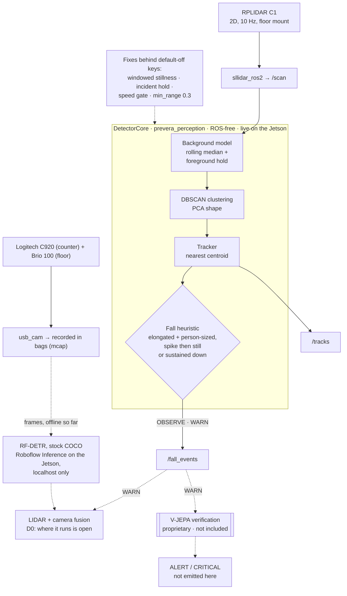
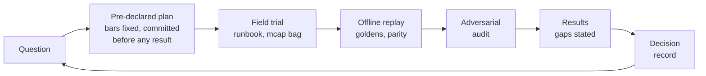

# PREVERA GUARDIAN+AI: LIDAR fall-detection prototype

A privacy-first fall detector for senior-care rooms, built on a Jetson Orin Nano. A 2D LIDAR on the floor finds a
person lying down from geometry alone, with no images. Two webcams with a stock RF-DETR detector, run locally on the
device, were shown in an offline evaluation to see the poses a single scan plane misses. A proprietary V-JEPA stage
(not in this repository) is where a fall gets confirmed. This repository holds the LIDAR detector, the tools that test it against real recordings, and
the field evidence behind its design decisions, including the results that failed.

> **Status:** research prototype, measured on one subject in one room. Not a medical device, not cleared by any
> regulator, and not to be relied on to detect falls. Apache-2.0, patent pending (see [NOTICE](NOTICE)).

[](https://github.com/JeremyGracey-AI/prevera-guardian-lidar/actions/workflows/tests.yml)

**At a glance**

| | |
|---|---|
| **Works** | A floor-level 2D LIDAR sees a person lying across or diagonal to its beam within a second, at 1.3 to 2.6 m, with 0 false alarms over 95 s of walking ([floor trials](docs/field-tests/2026-09-27-floor-mount-grid.md)). |
| **Does not** | See a person lying end-on (two of six lie-downs missed); reach WARN on the device (the fixes are tested offline only). Stock RF-DETR on two webcams sees the end-on poses but its box shape does not tell lying from standing ([C3](docs/field-tests/2026-09-27-rfdetr-results.md)). |
| **Open** | **D1**: boxes (no), keypoints ([rescore plan v2](docs/field-tests/2026-09-28-rfdetr-keypoints-plan-v2.md)) or a fine-tuned class split ([yes on public data](docs/field-tests/2026-09-28-roboflow-finetune-results.md): `lying` 1.000 / 1.000, 0 pose swaps on the test split; room frames next); **D0**: where fusion runs; the config flip behind plan v4's step-9 bar (its [label files](docs/field-tests/labels/README.md) for the 09-25 bags are still to write); a 3D sensor. |
| **How** | Every evaluation is declared before it runs; failures stay in the record; 18 [decision records](docs/DECISIONS.md). |
| **Upstream** | [roboflow/inference#3072](https://github.com/roboflow/inference/pull/3072): the Jetson 6.2.0 image returns HTTP 500 for every RF-DETR request under the documented hardened command; one-line fix, verified on this device. |
| **Try it** | `pytest` on the ROS-free core and tools, no hardware: 96 passed, 1 skipped ([quickstart](#quickstart)). |


*Lying end-on with the feet toward the sensor, a person is two 0.3 m clusters to a floor-level LIDAR: the detector
raised 0 events in 33 s. Stock RF-DETR, running on the Jetson, found the person in 33 of 33 frames on each camera.
From the [RF-DETR results](docs/field-tests/2026-09-27-rfdetr-results.md); every number on the figure is printed by
[`rfdetr_figures.py`](tools/bag_analysis/rfdetr_figures.py).*

## The problem

A fall detector in a resident's room has to notice a person on the floor, and images of them should not leave the
room. A 2D LIDAR sees shapes, not faces: a person standing is a small round slice, a person on the floor is a long thin one. The open
questions were whether that signal survives a real room, and what to add where it does not. Three days of field
tests answered part of it:

- **Height decides everything.** At counter height (121 cm) a level scan plane never touches a person on the floor:
  it lost one for 39 s while both cameras saw them ([capture night](docs/field-tests/2026-09-26-capture.md)). With the
  sensor on the floor (about 2 cm), lying across or diagonal to the beam is detected within a second.
- **End-on is a blind spot.** Lying along the beam, the plane sees only the soles or the head (0.22 to 0.33 m), and both
  such trials were missed ([floor trials](docs/field-tests/2026-09-27-floor-mount-grid.md)). That is what the cameras
  are for.
- **Escalation failed live; offline, the fixed config reaches WARN.** Stillness never accumulated past 3.4 s, and
  one track went silent after its single WARN. Both have fixes behind default-off configuration keys. Replayed on `floor-trials-1`
  with them on, all four lie-downs the LIDAR can see reach WARN 0.7 to 4.0 s after onset (3.3 to 6.5 s on stillness
  alone), and walking and standing raise nothing ([fixed-config replay](docs/field-tests/2026-09-27-fixed-config-replay.md)). The pre-declared bars that decide
  the switch (plan v4 step 9) have not been run, and the device still runs the legacy detector.

## System architecture

Solid lines run live on the Jetson; dotted lines are offline evaluation or planned. Details and the parameter tables:
[docs/ARCHITECTURE.md](docs/ARCHITECTURE.md).



## How the work is done

Every evaluation is written down before it runs, analysed with code that replays the recording, attacked by an
independent audit, and closed with a decision record. Failures stay in the record. More in
[docs/PROCESS.md](docs/PROCESS.md).



## Key results

All numbers link to the document that reports them. One subject, one room, one session each: these are feasibility
results, not recall estimates.

### Where the LIDAR can see a fallen person

| Mount | Person on the floor | False alarms | Source |
|---|---|---|---|
| Original height (09-25) | invisible: the scan toward the fall spot matched the empty room for 50 s | not measured | [2026-09-25](docs/field-tests/2026-09-25-rplidar-fall-tests.md) |
| Lowered (09-25) | visible (extent 0.8 to 1.3 m), but **no WARN**: stillness peaked at 0.4 s | not measured | same |
| Counter, level, 121 cm (09-26) | **lost for 39 s** while both cameras held them | 0 in 165 s | [Recording B](docs/field-tests/2026-09-26-capture.md) |
| Floor, about 2 cm (09-27) | detected across and diagonal; **missed end-on** | 0 in 95 s of walking | [floor trials](docs/field-tests/2026-09-27-floor-mount-grid.md) |

### Floor trials, legacy detector (`floor-trials-1`)

| Segment | Pose | Cluster length | Events |
|---|---|---|---|
| A | across the beam, 2.0 m | 1.64 m | 350 OBSERVE from onset to get-up |
| B | **end-on, feet toward the sensor**, 0.9 m | 0.33 m | **none: missed** |
| C | across, 2.6 m | 1.62 m | one WARN at 165.3 s, then **silent for 26 s** while still down |
| D | diagonal, 1.6 m | 0.99 m | 347 OBSERVE |
| E | diagonal, 1.3 m | 0.92 m | 335 OBSERVE |
| F | **end-on, head toward the sensor**, 0.83 m | 0.22 m | **none: missed** |
| W | standing and walking | | **0 false alarms** |

1,131 of the 1,132 events were OBSERVE; the one WARN is segment C's. Stillness never exceeded 3.4 s although each
lie-down was held for about 30 s, so the WARN rules almost never fired. (The field document says 1,129; its erratum
gives the recount.)

### Detector fixes, tested offline (not yet enabled on the device)

| Fix | Evidence (kind) | Record |
|---|---|---|
| Incident hold instead of the one-WARN latch | **replay** of `floor-trials-1`: segment C holds WARN to 193 s; every other segment unchanged | [DR-07](docs/DECISIONS.md#dr-07) |
| Windowed stillness (0.25 m over 1.5 s) | **unit tests**: 12 stillness tests, incl. a boundary test that fails without the epsilon | [DR-09](docs/DECISIONS.md#dr-09) |
| `min_range_m` 0.3, shipped with it | **replay**: without it, the fixed config turns a 6 cm clutter track into a WARN at 24 s | [DR-09](docs/DECISIONS.md#dr-09) |
| Per-track time base and speed gate | **unit tests** (`test_tracker.py`); motivated by the 4.6 m/s "motion" on 09-25, which was association jumps | [DR-08](docs/DECISIONS.md#dr-08) |
| All of the above behind legacy defaults | **replay**: default config byte-identical to before on all 7 bags | [DR-06](docs/DECISIONS.md#dr-06) |
| All of the above, switched on together | **replay** of `floor-trials-1`: WARN 0.7 to 4.0 s after onset in A, C, D and E; 0 events walking or standing | [results](docs/field-tests/2026-09-27-fixed-config-replay.md) |

That replay is not the step-9 scoring that decides the switch (WARN in every lying segment, 0 WARN in every
empty-room segment, scored against label files that do not exist yet). Its early WARNs come from the spike rule,
which fires once the 1.5 s stillness window has filled, in three of the four lie-downs on centroid jitter, and a
known false WARN (sitting in a chair, 09-26) persists. An earlier version of this README said that
rule could not fire without spike memory (plan v4 step 8); the replay disproves it ([caveats](docs/field-tests/2026-09-27-fixed-config-replay.md#caveats)).

### Stock RF-DETR on the LIDAR's blind spot (pre-declared, run on the Jetson)

| Condition (declared before the run) | nano | base | medium |
|---|---|---|---|
| C1: person in ≥ 90 % of B and of F frames, on at least one camera | **pass** (C920 33/33, 30/30) | **pass** | **pass** |
| C2: person in ≥ 90 % of walking frames, counter camera | **pass** 90/90 | **pass** 90/90 | **pass** 90/90 |
| C3: box width/height separates lying from standing | **fail** (B, D, E) | **fail** | **fail** |
| C4: cost next to the running LIDAR stack (report only) | 107.9 ms, 9.3 fps | 126.9 ms, 7.9 fps | 126.9 ms, 7.9 fps |

C2's walking boxes are hips and legs only (the counter camera cuts off heads), so it passes as a detection, not as a
view of a standing person. C3's failure was the pre-declared trigger for keypoints; the first keypoint run was
**invalid under its own validity rule** (the person class came back as id 1, not 0) and was not scored
([status](docs/field-tests/2026-09-27-rfdetr-keypoints-status.md)). C4 is the median serial HTTP round trip on the
device; the lowest `MemAvailable` seen was 2,584 MB with two models resident and the cameras off, and whether inference
disturbs `/scan` under load was not measured. Everything above, with the audit's caveats, is in the
[results](docs/field-tests/2026-09-27-rfdetr-results.md).

## Decisions

Eighteen decision records (DR-00 to DR-17), each with its status, the options on record (or a note that none were
written down) and its evidence; the open ones say what comes next: [docs/DECISIONS.md](docs/DECISIONS.md). DR-00 lists what was inherited from
the 2026-04 snapshot without a recorded rationale. The ones that shape the system:

| Decision | Status |
|---|---|
| Inherited baseline: 2D LIDAR, DBSCAN + a hand-tuned heuristic, rationale not recorded ([DR-00](docs/DECISIONS.md#dr-00)) | inherited; every threshold treated as a hypothesis |
| Scan plane at floor level, not counter height ([DR-02](docs/DECISIONS.md#dr-02)) | accepted; 3D sensor question open |
| Replay harness over a ROS-free core; fixes behind default-legacy keys ([DR-04](docs/DECISIONS.md#dr-04), [DR-06](docs/DECISIONS.md#dr-06)) | implemented |
| Two webcams + stock RF-DETR for the blind spots, inference on the device only ([DR-10](docs/DECISIONS.md#dr-10), [DR-11](docs/DECISIONS.md#dr-11)) | accepted |
| **D1**: boxes or keypoints ([DR-13](docs/DECISIONS.md#dr-13)) | open, direction keypoints |
| **D0**: where LIDAR and camera evidence are combined ([DR-14](docs/DECISIONS.md#dr-14)) | open, not built |
| V-JEPA verification kept proprietary, shown as a black box ([DR-15](docs/DECISIONS.md#dr-15)) | accepted |
| Scoped sudo, structural push gate, pre-declared evaluations ([DR-17](docs/DECISIONS.md#dr-17)) | accepted |

## Repository map

```
.
├── src/                          ROS 2 Humble workspace
│   ├── prevera_msgs/             FallEvent, PersonTrack, PersonTrackArray
│   ├── prevera_perception/       background, clustering, tracker, DetectorCore (ROS-free),
│   │   │                         rclpy node, synthetic scene, vjepa_bridge.py (interface stub)
│   │   └── test/                 the test suite (96 passed, 1 skipped), goldens, legacy reference
│   ├── prevera_bringup/          launch files, fall_detector.yaml (the config on the Jetson), udev, RViz
│   └── prevera_description/      sentinel URDF
├── tools/bag_analysis/           replay harness, bag timelines and frames, RF-DETR scorer and figures
├── tools/roboflow/               time-on-floor Workflow (the camera half of D0), runnable on the device
├── tools/git-hooks/pre-push      the structural push gate
├── jetson/                       bring-up and run scripts, camera views, scan and track probes
├── foxglove/guardian.json        Foxglove layout used during capture
├── demos/                        mobile-app UI concept (fictional data)
├── docs/
│   ├── DECISIONS.md              18 decision records (DR-00 to DR-17)
│   ├── ARCHITECTURE.md           components, data flow, topics, parameters, exposure
│   ├── PROCESS.md                how evaluations are run
│   ├── DEVELOPMENT-LOG.md        commit-by-commit evidence from the private history
│   ├── field-tests/              protocols, results, figures, handoffs, per-recording timelines
│   ├── hardware/                 rig documentation and photos
│   └── plans/                    replay-harness plan v4 and its open findings
├── setup_jetson.sh               workspace setup and build on the Jetson
├── LICENSE                       Apache-2.0
└── NOTICE                        copyright, patent notice, third-party components
```

Documents published from the private development history end with a **publication note** that lists what was
replaced (hosts, addresses, local paths, unpublished planning references). The notes sit at the end so that line
numbers cited between documents still hold.

## Quickstart

### Run the tests (no ROS, no hardware)

The suite is pinned to the Jetson's Python floor: Python 3.10 and numpy 1.x.

```bash
git clone https://github.com/JeremyGracey-AI/prevera-guardian-lidar.git
cd prevera-guardian-lidar
uv venv --python 3.10 .venv310
uv pip install --python .venv310/bin/python -r tools/bag_analysis/requirements.txt pytest
cd src/prevera_perception
PYTHONPATH=. ../../.venv310/bin/python -m pytest test/ -q
# 96 passed, 1 skipped   (the skip is test_node_adapter.py, which needs rclpy)
```

### Replay a bag through the detector

Field recordings are not published, so start with the synthetic fixture bag the tests use (from the repository root):

```bash
PY=.venv310/bin/python; H=tools/bag_analysis
$PY -c "import sys; sys.path.insert(0, '$H'); import mcap_fixture; mcap_fixture.write_scene_bag('/tmp/fixture.mcap')"
$PY $H/replay_detector.py schemas /tmp/fixture.mcap
$PY $H/replay_detector.py sanity  /tmp/fixture.mcap
# legacy detector: prints each event, ends with "totals: {1: 46, 2: 2}" (46 OBSERVE, 2 WARN)
$PY $H/replay_detector.py replay  /tmp/fixture.mcap --params $H/params/2026-09-25-live.yaml
# the fixes, switched on for this run only
$PY $H/replay_detector.py replay  /tmp/fixture.mcap \
    --set fall.hold_incident=true --set tracker.still_window_s=1.5 --set min_range_m=0.3
# ends with "totals: {1: 78, 2: 118}"
```

Track `#2` in both runs is the fixture's deliberate 6 cm collinear line (`ext=0.06 el=1000000.0`,
[`synthetic_scene.py:148`](src/prevera_perception/prevera_perception/synthetic_scene.py)). Its minor axis is zero, and a
degenerate cluster counts as horizontal with no size check while `fall.degenerate_requires_extent` is false, the
default ([ARCHITECTURE.md, section 2](docs/ARCHITECTURE.md#2-the-detector-one-scan-at-a-time)). It raises the legacy
run's WARN at 8.0 s and 80 of the 118 WARN lines with the fixes on, because the incident hold re-emits a held WARN on
every horizontal scan. The person (`#1`) warns at 9.0 s in the legacy run (spike path) and from 12.2 s with the fixes
on (sustained path; spike memory is not implemented).

The same commands take a real `ros2 bag record -s mcap` directory. The other verbs (`extract`, `diff`, `divergence`,
`transitions`) compare a replay with what the live node published: [tools/bag_analysis/README.md](tools/bag_analysis/README.md).

### On the Jetson (Orin Nano, JetPack 6.2, Ubuntu 22.04)

```bash
git clone https://github.com/JeremyGracey-AI/prevera-guardian-lidar.git ~/prevera-guardian-lidar
cd ~/prevera-guardian-lidar
sudo ./jetson/09-ros2-humble.sh         # ROS 2 Humble, bridges, udev rule, dialout (once)
./setup_jetson.sh                       # sllidar_ros2, deps, colcon build
source install/setup.bash
ros2 launch prevera_bringup perception.launch.py     # RPLIDAR C1 + fall detector
ros2 topic echo /fall_events
```

Without a LIDAR attached, `ros2 launch prevera_perception synthetic_dev.launch.py` runs the detector on a simulated
room: 3.5 s empty (background warm-up), a walk until 8 s, a fall with a 1.5 m/s spike, then the person lying still
([`synthetic_scene.py`](src/prevera_perception/prevera_perception/synthetic_scene.py)); expect OBSERVE while the person
lies there and one WARN about a second after the fall. For unattended runs with Foxglove (`:8765`) and rosbridge
(`:9090`), copy `jetson/guardian-*.sh` to the home directory and use `guardian-up.sh`, `guardian-status.sh` and
`guardian-down.sh`; they read the workspace path from `GUARDIAN_WS` (default `~/prevera-guardian-lidar`).

## Upstream contribution

Under the documented hardened `--read-only` container command, Roboflow's JetPack 6.2.0 Inference image returns HTTP 500
for every RF-DETR request, because Triton's kernel cache defaults to a read-only path.
[roboflow/inference#3072](https://github.com/roboflow/inference/pull/3072) sets `TRITON_CACHE_DIR` in that image (one
line, matching the JetPack 7.2.0 image). It was verified on this Jetson with the variable set at runtime: HTTP 500
before, predictions from all three RF-DETR sizes after. The PR is open. See [DR-12](docs/DECISIONS.md#dr-12).

## Limitations

- **One subject, one room, one session per result.** Frames within a segment are near-duplicates; treat each
  segment as roughly one trial.
- **The Jetson runs the legacy detector.** The fixes are tested offline only (unit tests, and replays of seven
  bags); enabling them (plan v4 step 9) needs the pre-declared bars: WARN in every lying segment, and 0 WARN in every
  empty-room segment. The fixed config's fastest WARNs mostly depend on centroid jitter; on stillness alone, WARN comes 3.3
  to 6.5 s after onset.
- **A single 2D plane cannot see a person lying end-on.** The cameras cover it in the trials above; fusion is not built.
- **Furniture feet look like a lying person** at floor level (elongated and still). It raised no alarm so far, but
  it is the main false-alarm risk once stillness works.
- **Camera privacy is not fully verified.** Inference runs on the device and the client posts only to localhost, but
  whether the server's active learning and telemetry were off is reported, not verified.
- **The camera views are unauthenticated.** Since 2026-09-28 the MJPEG views bind the loopback address by default
  and are opened through an ssh tunnel (`guardian-cams-up.sh`, `mjpeg_server.py`); `GUARDIAN_BIND=0.0.0.0` exposes
  them on purpose, for a trusted bench only. The camera topic itself is still reachable on the LAN through
  `foxglove_bridge` and `rosbridge`, which `guardian-up.sh` starts on all interfaces without authentication
  ([ARCHITECTURE, section 7](docs/ARCHITECTURE.md#7-ports-and-exposure)).
- **Not in this repository:** the V-JEPA verification stage, the RF-DETR runner used on the Jetson (`rf_eval.py`;
  [`tools/roboflow/`](tools/roboflow/) is its public stand-in), raw recordings, extracted frames and model outputs.

## Roadmap

1. Finish plan v4: spot memory across a re-spawn, time-based spike memory, then the config flip against the
   pre-declared R4/R5 bars, then deployment with a rollback tag ([plan](docs/plans/replay-harness-plan-v4.md)).
2. D1: a new pre-declared keypoint plan that fixes the class rule, and a counter-camera view that shows the whole body.
3. D0: measure the chosen fusion placement against the direct-call baseline on the device, with a bag recording
   `/scan` during the run.
4. Close the privacy gap structurally: disable active learning in the request, record the container environment,
   capture egress.
5. Measure the LIDAR-to-camera extrinsics and update the URDF; labelled trials with more subjects, ranges and rooms.
6. Revisit the 3D-sensor question with those numbers.
7. The goal after detection: fall-risk prediction, flagging rising risk before a fall. Not built; nothing in this
   repository predicts falls.

## Licence

Apache License 2.0 ([LICENSE](LICENSE)). Patent pending; see [NOTICE](NOTICE). The V-JEPA verification stage is
proprietary and not included.

## How this was built

Built with [Claude Code](https://claude.com/claude-code) as a collaborator. Claude Code wrote most of the code, tests
and documents, drove the Jetson over SSH within scoped permissions, and ran the adversarial reviews. Jeremy Gracey ran
the hardware, made every decision recorded in [DECISIONS.md](docs/DECISIONS.md), and owns the results.

## Author

Jeremy Gracey, MS · [PREVERA](https://preveraguard.com) · [jeremygracey.ai](https://jeremygracey.ai) ·
jeremy.a.gracey@gmail.com
