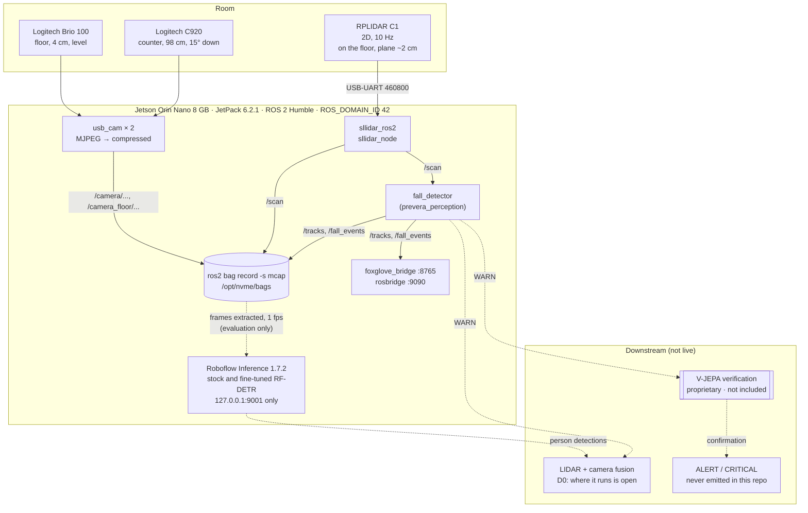
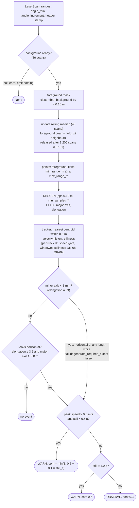
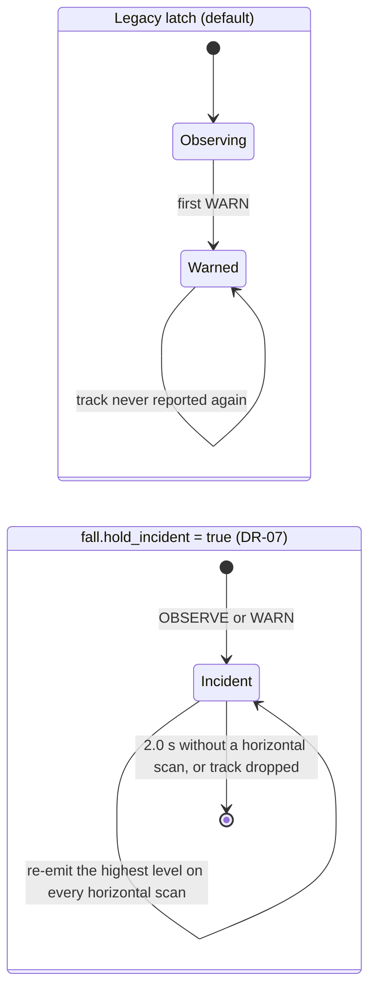
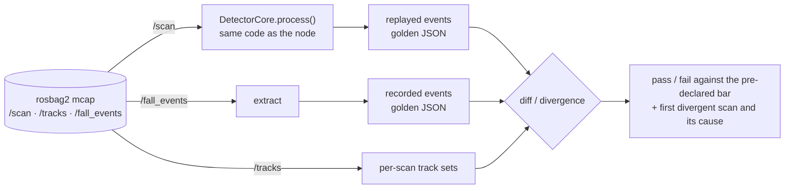

# Architecture

What runs where, what flows between the parts, and which parts are live, offline, planned or proprietary. The
decisions behind each part are in [DECISIONS.md](DECISIONS.md) (cited as DR-xx).

## 1. System context

Solid lines run live on the Jetson today. Dotted lines are offline evaluation or planned work. The double-bordered
box is proprietary and not in this repository.

| Part | State | Where to look |
|---|---|---|
| LIDAR driver + fall detector + bridges | live on the Jetson, legacy config | [`perception.launch.py`](../src/prevera_bringup/launch/perception.launch.py), [`jetson/guardian-up.sh`](../jetson/guardian-up.sh) |
| Detector fixes (incident hold, speed gate, windowed stillness) | implemented behind default-off keys; replay and tests only | DR-06 to DR-09, section 4 below |
| Two webcams into ROS | live when started (`guardian-cams-up.sh`), recorded in bags | [`jetson/guardian-cams-up.sh`](../jetson/guardian-cams-up.sh) |
| RF-DETR on the Jetson | stock models evaluated offline on extracted frames (09-27); fine-tuned children served on the device for cost, co-load and egress (09-28); one of them scored offline on the recorded room frames (09-29): both bars pass from the counter camera, the floor camera fails the head-first pose | [RF-DETR results](field-tests/2026-09-27-rfdetr-results.md), [fine-tune results](field-tests/2026-09-28-roboflow-finetune-results.md), [room-frame results](field-tests/2026-09-29-room-frames-results.md), DR-10, DR-11 |
| LIDAR + camera fusion | not built; design open | DR-14 (D0), DR-13 (D1) |
| V-JEPA verification | proprietary, not in this repository; interface stub only | DR-15, [`vjepa_bridge.py`](../src/prevera_perception/prevera_perception/vjepa_bridge.py) |

## 2. The detector, one scan at a time

The same `DetectorCore.process()` runs inside the ROS node on the Jetson and inside the replay harness on a laptop
(DR-04). The node only converts messages.

Values shown are the ones in [`fall_detector.yaml`](../src/prevera_bringup/config/fall_detector.yaml), the config the
Jetson runs. The heuristic is in `looks_horizontal()` and `evaluate()` in
[`detector_core.py`](../src/prevera_perception/prevera_perception/detector_core.py).

The degenerate branch matters in practice. When every point of a cluster lies on one line, its minor axis is below
1 mm and [`clustering.py`](../src/prevera_perception/prevera_perception/clustering.py) reports infinite elongation.
With `fall.degenerate_requires_extent` false (the default, and what the Jetson runs, because the node does not declare
it; section 4) such a cluster counts as horizontal whatever its length, so a clutter track a few centimetres long can
raise OBSERVE and, once still, WARN. The 6 cm clutter track that reached WARN at 24 s in the fixed-config replay of
`floor-trials-1` (DR-09) can only have passed through this branch, since it is far shorter than 0.8 m; so does track
`#2` in the README's fixture replay. Setting the option to true applies the 0.8 m length check to degenerate clusters
too; plan v4 step 9 decides it by a pre-declared rule.

### What happens after a WARN

The legacy latch is why `floor-trials-1` segment C went silent for 26 s after one WARN while the person stayed down
([2026-09-27, finding 3](field-tests/2026-09-27-floor-mount-grid.md)).

## 3. Topics and messages

| Topic | Type | Publisher | QoS | Notes |
|---|---|---|---|---|
| `/scan` | `sensor_msgs/LaserScan` | `sllidar_node` (or `synthetic_publisher` in dev) | sensor data (best effort) on the detector side | about 50 messages per 5 s when healthy |
| `/tracks` | [`prevera_msgs/PersonTrackArray`](../src/prevera_msgs/msg/PersonTrackArray.msg) | `fall_detector` | reliable, depth 10 | one array per processed scan; `is_still` = stillness > 0 |
| `/fall_events` | [`prevera_msgs/FallEvent`](../src/prevera_msgs/msg/FallEvent.msg) | `fall_detector` | reliable, depth 10 | levels 1 (OBSERVE) and 2 (WARN) only; `vjepa_confidence` is NaN |
| `/camera/image_raw/compressed` | `sensor_msgs/CompressedImage` | `usb_cam` (C920) | default | 1280×720 at 30 Hz |
| `/camera_floor/image_raw/compressed` | `sensor_msgs/CompressedImage` | `usb_cam` (Brio 100) | default | 1280×720 at 30 Hz |
| `/map` | `nav_msgs/OccupancyGrid` | `slam_toolbox` | default | only with `guardian.launch.py` |

`FallEvent` carries `alert_level`, `confidence`, `location` (in the detector's `frame_id`, `laser`),
`horizontal_extent_m`, `elongation_ratio` (clamped to 1e6), `stillness_duration_s`, `preceding_velocity_mps` and
`vjepa_confidence`. Alert levels: 0 NONE, 1 OBSERVE, 2 WARN, 3 ALERT, 4 CRITICAL; this repository emits 1 and 2.

## 4. Parameters

### Declared by the node (what the Jetson runs)

| Parameter | Node default | YAML value | Meaning |
|---|---|---|---|
| `min_range_m` / `max_range_m` | 0.05 / 10.0 | 0.05 / 10.0 | range window for foreground points (0.3 planned, DR-09) |
| `background.window_size` | 40 | 40 | scans in the rolling median |
| `background.warmup_scans` | 30 | 30 | scans before any detection |
| `background.foreground_margin_m` | 0.15 | 0.15 | how much closer than the background a return must be |
| `background.hold_foreground` | true | true | DR-01 |
| `background.max_hold_scans` | 1200 | 1200 | release a held beam after 2 min |
| `background.mask_dilation_beams` | 2 | 2 | also hold neighbouring beams |
| `cluster.eps_m` / `min_samples` / `min_points_per_cluster` | 0.12 / 4 / 6 | same | DBSCAN |
| `tracker.association_gate_m` | 0.5 | 0.5 | max centroid distance for a match |
| `tracker.max_missed_scans` | 15 | 15 | drop a track after this many misses |
| `tracker.velocity_window` | 10 | 10 | scans of speed history |
| `tracker.still_velocity_mps` | 0.15 | 0.15 | legacy per-scan stillness threshold |
| `fall.elongation_ratio` | 3.5 | 3.5 | major/minor axis ratio that counts as lying |
| `fall.major_axis_m` | **0.6** | **0.8** | minimum person-sized length; the YAML wins at launch. The mismatch dates back to the initial import and is listed in plan v4 step 4. |
| `fall.velocity_spike_mps` | 0.8 | 0.8 | spike before stillness |
| `fall.sustained_down_s` | 4.0 | 4.0 | stillness that alone raises WARN |

### Core options not yet declared by the node (DR-06)

These exist in `DetectorCore` and the tracker, default to the legacy behaviour, and are reachable only through the
replay harness (`replay_detector.py ... --set key=value`) and the tests until the config flip (plan v4 step 9).

| Option | Default (legacy) | Planned | Record |
|---|---|---|---|
| `fall.hold_incident` | false | true | DR-07 |
| `fall.incident_clear_s` | 2.0 | 2.0 | DR-07 |
| `fall.spike_stillness_s` | 0.5 | 0.5 | the legacy literal, now named |
| `fall.degenerate_requires_extent` | false | decided by a pre-declared rule | plan v4 step 9 |
| `tracker.per_track_dt` | false | true | DR-08 |
| `tracker.max_association_speed_mps` | 0.0 (off) | 3.0 | DR-08 |
| `tracker.still_window_s` | 0.0 (off) | 1.5 | DR-09 |
| `tracker.still_displacement_m` | 0.25 | 0.25 | DR-09 |

Not implemented yet (plan v4 steps 7 and 8): spot memory across a re-spawn at the same place, and time-based spike
memory.

## 5. Offline replay harness

Details and verbs: [`tools/bag_analysis/README.md`](../tools/bag_analysis/README.md). Every time is the message's
header stamp, never the mcap log time; every float is written as float32, as on the wire.

## 6. Packages and launch files

| Package | Contents |
|---|---|
| [`prevera_msgs`](../src/prevera_msgs) | `FallEvent`, `PersonTrack`, `PersonTrackArray` |
| [`prevera_perception`](../src/prevera_perception) | `background.py`, `clustering.py`, `tracker.py`, `detector_core.py` (all ROS-free), `fall_detector_node.py` (rclpy adapter), `synthetic_scene.py` + `synthetic_publisher_node.py`, `vjepa_bridge.py` (interface stub), the test suite (130 passed, 1 skipped in CI at `6990dfe`, tools tests included) |
| [`prevera_bringup`](../src/prevera_bringup) | `lidar.launch.py`, `perception.launch.py` (LIDAR + detector), `slam.launch.py`, `guardian.launch.py` (SLAM + detector, optional RViz), configs, udev rule, RViz layout |
| [`prevera_description`](../src/prevera_description) | sentinel URDF (scan plane at floor level since 2026-09-28, the 0.65 m rig behind an arg; DR-02) |

## 7. Ports and exposure

| Port | Service | Bound to | Note |
|---|---|---|---|
| 9001 | Roboflow Inference | 127.0.0.1 | loopback only (DR-11) |
| 8765 | foxglove_bridge | 127.0.0.1 by default (since 2026-09-28, second pass); `GUARDIAN_BIND=0.0.0.0` for a capture session | development visualisation, no authentication |
| 9090 | rosbridge | 127.0.0.1 by default (same) | development visualisation, no authentication |
| 8081, 8082, 8083 | camera MJPEG views and the two-camera page | 127.0.0.1 by default (since 2026-09-28); `GUARDIAN_BIND=0.0.0.0` for a trusted bench | no authentication; open through an ssh tunnel, stop after use |

The camera views are a development convenience. Until 2026-09-28 they bound every interface by default; they now
bind the loopback address and are reached with
`ssh -L 8081:127.0.0.1:8081 -L 8082:127.0.0.1:8082 -L 8083:127.0.0.1:8083 jetson`. That change covers the MJPEG
views only; later the same day `guardian-up.sh` was given the same rule for the bridges, so `foxglove_bridge`
(:8765) and `rosbridge` (:9090) now bind the loopback address unless `GUARDIAN_BIND=0.0.0.0` is set for the
session that starts them (the capture runbooks say when), and are otherwise reached through the same ssh tunnel
(`-L 8765:127.0.0.1:8765 -L 9090:127.0.0.1:9090`). What remains reachable on the LAN while the cameras run is
the ROS 2 graph itself: anyone who can join domain 42 with DDS multicast can subscribe to
`/camera/image_raw/compressed`. That is the transport's design, not a bind flag; closing it means DDS security or
`ROS_LOCALHOST_ONLY=1` on the device, which would also cut the OMEN's replay tooling off from live topics, and it
is recorded as the remaining open item, not fixed.

## 8. The V-JEPA boundary

The only artefacts of the verification stage in this repository are an interface and a field:

- [`vjepa_bridge.py`](../src/prevera_perception/prevera_perception/vjepa_bridge.py): two dataclasses, `FusionRequest`
  (track id, event stamp, LIDAR confidence) and `FusionResult` (track id, event stamp, verification confidence),
  and no logic.
- `FallEvent.vjepa_confidence`, published as NaN.

Nothing imports the stub. How the stage works and how it decides are not described here (DR-15).
