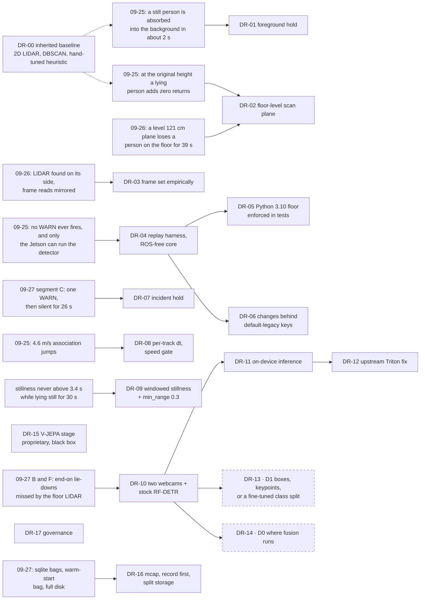

# Decision records

The design decisions behind this repository, each with the finding that forced it, the options on record, what was
decided, the evidence, and what it costs. Each record links to files in this repository. Where a number comes from a
private commit message, the commit is summarised in [DEVELOPMENT-LOG.md](DEVELOPMENT-LOG.md). Where the alternatives
were not written down at the time, the record says so. [DR-00](#dr-00) lists the choices inherited from the 2026-04
snapshot, whose rationale was never recorded; DR-01 to DR-17 were made from 2026-09-25 on.

Two labels appear in the field-test documents: **D0** (where fusion runs) and **D1** (boxes, keypoints, or a
fine-tuned class split). They are [DR-14](#dr-14) and [DR-13](#dr-13) below.

## Decision map

Findings from the field (left) forced each decision (right). Dashed boxes are still open. Dotted arrows from DR-00
mark the first findings, which were measured on the inherited baseline.

## Status at a glance

| # | Decision | Status |
|---|---|---|
| [DR-00](#dr-00) | Inherited baseline: 2D LIDAR, Jetson + ROS 2, DBSCAN + PCA, hand-tuned heuristic | inherited 2026-04; rationale not recorded |
| [DR-01](#dr-01) | Hold still foreground out of the background model | accepted, running on the Jetson |
| [DR-02](#dr-02) | Put the scan plane at floor level (about 2 cm) | accepted; the 3D-sensor question stays open |
| [DR-03](#dr-03) | Establish the scan frame empirically after every rig change | accepted |
| [DR-04](#dr-04) | Offline replay harness over a ROS-free detector core | implemented (plan v4 steps 1 to 3) |
| [DR-05](#dr-05) | Enforce the Jetson's Python floor in the test suite | accepted |
| [DR-06](#dr-06) | Every behaviour change behind a config key whose default is legacy | accepted; the flip (plan v4 step 9) is pending |
| [DR-07](#dr-07) | Hold the incident level instead of the one-WARN latch | implemented, default off |
| [DR-08](#dr-08) | Per-track time base and an association speed gate | implemented, default off |
| [DR-09](#dr-09) | Windowed stillness, shipped together with `min_range_m` 0.3 | stillness implemented, default off; `min_range_m` deferred to the flip |
| [DR-10](#dr-10) | Add two webcams and a stock camera detector for the LIDAR's blind spots | accepted; evaluated offline, not in the alert path |
| [DR-11](#dr-11) | Run camera inference on the device, not on a hosted API | accepted; pingback, version check and ultralytics probe off, each verified by capture 2026-09-29; usage record may leave, for now (Jeremy, 2026-09-29); model pull never captured |
| [DR-12](#dr-12) | Fix the Jetson inference image upstream (`TRITON_CACHE_DIR`) | PR open |
| [DR-13](#dr-13) | **D1**: boxes, keypoints, or a fine-tuned class split | open; class split passed F1/F2 on public data (2026-09-28), room frames next |
| [DR-14](#dr-14) | **D0**: where fusion runs | open |
| [DR-15](#dr-15) | Publish the LIDAR path; keep the V-JEPA verification stage proprietary | accepted |
| [DR-16](#dr-16) | Record every bag as mcap, start it before the restart, split storage | accepted |
| [DR-17](#dr-17) | Governance: scoped permissions, a structural push gate, pre-declared evaluations | accepted |

---

## DR-00 · Inherited baseline (2026-04 snapshot)

- **Status:** inherited, not re-decided. Every later record changes or gates a part of it.
- **Context:** the workspace was recovered on 2026-09-16 from an archived snapshot dated 2026-04-23, the only
  surviving copy ([development log](DEVELOPMENT-LOG.md), `1f42642`). No design notes came with it.
- **Decision (inherited):** a 2D RPLIDAR C1 as the only sensor, on a Jetson Orin Nano with ROS 2 Humble; a per-beam
  rolling-median background (40 scans); DBSCAN clustering (eps 0.12 m, min_samples 4) with a PCA shape; a nearest-centroid
  tracker (0.5 m gate); and a hand-tuned geometric heuristic: elongation ≥ 3.5, major axis ≥ 0.8 m in the YAML (0.6 m
  in the node), a velocity spike of 0.8 m/s followed by stillness, or 4.0 s of sustained stillness
  ([`fall_detector.yaml`](../src/prevera_bringup/config/fall_detector.yaml),
  [ARCHITECTURE.md, sections 2 and 4](ARCHITECTURE.md)). The message defines ALERT and CRITICAL for a verification
  stage ([DR-15](#dr-15)); the URDF placed the scan plane at 0.65 m until 2026-09-28 ([DR-02](#dr-02)).
- **Options on record:** none. Why a 2D sensor, why a hand-tuned heuristic rather than a learned classifier, and
  where each threshold came from were not recorded. The one stated reason is the URDF's comment on the mount
  height (0.55 m "catches waist on a standing adult, and produces an elongated silhouette for a person on the
  floor", the URDF's comment until 2026-09-28,
  [`sentinel.urdf.xacro` at `45501c3`](https://github.com/JeremyGracey-AI/prevera-guardian-lidar/blob/45501c3599d9af4d74272269841e0a88a9088ed4/src/prevera_description/urdf/sentinel.urdf.xacro)).
  On 09-25, at a mount height
  that was not written down, a person lying on the floor added no returns at all ([DR-02](#dr-02)).
- **Evidence:** none for the choices themselves. The field tests of 2026-09-25 to 27 are the first measurements of
  this baseline. The deployed legacy detector (this baseline plus [DR-01](#dr-01)) stays reproducible through
  [`legacy_reference.py`](../src/prevera_perception/test/legacy_reference.py) and
  [`params/2026-09-25-live.yaml`](../tools/bag_analysis/params/2026-09-25-live.yaml).
- **Consequences:** every threshold is treated as a hypothesis under test. Changes go behind keys whose default is
  this behaviour ([DR-06](#dr-06)). The 2D-or-3D question is open ([DR-02](#dr-02)).

## DR-01 · Hold still foreground out of the background model

- **Status:** accepted 2026-09-25; running on the Jetson (`36ca257`, merged as private PR #1).
- **Context:** the background is a per-beam rolling median over 40 scans (4 s at 10 Hz). Anything that stopped moving
  was learned into it within about 2 s, so a person lying still vanished before the 4 s sustained-down rule could fire:
  the detector could not report a fall ([field test 2026-09-25, finding 6](field-tests/2026-09-25-rplidar-fall-tests.md);
  [handoff lesson 2](field-tests/HANDOFF-2026-09-26.md)).
- **Options on record:** holding a beam forever was rejected because moved furniture must still be learned; a longer
  window was not recorded as considered.
- **Decision:** compute the foreground mask first, then update the history with it; held beams (plus 2 neighbours each
  side) keep their background value; a beam held longer than `background.max_hold_scans` (1,200 scans, 2 min) is released.
- **Evidence:** [`background.py`](../src/prevera_perception/prevera_perception/background.py),
  [`test_background.py`](../src/prevera_perception/test/test_background.py) and
  [`test_synthetic_fall.py`](../src/prevera_perception/test/test_synthetic_fall.py)
  (`test_without_hold_the_fallen_person_is_lost`); 14 tests pass, 7 of them fail on the previous code
  ([development log](DEVELOPMENT-LOG.md)).
- **Consequences:** someone who stands in one spot for minutes before a recording is baked into the median anyway
  ([handoff 09-27, lesson 12](field-tests/HANDOFF-2026-09-27.md)), hence "restart the detector on an empty room before
  every recording".

## DR-02 · Put the scan plane at floor level (about 2 cm)

- **Status:** accepted 2026-09-27; the floor mount is in use. Whether a 3D sensor is needed stays open.
- **Context:** at the original mount height a person lying on the floor added zero returns (the scan toward the fall
  spot matched the empty room for 50 s after the fall); lowered, the body was visible
  ([2026-09-25](field-tests/2026-09-25-rplidar-fall-tests.md)). A level plane at 121 cm on the counter lost a person on
  the floor for 39 s while both cameras held them, with zero false alarms over 165 s
  ([Recording B](field-tests/2026-09-26-capture.md)). The URDF assumed a level plane at 0.65 m (a 0.55 m mast on a
  0.10 m base, [`sentinel.urdf.xacro`](../src/prevera_description/urdf/sentinel.urdf.xacro)).
- **Options on record** ([rig doc, "The height problem"](hardware/rig-2026-09-26.md)): (1) pitch the LIDAR down (at 30°
  the plane meets the floor at 2.0 m, but it cuts the body at an angle and the background sees the floor as a curved
  wall); (2) put the tripod on the floor (about 0.3 m); (3) a 3D LIDAR or depth sensor, deferred until the 2D path is
  measured ([2026-09-25, next change 4](field-tests/2026-09-25-rplidar-fall-tests.md)). On 09-27 the sensor went lower
  still, onto the tile.
- **Decision:** RPLIDAR C1 on the floor at the counter base, level (gauge 0.0°), scan plane about 2 cm.
- **Evidence** ([floor-trials-1](field-tests/2026-09-27-floor-mount-grid.md)): lying across or diagonal to the beam
  (segments A, C, D, E) is a 0.9 to 1.65 m elongated cluster that fires within a second of going down at every range
  tried (1.3 to 2.6 m); lying end-on (B, F) shows only 0.22 to 0.33 m of soles or head and was missed; 95 s of walking
  raised no false alarm; the grid walk tracked continuously at all six stations.
- **Consequences:** the end-on blind spot ([DR-10](#dr-10)); standing people are seen as feet (each shoe its own track
  at the near row); furniture feet make elongated, still clusters, the same signature as a lying person, which is the
  false-alarm risk for the fixes in [DR-09](#dr-09). The URDF described the 0.65 m plane until 2026-09-28; it now
  puts the laser frame 0.02 m above the floor, with `lidar_mount_height:=0.65` drawing the original rig.

## DR-03 · Establish the scan frame empirically after every rig change

- **Status:** accepted 2026-09-26.
- **Context:** the driver's `inverted:` flag reverses the angle order; it does not describe how the sensor is mounted.
  During a mount rework the C1 rotated onto its side (89.9° on the gauge) without anyone noticing, so Recording A was
  made with a vertical scan plane and its frame read mirrored ([capture night](field-tests/2026-09-26-capture.md),
  [rig doc, 22:21](hardware/rig-2026-09-26.md)).
- **Decision:** gauge the C1's top in two directions after every touch; run `jetson/scan_probe.py` after every restart
  (a horizontal plane shows walls at real ranges and nothing at floor range); settle handedness with stands at known
  sides; keep `inverted: false` ([`rplidar_c1.yaml`](../src/prevera_bringup/config/rplidar_c1.yaml); the earlier
  `inverted: true` commit was reverted).
- **Options on record:** setting the frame through the driver's `inverted:` flag was tried first (`5b394aa`) and
  reverted (`3dc5010`), because the flag reverses the angle order and does not describe the mount
  ([development log](DEVELOPMENT-LOG.md)). No other alternative was written down.
- **Evidence:** calibration 2 settled forward = +y, camera-left = +x for the upright counter mount
  ([capture night](field-tests/2026-09-26-capture.md)); two stands on opposite sides settled the floor-mount frame
  (desk = −x, counter = +x, right-handed) ([2026-09-27](field-tests/2026-09-27-floor-mount-grid.md));
  [handoff 09-27, lessons 1 and 2](field-tests/HANDOFF-2026-09-27.md).
- **Consequences:** the frame differs between sessions, so each field-test document states it. The LIDAR-to-camera
  extrinsics that fusion needs are still unmeasured ([rig doc](hardware/rig-2026-09-26.md), measurement TODOs).

## DR-04 · Offline replay harness over a ROS-free detector core

- **Status:** implemented (plan v4 steps 1 to 3). The strict step-3b replay bar was not met on `floor-trials-1`
  because that bag started warm; event-level agreement was used instead and is stated as such.
- **Context:** the 09-25 bags contained the failure, but only the Jetson could run the detector, and synthetic data had
  hidden two bugs ([handoff 09-26, lesson 4](field-tests/HANDOFF-2026-09-26.md)).
- **Options on record** ([plan v4, section 0](plans/replay-harness-plan-v4.md)): risk-first, testability-first and
  minimal-refactor skeletons. Risk-first was chosen with named parts grafted from the other two, and each rejected item
  is listed with its reason (for example, a count-based velocity window that would have changed legacy output).
- **Decision:** the per-scan pipeline moves into
  [`detector_core.py`](../src/prevera_perception/prevera_perception/detector_core.py); the ROS node becomes a thin
  adapter; [`replay_detector.py`](../tools/bag_analysis/replay_detector.py) runs the same core over an mcap bag with
  no ROS installed and diffs it against what the node published.
- **Evidence:** the old and new nodes, fed the same 160 scans, published field-identical messages (130
  `PersonTrackArray`, 48 `FallEvent`) ([development log](DEVELOPMENT-LOG.md), `a0d7e49`);
  [`test_detector_core.py`](../src/prevera_perception/test/test_detector_core.py) pins a golden against a verbatim copy
  of the pre-refactor functions ([`legacy_reference.py`](../src/prevera_perception/test/legacy_reference.py));
  on `floor-trials-1` the legacy replay gave 1,134 events against 1,132 recorded, in the same segments
  ([plan v4 execution notes](plans/replay-harness-plan-v4-open-gaps.md)).
- **Consequences:** every later fix was built test-first on a Mac without ROS. Strict track-level replay needs bags that
  start before the detector restarts ([DR-16](#dr-16)).

## DR-05 · Enforce the Jetson's Python floor in the test suite

- **Status:** accepted 2026-09-26.
- **Context:** the Jetson runs Python 3.10 (Ubuntu 22.04); the development Mac defaults to Python 3.14 and numpy 2.x,
  so code that passes on the Mac can fail on the device. Which numpy and scikit-learn the running node imports is not
  recorded yet (plan v4 open item r3, [open gaps](plans/replay-harness-plan-v4-open-gaps.md)).
  [`09-ros2-humble.sh`](../jetson/09-ros2-humble.sh) installs the apt `python3-sklearn` (jammy ships scikit-learn
  0.23.2 and numpy 1.21.5), and [`setup_jetson.sh`](../setup_jetson.sh) then installs `'numpy<2'` and scikit-learn
  from pip into the user site, which takes precedence wherever it has been run.
- **Options on record:** matching the device's scikit-learn on the Mac was tried and dropped: 0.23.2 has no
  Python 3.10 wheel and a source build failed ([plan v4, section 1](plans/replay-harness-plan-v4.md)).
- **Decision:** [`test_python_floor.py`](../src/prevera_perception/test/test_python_floor.py) fails unless Python is
  3.10 and numpy is 1.x (escape hatches `PREVERA_ALLOW_OTHER_PY=1`, `PREVERA_ALLOW_NUMPY2=1`), records the
  scikit-learn version, parses every `.py` in the package, tests and tools with `feature_version=(3, 10)`, and rejects
  `tomllib` and `typing.Self`. [`requirements.txt`](../tools/bag_analysis/requirements.txt) and
  [`setup_jetson.sh`](../setup_jetson.sh) pin `numpy<2`.
- **Evidence:** [plan v4, section 1 "Python floor"](plans/replay-harness-plan-v4.md).
- **Consequences:** scikit-learn parity with the device is not established (the device's version is unrecorded, and
  0.23.2 cannot be installed on the Mac), so DBSCAN-sensitive test windows are asserted as windows, not exact stamps,
  until they run on the device (plan v4, section 6).

## DR-06 · Every behaviour change behind a config key whose default is legacy

- **Status:** accepted. The config flip that turns the fixes on (plan v4 step 9) has not happened.
- **Context:** the fixes had to be developed against recorded bags while the same code could still reproduce what the
  deployed detector did, and the Jetson must not change behaviour until a deliberate config commit.
- **Options on record** ([plan v4, section 0](plans/replay-harness-plan-v4.md)): a string `stillness_mode` switch and an
  auto-generated `declare_parameter` loop were rejected for numeric knobs with explicit declares and a parity test; a
  count-based `velocity_window: 30` was rejected because it changes legacy output.
- **Decision:** every new field defaults to `0` / `False` = legacy. Goldens are captured in their own commit before the
  change they guard. The YAML and the node stay untouched until step 9.
- **Evidence:** [plan v4, section 0](plans/replay-harness-plan-v4.md) (the convention);
  `test_legacy_defaults_unchanged` against [`test/golden/tracker_legacy_scenes.json`](../src/prevera_perception/test/golden/tracker_legacy_scenes.json)
  (four seeded mutations of the tracker each fail it); the default config is byte-identical to the incident-hold commit
  on all 7 bags ([execution notes](plans/replay-harness-plan-v4-open-gaps.md)).
- **Consequences:** the node does not declare the new keys yet, so DR-07 to DR-09 are reachable only through the replay
  harness (`--set key=value`) and the tests. **The Jetson runs the legacy detector.** Step 9 must edit the YAML and the
  node together (a parity test enforces it).

## DR-07 · Hold the incident level instead of the one-WARN latch

- **Status:** implemented behind `fall.hold_incident` (default `false`); not enabled on the device.
- **Context:** the legacy detector adds a track to a set at its first WARN and never reports it again. In
  `floor-trials-1` segment C that meant one WARN at 165.3 s, then silence for 26 s while the person stayed down and
  tracked ([2026-09-27, finding 3](field-tests/2026-09-27-floor-mount-grid.md)).
- **Options on record:** none beyond the chosen design.
- **Decision:** per track, hold the highest level reached and its confidence, re-emit it on every scan the track still
  looks horizontal, and end the incident after `fall.incident_clear_s` (2.0 s) without a horizontal scan or when the
  track is dropped.
- **Evidence:** [`test_incident_hold.py`](../src/prevera_perception/test/test_incident_hold.py) (8 tests); replaying
  `floor-trials-1` with the key on, C holds WARN on every scan to 193 s (the get-up) and every other segment is identical
  to the legacy replay ([development log](DEVELOPMENT-LOG.md), `337641f`).
- **Consequences:** a spurious WARN is held too. C's WARN came from a jitter-made spike (1.53 m/s from a 15 cm
  centroid jump), so hold needs spike gating (plan v4 step 8, not implemented). The walking baseline had 0 WARN either
  way.

## DR-08 · Per-track time base and an association speed gate

- **Status:** implemented behind `tracker.per_track_dt` and `tracker.max_association_speed_mps` (defaults off; the
  planned values are `true` and 3.0 m/s).
- **Context:** tracker speed spikes of up to 4.6 m/s on 09-25 were association jumps between different clusters, not
  motion ([2026-09-25, finding 5](field-tests/2026-09-25-rplidar-fall-tests.md)). With one tracker-wide time step, a
  track reacquired after k missed scans also reads (k+1) times too fast, so a speed gate alone would reject every
  reacquisition ([plan v4, step 5](plans/replay-harness-plan-v4.md)).
- **Options on record** ([plan v4, step 5](plans/replay-harness-plan-v4.md)): a speed gate on the tracker-wide time
  step alone, rejected for the reason above; per-track time is bundled with the gate as its prerequisite.
- **Decision:** measure each track's velocity, age and stillness from its own last-seen stamp; try candidate clusters in
  order of distance and take the first inside both the gate and the speed limit, else spawn; record why every new track
  was spawned (`Tracker.spawn_log`).
- **Evidence:** [`tracker.py`](../src/prevera_perception/prevera_perception/tracker.py),
  [`test_tracker.py`](../src/prevera_perception/test/test_tracker.py).
- **Consequences:** a track's published `age_s` grows by the whole gap on reacquisition; a fall whose centroid jumps more
  than 0.3 m between two scans spawns a new track, so only the speeds the new track itself records count toward
  the spike rule (plan v4, section 6); in the replay those were still enough to fire it ([fixed-config replay](field-tests/2026-09-27-fixed-config-replay.md)).

## DR-09 · Windowed stillness, shipped together with `min_range_m` 0.3

- **Status:** windowed stillness implemented behind `tracker.still_window_s` (default 0 = legacy). `min_range_m` 0.3
  is deferred into the config flip. Neither runs on the device.
- **Context:** stillness from per-scan speed never accumulates on real data: at most 0.4 s on 09-25
  ([finding 2](field-tests/2026-09-25-rplidar-fall-tests.md)) and never above 3.4 s in `floor-trials-1` although each
  lie-down was held still for about 30 s, because `is_still` toggles every second or two
  ([2026-09-27, finding 2](field-tests/2026-09-27-floor-mount-grid.md)).
- **Options on record** ([plan v4, section 0 and step 6](plans/replay-harness-plan-v4.md)): the legacy per-scan speed
  test stays as the default; a displacement window was chosen over it. Within that design the plan rejects a
  `still_since_s = still_since_s or ...` idiom (wrong at stamp 0.0) and a first-draft gap test that contradicted the
  algorithm. Raising `min_range_m` above 0.3 stays open if the 0.3 to 0.4 m range band turns out to be populated
  ([open gaps](plans/replay-harness-plan-v4-open-gaps.md), r1 and r3).
- **Decision:** a track is still when its samples cover the last 1.5 s and every one lies within 0.25 m of its current
  centroid; stillness counts from the oldest retained sample. Boundary comparisons use a 1e-6 s epsilon because the two
  stamp sources differ in the last bits. `min_range_m` 0.3 ships in the same flip: replay shows that without it the
  6 cm camera/counter-edge clutter track reaches a sustained WARN at 24 s under the fixed config, before anyone lies down
  ([execution notes](plans/replay-harness-plan-v4-open-gaps.md)).
- **Evidence:** [`test_stillness.py`](../src/prevera_perception/test/test_stillness.py) (the plan's seven scenarios
  plus a boundary test that fails if the epsilon is dropped from either comparison), and a
  [replay of `floor-trials-1`](field-tests/2026-09-27-fixed-config-replay.md) with every fix on: WARN 0.7 to 4.0 s after onset in the four visible
  lie-downs, 3.3 to 6.5 s on stillness alone, 0 events walking or standing.
- **Consequences:** any static held-foreground cluster can now accrue stillness, so the flip carries a hard bar: 0 WARN
  in every empty-room segment before deployment ([plan v4, step 9, R5](plans/replay-harness-plan-v4.md)). Without spike
  memory (step 8, not implemented) the spike rule still fires once the window has filled, on any speed of at least
  0.8 m/s still among the track's last 10 matched updates: centroid jitter in three `floor-trials-1` lie-downs, the
  going-down motion in the fourth. This record first said it could not fire; the [replay](field-tests/2026-09-27-fixed-config-replay.md#caveats) corrected that.

## DR-10 · Add two webcams and a stock camera detector for the LIDAR's blind spots

- **Status:** accepted. Both cameras were recorded alongside the LIDAR from 2026-09-26 (`counter-baseline-1`,
  `counter-baseline-2`, `floor-trials-1`). Stock RF-DETR was evaluated offline on frames extracted from
  `floor-trials-1`; it is not in the live alert path.
- **Context:** a single 2D plane cannot see a person below it (counter height: lost for 39 s) or lying end-on at floor
  level (B and F missed; 0.22 to 0.33 m visible) ([DR-02](#dr-02)).
- **Options on record:** a 3D LIDAR or depth sensor (open since 09-25); a camera with a detector.
- **Decision:** a Logitech C920 on the counter (98 cm, 15° down) and a Logitech Brio 100 on the floor (4 cm, level),
  both into ROS via `usb_cam`; evaluate stock COCO RF-DETR (no fine-tuning) under a
  [pre-declared plan](field-tests/2026-09-27-rfdetr-eval-plan.md).
- **Evidence** ([results](field-tests/2026-09-27-rfdetr-results.md)): C1 passes for nano, base and medium: the counter
  C920 finds the person in 33/33 B frames and 30/30 F frames, exactly the lie-downs the LIDAR missed; C2 passes (90/90
  W frames), with the caveat that every W box is hips and legs only.
- **Consequences:** the privacy claim changes from "no camera" to "inference on the device, frames posted only to
  localhost" ([DR-11](#dr-11)). The counter camera never shows a standing person's head or torso, which matters for
  keypoints ([DR-13](#dr-13)). This is a feasibility result on one subject, one room, one session, with near-duplicate
  frames inside each segment; it is not a recall estimate.

## DR-11 · Run camera inference on the device, not on a hosted API

- **Status:** accepted; privacy checked by four captures (two egress, two container start).
  2026-09-28: the container posted a record of every request
  (class and confidence per detection, API key in clear, hostname, IP, MAC) to `api.roboflow.com` once a minute
  through the model-monitoring pingback, which the hardened command never turned off; `TELEMETRY_OPT_OUT` is inert in
  Inference 1.7.2. 2026-09-29: with `METRICS_ENABLED=False` in the command
  ([`jetson/inference-server-up.sh`](../jetson/inference-server-up.sh)) that post is gone (EG1 PASS, 12,987 bytes in
  580 frames); what still leaves is the usage collector's aggregated ~2.4 KB every ~10 s while inferring, with the
  API key in clear, hashed hostname and IP, model id and frame counts, no per-detection field; and, at every
  container start, a version check to `api.github.com` (`DISABLE_VERSION_CHECK=True` turns it off; verified by a
  [container-start capture](field-tests/2026-09-29-version-check-capture-plan.md) at 02:57 UTC, VC2 PASS), which
  also found ultralytics' `is_online()` handshake to `1.1.1.1:80`, 0 bytes, twice per start (VC1 FAIL as declared);
  with `YOLO_OFFLINE=True` a [fourth capture](field-tests/2026-09-29-yolo-offline-capture-plan.md) at 03:11 UTC saw
  no packet leave the container for any non-LAN address in 32.6 minutes, with no request sent (VC1, VC2 PASS). A
  container that is not asked anything said nothing to anyone for as long as it was watched (32.6 minutes, idle;
  a model pull has never been captured).
  **Decision (Jeremy, 2026-09-29): yes, for now**, the aggregated usage record may leave once
  requests arrive; no revisit trigger was set.
- **Context:** the product is a privacy-preserving fall detector in residents' rooms; frames of people must not leave
  the room.
- **Options on record:** a hosted inference API, rejected because frames would leave the room. No cost or latency
  comparison was written down.
- **Decision:** Roboflow Inference 1.7.2 (`roboflow-inference-server-jetson-6.2.0`) runs as a container on the Jetson,
  listening on `127.0.0.1:9001` only; the client posts frames only there.
- **Evidence** ([results, sections 2 and 5](field-tests/2026-09-27-rfdetr-results.md)): the listener is loopback only;
  median serial round trip 107.9 ms (nano, 9.3 fps) and 126.9 ms (base and medium, 7.9 fps) next to the running LIDAR
  driver and detector; lowest `MemAvailable` 2,584 MB with two models resident and the cameras stopped.
- **Consequences and gaps:** on 2026-09-27 that active learning and telemetry were off was reported, not verified. On
  2026-09-28 all three follow-ups ran ([fine-tune results, section 5](field-tests/2026-09-28-roboflow-finetune-results.md)):
  every request now carries `disable_active_learning: true` (the runner's test checks it); the container environment
  is recorded there from `docker inspect`; and one run was captured with `tcpdump`. The capture (EG1 FAIL, EG2 PASS)
  shows 285 KB leaving during 580 frames, all to `api.roboflow.com`, as one 280 KB post shaped and timed like the
  model-monitoring pingback (`METRICS_ENABLED`, default True, 60 s) plus ~2.4 KB every 10 s from the usage
  collector; the frames themselves did not leave (that capture began 34 s into the run and saw 167 of the 580
  frames, 40.7 MB, over the docker bridge; the results record the correction beside EG1). **Telemetry was not
  off**: `TELEMETRY_OPT_OUT=True` is inert in 1.7.2 and `METRICS_ENABLED` was never set. The pre-declared re-capture
  with `METRICS_ENABLED=False` ran on 2026-09-29 ([plan](field-tests/2026-09-28-egress-recapture-plan.md), results
  section 5 "Egress, re-capture"): 12,987 bytes out during 580 frames, all to `api.roboflow.com`, in ~2.4 KB
  usage-collector exchanges every ~10 s; no post over 3.3 KB in 34 minutes of capture; the full 166 MB of frames
  went to the container and did not leave (EG1 PASS, EG2 PASS). The version check to `api.github.com` at container
  start was found in the same capture, outside the loop. Whether the aggregated usage record may leave at all was
  put to Jeremy as a product question and answered on 2026-09-29: **yes, for now**. What that accepts, by the
  1.7.2 code: about 2.4 KB every ~10 s while requests arrive, to `api.roboflow.com`, carrying the API key in
  clear, the sha256 of the hostname and of the IP, the model id, frame counts, fps and megapixel buckets, no
  per-detection field and no image. If it is revisited, the candidates are `OFFLINE_MODE=True` (env.py warns it
  leaves authentication and usage accounting undefined; a workspace model may refuse to load) or a local sink for
  `METRICS_COLLECTOR_BASE_URL` / `TELEMETRY_API_USAGE_ENDPOINT_URL`, each with its own pre-declared capture. The
  version-check capture ran at 02:57 UTC ([results, section 5, "Container start"](field-tests/2026-09-28-roboflow-finetune-results.md)):
  no GitHub lookup, no connection; two 0-byte TCP handshakes to `1.1.1.1:80` from the container instead, ultralytics'
  import-time online check, VC1 FAIL as written; the start capture with `YOLO_OFFLINE=True` at 03:11 UTC then passed
  both bars with zero packets from the container to any non-LAN address. Still owed: a capture that covers a model
  pull. The evaluation plan's "frames never leave the device"
  was wrong as written on 09-27 (frames were copied to the Mac for scoring); the results document corrects it and
  leaves the plan as committed. Whether inference disturbs `/scan` under load: measured once on 2026-09-28, 10.009 Hz with no gap
  over 0.5 s while `e65db0` served 580 frames (CL1, CL2 PASS,
  [fine-tune results, section 5](field-tests/2026-09-28-roboflow-finetune-results.md)); one run, cameras off.

## DR-12 · Fix the Jetson inference image upstream (`TRITON_CACHE_DIR`)

- **Status:** pull request [roboflow/inference#3072](https://github.com/roboflow/inference/pull/3072): open, review
  required, as of 2026-09-29 (a one-line `ENV` fix plus a unit test).
- **Context:** started with the documented hardened `--read-only` command, the JetPack 6.2.0 image returns HTTP 500 for
  every RF-DETR request: Triton compiles preprocessing kernels into `/root/.triton/cache`, which is read-only. YOLO
  models on the same server are unaffected.
- **Options:** set the variable locally and move on, or also fix the image for every Jetson user.
- **Decision:** both. Locally, point `TRITON_CACHE_DIR` at the writable cache volume
  ([results, section 2](field-tests/2026-09-27-rfdetr-results.md)); upstream, one `ENV` line in
  `Dockerfile.onnx.jetson.6.2.0`, matching what the JetPack 7.2.0 image already sets.
- **Evidence:** the PR's test on this Jetson (Orin Nano 8 GB, JetPack 6.2.1, Inference 1.7.2): HTTP 500 for all three
  RF-DETR sizes before, predictions after, with the variable set at runtime. The image itself was not rebuilt from the
  Dockerfile.
- **Consequences:** the second fix, `MAX_ACTIVE_MODELS=2` after `CUBLAS_STATUS_ALLOC_FAILED` on the 8 GB board, is
  recorded in the results and offered upstream as a separate documentation note.

## DR-13 · D1: boxes, keypoints, or a fine-tuned class split

- **Status:** open. Box shape: measured no (C3). Keypoints: the first run was invalid under its own rule; the
  [v2 rescore plan](field-tests/2026-09-28-rfdetr-keypoints-plan-v2.md) fixes the person rule and waits for the Mac.
  Fine-tuned class split: measured **yes on public data** (2026-09-28, F1 and F2 pass); not yet measured on room frames.
- **Definition:** D1 is what the camera model predicts for the fall signal: a bounding box (a fall class or the box's
  shape), human keypoints (pose), or, since 2026-09-28, a detector fine-tuned to predict the pose as a class.
- **Context:** detection condition C3 (the counter camera's box aspect separates lying from standing) failed for all
  three model sizes: median width/height 0.85 to 0.87 in B, 0.78 to 0.79 in D and E; W passes only because the frame cuts
  the person off at the top ([results, C3](field-tests/2026-09-27-rfdetr-results.md)).
- **Options on record:** a box (a fall class or the box's shape) or keypoints, as defined above. The pre-declared plan
  tested box shape first (C3) and named keypoints as the consequence if it failed. A third option, a pose-as-class
  fine-tune, was added by the [2026-09-28 plan](field-tests/2026-09-28-roboflow-finetune-plan.md) before its run.
- **Decision so far:** the consequence declared before the run applies: box shape alone cannot carry D1, so keypoints
  are next. The keypoint check was [pre-declared](field-tests/2026-09-27-rfdetr-keypoints-plan.md) and run, and failed
  validity check 9(c): every instance came back as `class_id` 1, none as `class_id` 0, so K1 to K3 were not scored
  ([status](field-tests/2026-09-27-rfdetr-keypoints-status.md),
  [extract](field-tests/2026-09-27-rfdetr/keypoints-validity.json)).
- **Evidence:** C3 per model and segment in the [results](field-tests/2026-09-27-rfdetr-results.md); the validity
  failure in the [status note](field-tests/2026-09-27-rfdetr-keypoints-status.md) and its
  [extract](field-tests/2026-09-27-rfdetr/keypoints-validity.json); the class split's F1 (`lying` 1.000 / 1.000)
  and F2 (0 of 24 pose swaps) on the arm-A test split, with the comparison arms, in the
  [fine-tune results](field-tests/2026-09-28-roboflow-finetune-results.md) and its
  [extracts](field-tests/2026-09-28-roboflow/).
- **Consequences:** the keypoint rescore (plan v2, on the Mac) and a room-frame plan for the class split are both
  pre-declared next measurements; which runs first is open. A counter-camera framing that shows the whole body
  (D and E are cut at the frame edges, W at the top) is needed by either.

## DR-14 · D0: where fusion runs

- **Status:** open; nothing is built.
- **Definition:** D0 is where LIDAR and camera evidence are combined.
- **Options on record:** the candidate placements are in planning notes that are not published and are not described
  here.
- **Evidence so far:** the direct-call baseline is 108 to 127 ms per frame for the stock models, of which 18 to 19 ms
  is HTTP and JSON, with about 2.6 GB of memory headroom, measured serially on one camera stream with the cameras off
  ([results, section 5](field-tests/2026-09-27-rfdetr-results.md)). The fine-tuned children measured the same way on
  2026-09-28: 78.7 ms (`e65db0`, 288x288) and 125.2 ms (`00ba18`, 640x640), floor 2,799 MB with both resident
  ([fine-tune results, section 5](field-tests/2026-09-28-roboflow-finetune-results.md)).
- **Next:** measure the chosen placement against that baseline on the device, recording `/scan` and `/fall_events`
  during the run (co-load was measured once for the direct call on 2026-09-28: CL1, CL2 PASS; one run, cameras
  off). Any placement needs the LIDAR-to-camera extrinsics, which are not
  measured yet ([rig doc](hardware/rig-2026-09-26.md)). Since 2026-09-28 the camera side exists as a runnable
  artefact, the [time-on-floor Workflow](../tools/roboflow/README.md), which turns any pose-as-class model into
  seconds since a down-pose track entered a floor polygon, the unit the LIDAR detector's stillness clock uses. Its
  clock has been validated structurally, not on video.

## DR-15 · Publish the LIDAR path; keep the V-JEPA verification stage proprietary

- **Status:** accepted for this repository.
- **Context:** in the product design, WARN events escalate to a video verification stage built on V-JEPA, which is what
  would confirm a fall (ALERT, CRITICAL). That stage is proprietary and patent pending. The LIDAR path, the camera
  evaluation, the tools and the evidence are what this repository shows.
- **Options on record:** none written down at the time.
- **Decision:** V-JEPA appears only as a black box in the documents and diagrams.
  [`vjepa_bridge.py`](../src/prevera_perception/prevera_perception/vjepa_bridge.py) is an interface stub: two dataclasses
  (`FusionRequest`, `FusionResult`) and no logic. `FallEvent.vjepa_confidence` stays in the message and is
  published as NaN. ALERT and CRITICAL are defined but never emitted here. See [NOTICE](../NOTICE).
- **Evidence:** nothing in the code imports the stub; the test suite passes with it (130 passed, 1 skipped in CI at
  `6990dfe`).
- **Consequences:** every claim in this repository is about OBSERVE and WARN from the LIDAR and about camera
  detection (stock and fine-tuned RF-DETR); nothing here measures or implies how the verification stage performs.

## DR-16 · Record every bag as mcap, start it before the restart, split storage

- **Status:** accepted 2026-09-27.
- **Context** ([2026-09-27, process lessons](field-tests/2026-09-27-floor-mount-grid.md)): `ros2 bag record` defaulted
  to sqlite3 and the harness reads mcap only; `floor-trials-1` started 7 min after the detector restart, so a cold replay
  could not reproduce the live tracker's hidden state (track-level divergence compared 0 scans); the Mac's disk filled
  during a 6.9 GB copy and the partial file kept its final name. Two 720p30 camera streams write about 11 MB/s
  ([handoff 09-27, lesson 7](field-tests/HANDOFF-2026-09-27.md)).
- **Options on record:** none written down at the time.
- **Decision:** always `ros2 bag record -s mcap`; start the recorder first, then restart the detector on an empty room;
  keep full bags on the Jetson's NVMe and a size-checked workstation backup; keep LIDAR-only mcaps (`ros2 bag convert`,
  34 MB and 8 MB) on the Mac. Field data is never committed ([`.gitignore`](../.gitignore)).
- **Evidence:** [2026-09-27, process lessons 1 to 3](field-tests/2026-09-27-floor-mount-grid.md): the conversion of
  both sqlite bags (schemas intact), `divergence` comparing 0 scans on the warm-started bag, and the full Mac disk
  (129 MB free) with a partial copy under its final name.
- **Consequences:** the two existing sqlite bags were converted; the strict track-level replay bar becomes reachable
  for future recordings.

## DR-17 · Governance: scoped permissions, a structural push gate, pre-declared evaluations

- **Status:** accepted.
- **Options on record:** a written "never push" rule was the control before the hook and was broken by agent runs;
  no other alternative was written down.
- **Scoped permissions:** the development agent may SSH to the Jetson; on the Jetson a sudoers drop-in allows
  password-less service control, `jetson_clocks`, `nvpmodel -q` and shutdown/reboot only, and plain `sudo -n true` is
  refused ([2026-09-27, lesson 6](field-tests/2026-09-27-floor-mount-grid.md)). Physical steps and every other `sudo`
  line are Jeremy's ([runbook](field-tests/RUNBOOK-2026-09-26-capture.md), "Who runs what").
- **Structural push gate:** a `pre-push` hook refuses every push unless `ALLOW_PUSH=1` is set for that one command. It
  exists because agent runs had pushed despite a written "never push" rule: a rule a prompt can talk itself out of is
  not a control ([`tools/git-hooks/pre-push`](../tools/git-hooks/pre-push)).
- **Pre-declared evaluations:** the plan, with its pass bars, is committed before the first result; thresholds do not
  move afterwards; audit findings are written beside unchanged verdicts; failures are reported as findings. The RF-DETR
  plan was committed at 16:38 and its results at 17:26; the keypoint plan at 17:36 and the run at 17:44
  ([development log](DEVELOPMENT-LOG.md)). On 2026-09-28 the fine-tune plan preceded its results by 2 h 41 min
  (`4adc303` to `d88072e`), and the close-the-gaps plan (`cec878a`, 23:25 UTC) preceded the co-load bags (23:32) and the
  egress capture (23:40); its EG1 bar failed and is reported as a finding with the bar unchanged. See
  [PROCESS.md](PROCESS.md).
- **Evidence:** run without the variable, the hook prints its block message and exits 1 (`sh tools/git-hooks/pre-push`,
  checked 2026-09-27); the sudoers scope was checked by `sudo -n true` being refused (lesson 6 above); the plan and
  result commit times are in the [development log](DEVELOPMENT-LOG.md).
- **Consequences:** slower in places (the invalid keypoint run is not rescored informally), but every number in the
  repository traces to a document, a test or a script.
