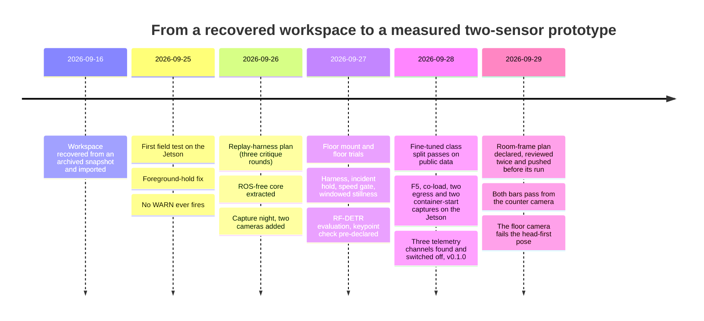

# Development log

This repository was assembled on 2026-09-27 from a private development repository. Its own git history starts fresh
(the private history contains planning material that is not published), so this log carries forward what the
private commits recorded: what changed, why, and the evidence each commit gave. The short hashes are the private
ones; they are the same hashes the field-test documents and the plan cite, and they do not resolve in this
repository; the hashes in the 2026-09-28 section, and in the test table from PR #1 on, are this repository's own and
resolve here. Commits that only touched unpublished planning documents are listed as such.

Who did what, throughout: Jeremy Gracey ran the hardware (mounting, taping, levelling, lying on the floor), made
every decision recorded in [DECISIONS.md](DECISIONS.md), and owns the results. Claude Code (Anthropic's coding
agent) wrote most of the code, tests and documents, drove the Jetson over SSH within scoped permissions, and ran
the adversarial reviews. Commits it wrote carry a `Co-Authored-By` trailer.

## Test suite over time

| After | Tests | Where the number comes from |
|---|---|---|
| import (`1f42642`) | 12 pass on a no-ROS machine; `test_synthetic_fall.py` cannot even be collected without `rclpy` | plan v4 step 1 |
| `36ca257` foreground hold | 14 pass (7 of them fail on the previous code) | commit body |
| `4613bdc` SyntheticScene | 14 pass with no `rclpy` on the path | commit body |
| `a0d7e49` DetectorCore | 25 passed, 1 skipped | commit body |
| `ca88874` replay harness | 38 passed, 1 skipped | commit body |
| `337641f` incident hold | 46 passed, 1 skipped | commit body |
| `ef87137` speed gate, per-track dt | 57 passed, 1 skipped | commit body |
| `fc73c11` windowed stillness | **70 passed, 1 skipped** | commit body; re-run in this repository |
| `6bf7127` PR #1, fine-tune branch and review fixes | 96 passed, 1 skipped | README at the merge |
| `3adcd15` PR #3, gaps branch (co-load, egress, CI, URDF) | 124 passed, 1 skipped | README at the merge; CI |
| `efc8b43` PR #4, egress re-capture | 129 passed, 1 skipped | README at the merge; CI |
| `2e6d582` version-check branch, merged as PR #5 (`6990dfe`) | **130 passed, 1 skipped** | container and Mac; CI at `6990dfe` |
| `2f39402` room-frame plan, runner and scorer | **193 passed, 1 skipped** | Mac, Python 3.10; 63 of them are the room-frame tests |

The one skip is `test_node_adapter.py`, which needs `rclpy` and runs on the Jetson or in WSL with ROS 2 Humble.

## 2026-09-16: recovery

| Commit | What | Evidence / notes |
|---|---|---|
| `1f42642` | Initial import of the ROS 2 Humble workspace (Jetson Orin Nano + RPLIDAR C1) | Recovered from an archived snapshot dated 2026-04-23. The Jetson had been re-imaged two days after that snapshot and held no copy, so the snapshot was the only surviving source. |
| `7ac3942`, `8916908` | Provenance notes | That the Jetson held no copy was verified on 2026-09-16. |
| `8f0bdaa`, `7b0875c` | Planning documents | Not published. |

## 2026-09-25: first field test

| Commit | What | Evidence / notes |
|---|---|---|
| `e105795` | Restore the `<name>` tag in three `package.xml` files | They had `<n>`; rosdep and colcon rejected the workspace. |
| `36ca257` | **Hold still foreground so a fallen person is not absorbed** | The rolling-median background (40 scans at 10 Hz) learned anything still for about 2 s, so a lying person vanished before the 4 s sustained rule could fire. Held beams (plus 2 neighbours each side) keep their background value, released after 1,200 scans (2 min) so moved furniture is still learned. The synthetic publisher was fixed to show the failure (empty room during warm-up, a real velocity spike, the body lying broadside because end-on a 2D scan sees only about 25 cm). 14 tests pass, 7 of them fail on the previous code. Verified in ROS 2 Humble (WSL): the synthetic launch emits OBSERVE then WARN (1.54 m/s spike, 0.5 s still). This was private PR #1 and is what runs on the Jetson. |
| `076354e` | Jetson bring-up scripts, bag tools, [field test](field-tests/2026-09-25-rplidar-fall-tests.md) | Lowering the sensor makes the lying body visible, but WARN never fires: stillness never exceeds 0.4 s at 3.4 to 4.9 m (centroid jitter and track re-spawns). |
| `7b705c2` | [Handoff](field-tests/HANDOFF-2026-09-26.md) and `guardian-status.sh` | 15 lessons (sensing and ops), the chunk plan, the clean-data protocol. |

## 2026-09-26: plan, refactor, capture night

| Commit | What | Evidence / notes |
|---|---|---|
| `5b394aa` | `inverted: true` in `rplidar_c1.yaml` | Later reverted (`3dc5010`): the flag reverses angle order, it does not describe orientation. |
| `3896706`, `e068abe` | Camera and capture tools (`mjpeg_server.py`, `track_sampler.py`, `scan_probe.py`, `guardian-cams-up/down.sh`, `bag_timeline.py`, `bag_frames.py`) | All ran on the Jetson that night. |
| `3ea5ebc` | [Replay-harness plan v4](plans/replay-harness-plan-v4.md) and its [open findings](plans/replay-harness-plan-v4-open-gaps.md) | Three revise/critique rounds (resolutions per round: 21, 29, 19). The loop did not converge, and the remaining findings were published with the plan instead of being hidden. |
| `4613bdc` | Plan step 1: ROS-free `SyntheticScene` | SHA-256 of the 160 seed-42 scans identical before and after the move; 14 tests collect and pass with no `rclpy`. |
| `a0d7e49` | Plan step 2: ROS-free `DetectorCore`; the node becomes a thin adapter | Test-first (collection failed on the missing module, then green). The old node and the new node were driven with the same 160 `LaserScan`s: 130 `PersonTrackArray` and 48 `FallEvent` messages, field-identical, under both the declared defaults and the YAML. 25 passed, 1 skipped. |
| `a25a4e0` ... `d922db2` | [Rig](hardware/rig-2026-09-26.md), [runbook](field-tests/RUNBOOK-2026-09-26-capture.md), [capture night](field-tests/2026-09-26-capture.md), [handoff](field-tests/HANDOFF-2026-09-27.md) | LIDAR found on its side (89.9°) after a mount rework, so Recording A is a vertical-plane dataset; Recording B, a level 121 cm plane, loses a person on the floor for 39 s with zero false alarms. |
| `f185066` | Private PR #1 merged | |
| `bcae696` | Planning document | Not published. Its two open design decisions (D0, D1) are recorded in [DECISIONS.md](DECISIONS.md). |

## 2026-09-27: floor mount, fixes, camera evaluation

| Commit | What | Evidence / notes |
|---|---|---|
| `ca88874` | Plan step 3: [offline replay harness](../tools/bag_analysis/README.md) | 38 passed, 1 skipped. Stated gap: written by an agent workflow on 09-26 whose adversarial-review results were lost with that session, so it was committed on the strength of the test suite alone. |
| `3dc5010` | Revert `inverted: true` | The C1 is upright (09-26) and then on the floor (09-27). |
| `4d7a0ec`, `ccb9f86`, `30a470d` | Floor-mount photos, jtop, [grid walk](field-tests/2026-09-27-floor-mount-grid.md) | C1 on the tile, level 0.0°; continuous tracking at six stations. |
| `1f49a34`, `c1ad13c` | [Floor trials](field-tests/2026-09-27-floor-mount-grid.md) and process lessons | Across/diagonal detected at onset, end-on missed, nothing escalates, segment C silent after one WARN. |
| `337641f` | **Hold the incident level instead of latching silent after WARN** (`fall.hold_incident`, default off) | 8 new tests; 46 passed, 1 skipped; legacy parity unchanged. Replay of `floor-trials-1` with the key on: segment C holds WARN every scan to 193 s (the get-up); every other segment identical to the legacy replay. Known limit: C's WARN came from a jitter-made spike (1.53 m/s from a 15 cm centroid jump), so a spurious WARN is now held too. |
| `53ebdda` | Capture the legacy tracker golden **before** changing the tracker | A separate commit so "captured before this change" is checkable from the log. |
| `ef87137` | Plan step 5: per-track `last_seen_s`, association speed gate, `spawn_log` (all default off) | Four seeded mutations of `tracker.py` each fail the golden; 57 passed, 1 skipped. |
| `24e4931` | Pin the golden's driver to frozen legacy configs | So a later YAML change cannot fail the golden for an unrelated reason and invite a regeneration. |
| `fc73c11` | Plan step 6: windowed displacement stillness + `STAMP_EPS` (default off) | The plan's seven scenarios alone do not catch a missing epsilon (checked by mutation), so a boundary test was added that fails if the epsilon is dropped. The `or` idiom and an unseeded spawn each fail 6 and 8 of the scenarios. 70 passed, 1 skipped. |
| `36ca654` | Execution notes | Step 4 (`min_range_m` 0.3) deferred into step 9, because replay shows it must ship with windowed stillness: without it the 6 cm camera/counter-edge track reaches a sustained WARN at 24 s under the fixed config, before anyone lies down. The default config is byte-identical to `337641f` on all 7 bags. |
| `73ec3f6` (16:38) | [RF-DETR evaluation plan](field-tests/2026-09-27-rfdetr-eval-plan.md), **committed before any model ran** | Four conditions, thresholds fixed. |
| `6460492` (17:26) | [RF-DETR results](field-tests/2026-09-27-rfdetr-results.md), scorer and figures | C1, C2 pass; C3 fails for every model size, so keypoints next (D1). An audit relabelled "inference-only" time as server processing and corrected the "frames never leave the device" subtitle. |
| `2bab653` (17:36) | [Keypoint check plan](field-tests/2026-09-27-rfdetr-keypoints-plan.md), **committed before any keypoint inference** | The run (00:44 UTC, i.e. 17:44 local) failed its own validity check 9(c): [status note](field-tests/2026-09-27-rfdetr-keypoints-status.md). |

Upstream, the same day: [roboflow/inference#3072](https://github.com/roboflow/inference/pull/3072) (open), a one-line
fix that sets `TRITON_CACHE_DIR` in the Jetson 6.2.0 image, plus a unit test; see
[DECISIONS.md, DR-12](DECISIONS.md#dr-12).

Written up after the fact: the evidence run behind `36ca654` replayed all seven bags under the legacy, fixed and
fixed + hold configs. Its `floor-trials-1` result (WARN 0.7 to 4.0 s after onset in the four visible lie-downs, none
walking or standing) and the correction it forces in DR-09 are in the
[fixed-config replay](field-tests/2026-09-27-fixed-config-replay.md).

## 2026-09-28: fine-tune on public data, device fit, and what the network captures found

Five pull requests merged and one tag (`v0.1.0` at `3adcd15`); through `6990dfe`, 53 commits, 64 files, 9,663
insertions; tests 70 → 130 (124 at the tag).
Five plans committed before their runs; two bars failed and stay in the record as written. Jeremy pushed PR #1's
22 commits himself; every later push was made from the Mac's shell on his instruction with `ALLOW_PUSH=1`
([DECISIONS.md, DR-17](DECISIONS.md#dr-17)); every `sudo` on the Jetson was his.

| Commit | What | Evidence / notes |
|---|---|---|
| `4adc303` (11:30) | [Fine-tune plan](field-tests/2026-09-28-roboflow-finetune-plan.md), **committed before any training** | Three public Universe datasets forked and versioned; rule for the model pick fixed in advance. |
| `2a505e5`, `3e99897` | [Keypoint rescore plan v2](field-tests/2026-09-28-rfdetr-keypoints-plan-v2.md), `--plan v2` path | The 09-27 run's class-id mismatch fixed by name; not yet run (needs the Mac's kp-venv). |
| `415e390`, `3b011db`, `cd5678b`, `db9b911` | Camera views bind loopback; URDF at floor level; CI, `CITATION.cff`, README table; `tools/roboflow/` time-on-floor Workflow | The Workflow ran once on the hosted API on one public image with a public model; no room frame went anywhere. |
| `d88072e` (14:11) | [Fine-tune results](field-tests/2026-09-28-roboflow-finetune-results.md): **F1 and F2 pass on public data** | `lying` 1.000 / 1.000 at the rule's threshold, 0 of 24 pose swaps, on 73 images; "not dead on arrival", not a recall estimate. DR-13 gains a measured third option. |
| `d0548f3` … `007ff1d` (14:45–14:52) | Review fix pass | Fresh-context review found 1 critical (the keypoint probe would have failed v2 for the same reason as v1) and 5 important; all fixed with tests that failed first. |
| `6bf7127` (15:39) | **PR #1 merged**, 22 commits | 96 passed, 1 skipped. |
| `9867f6c` (16:04) | [F5 device fit](field-tests/2026-09-28-roboflow-finetune-results.md) on the Jetson | `e65db0` 78.7 ms, `00ba18` 125.2 ms per frame, serial, cameras off; floor 2,799 MB with both resident. `f5_device_fit.py` crashed on macOS (`/proc/meminfo`), fixed. |
| `03c9fa4` (16:25) | **PR #2 merged** | 99 passed, 1 skipped. |
| `cec878a` (16:25) | [Close-the-gaps plan](plans/2026-09-28-close-the-gaps-plan.md), bars CL1/CL2 and EG1/EG2 fixed before the runs | |
| `5df0240`, `09e45e9`, `1f95604` | CI hardening; URDF mast under the raised rig and `state_publisher.launch.py` fixed (a bare `Command` had raised a TypeError on Humble since the first commit); yaml-read test | Each with a test that failed first. |
| `70cbf17`, `c64e724` | `scan_rate.py`; **co-load measured**: CL1, CL2 PASS | `/scan` 10.009 Hz, no gap over 0.5 s, while the GPU served 580 frames. |
| `6194090`, `413be8c`, `de2455c` | `egress_summary.py`; **egress captured: EG1 FAIL** (285,098 bytes), EG2 PASS | One 280 KB post to `api.roboflow.com` during 580 frames. First written up as the usage collector. |
| `c972d0a`, `4a8c02c` | `foxglove_bridge` and `rosbridge` on loopback by default; `rf_eval.py` versioned verbatim | The reviewer's open item and the 09-27 next step 4. |
| `32de5be` (17:14) | Review fixes: **the post is the model-monitoring pingback**, not the usage collector; `/22` LAN disclosure | Verified against the 1.7.2 source: one record per request, API key in clear, class and confidence per detection, hostname, IP, MAC, once a minute. `TELEMETRY_OPT_OUT` is inert. |
| `3adcd15` (17:25) | **PR #3 merged**, 14 commits; tag **`v0.1.0`** | 124 passed, 1 skipped. |
| `a8d7e85`, `f41c8be` | `jetson/inference-server-up.sh`: the DR-11 command versioned, `METRICS_ENABLED=False` added; [re-capture plan](field-tests/2026-09-28-egress-recapture-plan.md) before the run | Under `sudo` a literal `~` is `/root`; the key file is now resolved from `SUDO_USER`, test first. |
| `bd3e1f2` (18:48) | **Egress re-capture: EG1 PASS** at 12,987 bytes, EG2 PASS | The pingback is gone; six ~2.4 KB usage flushes remain. Prediction 4 was wrong (container leg 334 MB, not 82) and exposed that the 23:41 capture had begun 34 s into its run: correction written beside the failed EG1, not over it. The container's version check to `api.github.com` found in the same capture. |
| `b3bd929`, `efc8b43` (18:53) | `DISABLE_VERSION_CHECK=True` on the script (test first); **PR #4 merged** | 129 passed, 1 skipped. |
| `c143b5a` (19:28) | **DR-11 decision recorded**: the usage collector's aggregated record may leave, for now (Jeremy) | What that accepts, by the code: API key in clear, hashed hostname and IP, model id, counts; no per-detection field. [Version-check capture plan](field-tests/2026-09-29-version-check-capture-plan.md) before the run. |
| `6a8a8b1` (20:08) | **Container-start capture: VC1 FAIL, VC2 PASS** | No GitHub lookup (the flag works); two 0-byte TCP handshakes to `1.1.1.1:80` from the container: ultralytics' `is_online()` at import. The bar stands. |
| `c332945`, `37b2390` | `YOLO_OFFLINE=True` on the script (test first); [its capture plan](field-tests/2026-09-29-yolo-offline-capture-plan.md) | |
| `2e6d582` (21:07) | **Container-start capture with `YOLO_OFFLINE=True`: VC1, VC2 PASS** | Zero packets from the container to any non-LAN address for as long as it was watched (32.6 minutes, idle; a model pull has never been captured). 130 passed, 1 skipped. |

Not done, on purpose: no room frame, bag or field data went to Roboflow or any hosted API; no Active Learning; no
new decision record; nothing about the V-JEPA stage. Still owed on the privacy side: a capture that covers a model
pull. The device state and the ordered next steps are in [HANDOFF-2026-09-28.md](field-tests/HANDOFF-2026-09-28.md).

## 2026-09-29: the room-frame measurement

All times PDT. Hashes are this repository's own.

| Commit | What | Evidence |
|---|---|---|
| `72c25ac`, merged as PR #6 (`7174fc9`) | Documents brought to the 09-28 state; three privacy statements scoped to what was captured | 130 passed, 1 skipped; CI |
| `2875bdf`, merged as PR #7 (`6cb83fd`) | `website/`: the source of the public page, with its claims table | the pull request's description lists its checks |
| `560006a` (16:14) | [Room-frame plan](field-tests/2026-09-29-room-frames-plan.md), `jetson/rf_room_eval.py`, `tools/bag_analysis/score_room_frames.py`, tests | First review, before the commit: two blockers. A server that stopped answering still cleared R2; a partial file got a verdict. Both closed in the scorer ([record](field-tests/2026-09-29-room-frames/reviews.md)) |
| `2f39402` (16:51) | Second review applied: no proxy, no smoke mode, rows written when a session drops, summary compared with its types | 193 passed, 1 skipped; 44 seeded mutations, none survives ([script and output](field-tests/2026-09-29-room-frames/)) |
| pushed 16:51, run 16:52 | **Room frames: R1 PASS, R2 PASS, carried by the counter camera** | [results](field-tests/2026-09-29-room-frames-results.md): counter camera B 32 of 33, F 30 of 30, W 0 of 90; floor camera F 0 of 30, all read `standing`. 580 answered, no error; one run, scored once |

Not done, on purpose: no room frame went to Roboflow or any hosted API; the model under test was not retrained;
`00ba18` was not run; D1 was not decided. Not verified at the run: the container's environment (no `docker`
access without a password) and the network (no capture).

