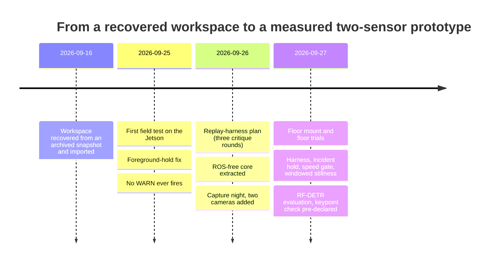

# Development log

This repository was assembled on 2026-09-27 from a private development repository. Its own git history starts fresh
(the private history contains planning material that is not published), so this log carries forward what the
private commits recorded: what changed, why, and the evidence each commit gave. The short hashes are the private
ones; they are the same hashes the field-test documents and the plan cite, and they do not resolve in this
repository. Commits that only touched unpublished planning documents are listed as such.

Who did what, throughout: Jeremy Gracey ran the hardware (mounting, taping, levelling, lying on the floor), made
every decision recorded in [DECISIONS.md](DECISIONS.md), and owns the results. Claude Code (Anthropic's coding
agent) wrote most of the code, tests and documents, drove the Jetson over SSH within scoped permissions, and ran
the adversarial reviews. Commits it wrote carry a `Co-Authored-By` trailer.

## Test suite over time

| After | Tests | Where the number comes from |
|---|---|---|
| import (`1f42642`) | 12 pass on a no-ROS machine; `test_synthetic_fall.py` cannot even be collected without `rclpy` | plan v4 step 1 |
| `36ca257` foreground hold | 14 pass (7 of them fail on the previous code) | commit body |
| `4613bdc` SyntheticScene | 14 pass with no `rclpy` on the path | commit body |
| `a0d7e49` DetectorCore | 25 passed, 1 skipped | commit body |
| `ca88874` replay harness | 38 passed, 1 skipped | commit body |
| `337641f` incident hold | 46 passed, 1 skipped | commit body |
| `ef87137` speed gate, per-track dt | 57 passed, 1 skipped | commit body |
| `fc73c11` windowed stillness | **70 passed, 1 skipped** | commit body; re-run in this repository |

The one skip is `test_node_adapter.py`, which needs `rclpy` and runs on the Jetson or in WSL with ROS 2 Humble.

## 2026-09-16: recovery

| Commit | What | Evidence / notes |
|---|---|---|
| `1f42642` | Initial import of the ROS 2 Humble workspace (Jetson Orin Nano + RPLIDAR C1) | Recovered from an archived snapshot dated 2026-04-23. The Jetson had been re-imaged two days after that snapshot and held no copy, so the snapshot was the only surviving source. |
| `7ac3942`, `8916908` | Provenance notes | That the Jetson held no copy was verified on 2026-09-16. |
| `8f0bdaa`, `7b0875c` | Planning documents | Not published. |

## 2026-09-25: first field test

| Commit | What | Evidence / notes |
|---|---|---|
| `e105795` | Restore the `<name>` tag in three `package.xml` files | They had `<n>`; rosdep and colcon rejected the workspace. |
| `36ca257` | **Hold still foreground so a fallen person is not absorbed** | The rolling-median background (40 scans at 10 Hz) learned anything still for about 2 s, so a lying person vanished before the 4 s sustained rule could fire. Held beams (plus 2 neighbours each side) keep their background value, released after 1,200 scans (2 min) so moved furniture is still learned. The synthetic publisher was fixed to show the failure (empty room during warm-up, a real velocity spike, the body lying broadside because end-on a 2D scan sees only about 25 cm). 14 tests pass, 7 of them fail on the previous code. Verified in ROS 2 Humble (WSL): the synthetic launch emits OBSERVE then WARN (1.54 m/s spike, 0.5 s still). This was PR #1 and is what runs on the Jetson. |
| `076354e` | Jetson bring-up scripts, bag tools, [field test](field-tests/2026-09-25-rplidar-fall-tests.md) | Lowering the sensor makes the lying body visible, but WARN never fires: stillness never exceeds 0.4 s at 3.4 to 4.9 m (centroid jitter and track re-spawns). |
| `7b705c2` | [Handoff](field-tests/HANDOFF-2026-09-26.md) and `guardian-status.sh` | 15 lessons (sensing and ops), the chunk plan, the clean-data protocol. |

## 2026-09-26: plan, refactor, capture night

| Commit | What | Evidence / notes |
|---|---|---|
| `5b394aa` | `inverted: true` in `rplidar_c1.yaml` | Later reverted (`3dc5010`): the flag reverses angle order, it does not describe orientation. |
| `3896706`, `e068abe` | Camera and capture tools (`mjpeg_server.py`, `track_sampler.py`, `scan_probe.py`, `guardian-cams-up/down.sh`, `bag_timeline.py`, `bag_frames.py`) | All ran on the Jetson that night. |
| `3ea5ebc` | [Replay-harness plan v4](plans/replay-harness-plan-v4.md) and its [open findings](plans/replay-harness-plan-v4-open-gaps.md) | Three revise/critique rounds (resolutions per round: 21, 29, 19). The loop did not converge, and the remaining findings were published with the plan instead of being hidden. |
| `4613bdc` | Plan step 1: ROS-free `SyntheticScene` | SHA-256 of the 160 seed-42 scans identical before and after the move; 14 tests collect and pass with no `rclpy`. |
| `a0d7e49` | Plan step 2: ROS-free `DetectorCore`; the node becomes a thin adapter | Test-first (collection failed on the missing module, then green). The old node and the new node were driven with the same 160 `LaserScan`s: 130 `PersonTrackArray` and 48 `FallEvent` messages, field-identical, under both the declared defaults and the YAML. 25 passed, 1 skipped. |
| `a25a4e0` ... `d922db2` | [Rig](hardware/rig-2026-09-26.md), [runbook](field-tests/RUNBOOK-2026-09-26-capture.md), [capture night](field-tests/2026-09-26-capture.md), [handoff](field-tests/HANDOFF-2026-09-27.md) | LIDAR found on its side (89.9°) after a mount rework, so Recording A is a vertical-plane dataset; Recording B, a level 121 cm plane, loses a person on the floor for 39 s with zero false alarms. |
| `f185066` | PR #1 merged | |
| `bcae696` | Planning document | Not published. Its two open design decisions (D0, D1) are recorded in [DECISIONS.md](DECISIONS.md). |

## 2026-09-27: floor mount, fixes, camera evaluation

| Commit | What | Evidence / notes |
|---|---|---|
| `ca88874` | Plan step 3: [offline replay harness](../tools/bag_analysis/README.md) | 38 passed, 1 skipped. Stated gap: written by an agent workflow on 09-26 whose adversarial-review results were lost with that session, so it was committed on the strength of the test suite alone. |
| `3dc5010` | Revert `inverted: true` | The C1 is upright (09-26) and then on the floor (09-27). |
| `4d7a0ec`, `ccb9f86`, `30a470d` | Floor-mount photos, jtop, [grid walk](field-tests/2026-09-27-floor-mount-grid.md) | C1 on the tile, level 0.0°; continuous tracking at six stations. |
| `1f49a34`, `c1ad13c` | [Floor trials](field-tests/2026-09-27-floor-mount-grid.md) and process lessons | Across/diagonal detected at onset, end-on missed, nothing escalates, segment C silent after one WARN. |
| `337641f` | **Hold the incident level instead of latching silent after WARN** (`fall.hold_incident`, default off) | 8 new tests; 46 passed, 1 skipped; legacy parity unchanged. Replay of `floor-trials-1` with the key on: segment C holds WARN every scan to 193 s (the get-up); every other segment identical to the legacy replay. Known limit: C's WARN came from a jitter-made spike (1.53 m/s from a 15 cm centroid jump), so a spurious WARN is now held too. |
| `53ebdda` | Capture the legacy tracker golden **before** changing the tracker | A separate commit so "captured before this change" is checkable from the log. |
| `ef87137` | Plan step 5: per-track `last_seen_s`, association speed gate, `spawn_log` (all default off) | Four seeded mutations of `tracker.py` each fail the golden; 57 passed, 1 skipped. |
| `24e4931` | Pin the golden's driver to frozen legacy configs | So a later YAML change cannot fail the golden for an unrelated reason and invite a regeneration. |
| `fc73c11` | Plan step 6: windowed displacement stillness + `STAMP_EPS` (default off) | The plan's seven scenarios alone do not catch a missing epsilon (checked by mutation), so a boundary test was added that fails if the epsilon is dropped. The `or` idiom and an unseeded spawn each fail 6 and 8 of the scenarios. 70 passed, 1 skipped. |
| `36ca654` | Execution notes | Step 4 (`min_range_m` 0.3) deferred into step 9, because replay shows it must ship with windowed stillness: without it the 6 cm camera/counter-edge track reaches a sustained WARN at 24 s under the fixed config, before anyone lies down. The default config is byte-identical to `337641f` on all 7 bags. |
| `73ec3f6` (16:38) | [RF-DETR evaluation plan](field-tests/2026-09-27-rfdetr-eval-plan.md), **committed before any model ran** | Four conditions, thresholds fixed. |
| `6460492` (17:26) | [RF-DETR results](field-tests/2026-09-27-rfdetr-results.md), scorer and figures | C1, C2 pass; C3 fails for every model size, so keypoints next (D1). An audit relabelled "inference-only" time as server processing and corrected the "frames never leave the device" subtitle. |
| `2bab653` (17:36) | [Keypoint check plan](field-tests/2026-09-27-rfdetr-keypoints-plan.md), **committed before any keypoint inference** | The run (00:44 UTC, i.e. 17:44 local) failed its own validity check 9(c): [status note](field-tests/2026-09-27-rfdetr-keypoints-status.md). |

Upstream, the same day: [roboflow/inference#3072](https://github.com/roboflow/inference/pull/3072) (open), one line that
sets `TRITON_CACHE_DIR` in the Jetson 6.2.0 image; see [DECISIONS.md, DR-12](DECISIONS.md#dr-12).

Written up after the fact: the evidence run behind `36ca654` replayed all seven bags under the legacy, fixed and
fixed + hold configs. Its `floor-trials-1` result (WARN 0.7 to 4.0 s after onset in the four visible lie-downs, none
walking or standing) and the correction it forces in DR-09 are in the
[fixed-config replay](field-tests/2026-09-27-fixed-config-replay.md).
