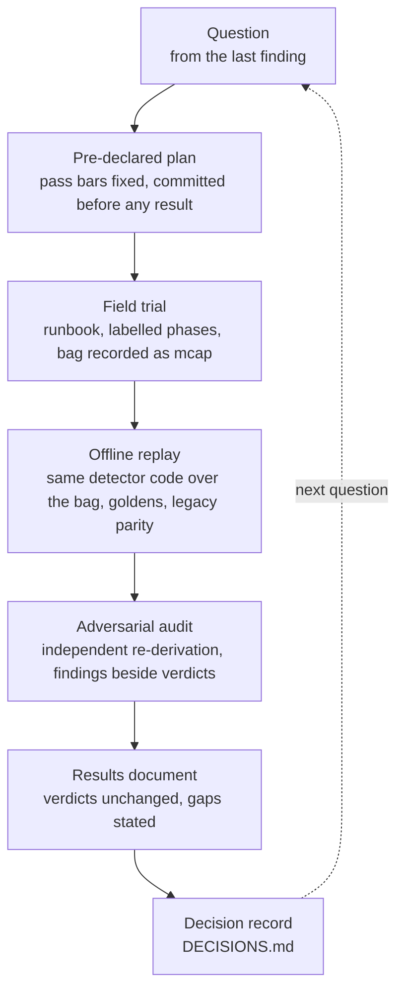

# How the work is done

This project is run like an experiment: say in advance what would count as success, collect data under a written
protocol, analyse it with code that can be re-run, have the analysis attacked, and write down what failed. Each
practice below links to a real instance in this repository.



## 1. Pre-declare the pass bar

A plan with its conditions and thresholds is committed before the first result exists. After the results, thresholds
do not move and segments are not redefined; if a definition turns out to be wrong, that is written next to the
unchanged verdict, and any rerun gets a new plan.

- RF-DETR detection: [plan](field-tests/2026-09-27-rfdetr-eval-plan.md) committed at 16:38, [results](field-tests/2026-09-27-rfdetr-results.md)
  at 17:26. Condition C3 failed for every model size and is reported as a failure; its consequence (keypoints are
  needed) was written into the plan before the run.
- RF-DETR keypoints: [plan](field-tests/2026-09-27-rfdetr-keypoints-plan.md) committed at 17:36, the run at 17:44. The run
  failed the plan's own validity check 9(c), so nothing was scored and no informal score was substituted
  ([status](field-tests/2026-09-27-rfdetr-keypoints-status.md)).
- Replay harness: every bar (the OBSERVE alignment tolerance, the R4 and R5 bars, the flip rules for two options) is
  fixed in [plan v4](plans/replay-harness-plan-v4.md) before the data it applies to is replayed.

Integer bars are written as integers (">= 90 %" of 33 frames is 30/33, compared as `10·hits >= 9·n`) so that rounding
cannot decide a verdict ([`score_rfdetr.py`](../tools/bag_analysis/score_rfdetr.py)).

## 2. Collect data under a runbook

Field sessions follow a written runbook: positions and heights measured with a tape and a digital angle gauge, the
detector restarted on an empty room, the recorder started first, labels typed per phase, and a one-screen health check
before and after ([runbook](field-tests/RUNBOOK-2026-09-26-capture.md), [rig](hardware/rig-2026-09-26.md),
[`jetson/guardian-status.sh`](../jetson/guardian-status.sh)). When a session goes wrong, the failure becomes a lesson
with a fix: labels failed twice, so the label window is now tested before the bag starts
([handoff 09-27, lesson 8](field-tests/HANDOFF-2026-09-27.md)); the LIDAR rotated 90° unnoticed, so it is now gauged in
two directions after every touch (lesson 1).

## 3. Replay, don't re-run

The detector's per-scan logic is one ROS-free class that the node and the replay harness share
([DR-04](DECISIONS.md#dr-04)). A fix is developed test-first against recorded bags on a laptop, with no ROS and no
Jetson:

- **Goldens captured before the change they guard**, in their own commit, so "captured before" can be checked
  ([`test/golden/tracker_legacy_scenes.json`](../src/prevera_perception/test/golden/tracker_legacy_scenes.json)).
- **Legacy parity**: every new option defaults to the old behaviour, and tests prove the default path is unchanged
  ([DR-06](DECISIONS.md#dr-06)).
- **Mutation checks on the tests themselves**: four seeded mutations of the tracker each fail the golden; the plan's
  seven stillness scenarios did not catch a missing epsilon, so a boundary test was added that does
  ([development log](DEVELOPMENT-LOG.md)).
- **The device's constraints are enforced, not remembered**: the suite fails on anything other than Python 3.10 and
  numpy 1.x ([`test_python_floor.py`](../src/prevera_perception/test/test_python_floor.py), [DR-05](DECISIONS.md#dr-05)).

## 4. Attack the analysis

Plans and results go through adversarial review: a separate pass that re-derives the numbers from the raw files and
tries to break the claims. Its findings are written beside the verdicts, and a finding that invalidates a label or a
claim is acted on:

- The RF-DETR audit found that "inference-only" time included decode and pre/post-processing (relabelled "server
  processing"), that `first_call_s` was a warm load and not a cold start, that the W boxes were legs only, and that "frames
  never leave the device" was false as written. None changed a verdict; all are in the
  [results, section 6](field-tests/2026-09-27-rfdetr-results.md).
- Plan v4 went through three revise/critique rounds. They did not converge, so the remaining findings were published
  with the plan instead of being smoothed over ([open findings](plans/replay-harness-plan-v4-open-gaps.md)).

## 5. State the gaps

Every results document ends with what is not known. Examples: the RF-DETR runner (`rf_eval.py`) is not in the
repository; active learning and telemetry being off is reported, not verified; one subject, one room, one session;
frames within a segment are near-duplicates, so each segment is closer to one trial than to thirty
([results, section 7](field-tests/2026-09-27-rfdetr-results.md)). The same goes for this publication: what was
excluded or redacted is stated at the top of each redacted document.

## 6. Govern the tools, including the AI

The code and most documents were written with Claude Code as a collaborator. Its authority is limited by structure,
not by instructions it could talk itself out of ([DR-17](DECISIONS.md#dr-17)):

- It may SSH to the Jetson, where a sudoers drop-in allows only service control, clocks, power-mode query and
  shutdown. Physical steps and every other `sudo` line are Jeremy's.
- Pushing is blocked by a `pre-push` hook unless `ALLOW_PUSH=1` is set for that one command. Install it in a fresh
  clone with:

  ```bash
  cp tools/git-hooks/pre-push .git/hooks/pre-push && chmod +x .git/hooks/pre-push
  ```

- Commits it authored carry a `Co-Authored-By` trailer. Decisions are Jeremy's and are recorded as such.

## 7. Where the evidence lives

| Kind | Location |
|---|---|
| Field protocols and results | [`docs/field-tests/`](field-tests/) |
| Rig, heights, angles, photos | [`docs/hardware/`](hardware/) |
| Implementation plans and their open findings | [`docs/plans/`](plans/) |
| Decisions | [`docs/DECISIONS.md`](DECISIONS.md) |
| Commit-by-commit evidence | [`docs/DEVELOPMENT-LOG.md`](DEVELOPMENT-LOG.md) |
| Analysis code | [`tools/bag_analysis/`](../tools/bag_analysis/) |
| Tests | [`src/prevera_perception/test/`](../src/prevera_perception/test/) |

Raw bags, the 580 extracted frames and model results files are not published. Where a document quotes them, it names
the script that produced the number, so the analysis can be re-run on new recordings.
