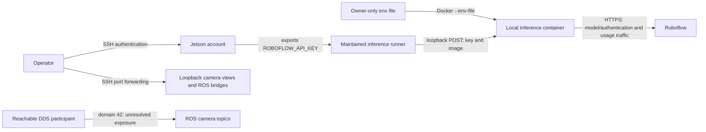

# Access and credential boundaries

This prototype has no application login, user database, session cookie, JWT issuer or refresh-token flow.
Access depends on the Jetson's host permissions, SSH, network reachability and the Roboflow API key used by
camera inference. The LIDAR detector does not need that key. This document describes the repository's controls;
it does not establish the configuration of a running device or guarantee that data cannot leave it.

The transport and env-file checks described below are source changes. They must be deployed and checked on the
Jetson before being treated as device behavior. The historical captures linked below cover their recorded
container versions, settings and time windows; they do not validate these new client changes.

## Components and request flow

| Component | Access boundary | Credentials and data |
|---|---|---|
| SSH and the Jetson account | The device's SSH server, account permissions and sudo policy | SSH credentials and host keys are configured outside this repository. The actual password/key policy cannot be inferred from these scripts. |
| MJPEG views and camera page, ports 8081–8083 | Loopback by default; operator can expose them with `GUARDIAN_BIND` | No application authentication. Camera images are available to a client that can reach the listener. |
| Foxglove and rosbridge, ports 8765 and 9090 | Loopback by default; same `GUARDIAN_BIND` override | No application authentication in the repository's launch commands. These expose ROS data to reachable clients. |
| ROS 2 / DDS, domain 42 | Network participation in the ROS graph | No DDS authentication configuration is supplied here. A domain number is not a credential. |
| Maintained inference runners | Literal loopback HTTP(S) origin enforced by the shared transport | `ROBOFLOW_API_KEY` and a base64 image are sent in each inference request body. |
| Roboflow Inference container, port 9001 | Published at `127.0.0.1:9001`; Roboflow handles model authentication | Docker loads the key from an env file. The server can contact Roboflow for model/authentication and usage accounting. |
| GitHub Actions | Workflow token restricted to `contents: read` | The test workflow does not inject a Roboflow key. It runs the ROS-free suite and file checks. |



The maintained clients are [`rf_room_eval.py`](../jetson/rf_room_eval.py), which records room-frame predictions,
and [`f5_device_fit.py`](../jetson/f5_device_fit.py), which measures latency and memory. They query local server
metadata and POST JSON to `/infer/object_detection`; each inference body includes `model_id`, `api_key`,
`confidence`, `disable_active_learning: true` and the image. There is no separate application access token or
refresh step. The server's own authentication and model access are supplied by Roboflow, not implemented here.

## Host, camera and ROS access

[`guardian-cams-up.sh`](../jetson/guardian-cams-up.sh) and
[`guardian-up.sh`](../jetson/guardian-up.sh) default to `127.0.0.1`. An SSH tunnel lets an operator reach those
listeners through the existing host login, for example:

```sh
ssh -L 8081:127.0.0.1:8081 -L 8082:127.0.0.1:8082 -L 8083:127.0.0.1:8083 jetson
```

The operator's SSH configuration supplies the `jetson` host alias. Bridge access can use the same pattern for
ports 8765 and 9090. The tunnel protects that connection; it does not add an application login to the service.
Other local processes on the device can still reach loopback listeners. Setting `GUARDIAN_BIND=0.0.0.0`
deliberately exposes the camera views or bridges on the LAN without adding authentication.

The camera nodes still publish into ROS domain 42. A participant that can join the DDS graph can subscribe to
camera topics even when the HTTP/WebSocket listeners are loopback-only. DDS security or a coordinated
`ROS_LOCALHOST_ONLY=1` deployment remains an unresolved choice; the latter would also interrupt off-device
tools that need live topics. See [architecture, ports and exposure](ARCHITECTURE.md#7-ports-and-exposure).

[DR-17](DECISIONS.md#dr-17) records a scoped sudo policy for the development agent. The sudoers file, SSH keys,
server configuration and account provisioning are not managed by these source files. Docker administration is
privileged on the documented device; the inference launcher is an operator-run restart, not a harmless status check.

## Inference destination and error handling

[`inference_http.py`](../jetson/inference_http.py) supplies the transport for both maintained runners:

- The default remains `http://127.0.0.1:9001`.
- Overrides accept only `http` or `https` with a literal loopback address: IPv4 `127.0.0.0/8` or IPv6 `::1`.
  For example, `http://[::1]:9001` is valid. DNS names, including `localhost`, are rejected.
- A valid alternate port is allowed for local test servers. An origin may have no path or a single `/`;
  user information, query strings, fragments and other paths are rejected.
- Environment proxy settings are bypassed. Redirects are rejected, including redirects to another loopback
  URL, so a server cannot redirect a credential-bearing request to a second destination.
- Error reporting retains status/error categories but suppresses server response bodies and reason text.
  Tests use a fake key to check error-output handling; the key is not intentionally included in result files.

These checks constrain the clients' outbound requests. They do not constrain the container's outbound traffic,
authenticate the local process listening on the selected port, or protect against a compromised host. Default
local HTTP carries the key and image without TLS inside the host; anyone able to inspect relevant process
memory, Docker metadata or local traffic may obtain them. Selecting HTTPS requires a local server with a
certificate accepted by the client's normal TLS verification; this change does not configure that server.

[`rf_eval.py`](../jetson/rf_eval.py) is a deliberately preserved copy of the runner used for the 2026-09-27
experiment. It is historical evidence and does not use the new transport. The SDK examples in
[`tools/roboflow/README.md`](../tools/roboflow/README.md) are also outside this shared transport; their hosted
example is for public inputs. Do not infer the maintained clients' guarantees for either path.

## Key storage, use and rotation

[`jetson/roboflow.env.example`](../jetson/roboflow.env.example) contains a placeholder only. For a new device,
create `~/.roboflow.env` from that template as the account that will invoke the launcher, replace the placeholder
using a local editor, and set mode `0600`. Do not overwrite an existing key file when copying the example. The
real file belongs outside the checkout; do not paste its contents into commands, logs, issues or commits.

```sh
chmod 600 "$HOME/.roboflow.env"
```

[`inference-server-up.sh`](../jetson/inference-server-up.sh) resolves the default file from the invoking user's
home (`SUDO_USER` when called through sudo), with `GUARDIAN_ENV_FILE` as an explicit path override. Before any
Docker command, it requires a readable regular file, rejects symlinks, checks invoking-user ownership and an
owner read bit, and rejects every group/other permission bit. `0600` is the recommended mode; owner-only `0400`
also satisfies the checks. A failure leaves the existing container and the file permissions unchanged and
reports a reason without printing the file's contents. This checks file access, not the validity or scope of
the API key stored inside it.

Docker receives the file through `--env-file`, so the key value is not a command-line argument. The runners
read `ROBOFLOW_API_KEY` from their process environment and stop if it is empty. When exporting it from the env
file, use a trusted local file in a short-lived shell with command tracing disabled; sourcing a shell file
executes its contents. Unset the variable or close that shell when finished. File permission checks in the
launcher do not check a separately supplied runner environment.

The key remains available to the relevant process and container; this is not a secret vault. Privileged users
and Docker administrators can inspect container environment values. Avoid unfiltered `docker inspect`, shell
tracing, debug dumps and publishing raw packet captures. The launcher's normal settings report filters its
output to named non-secret settings, but that does not restrict a separate administrator command.

Rotation is an operator task; no automatic expiry, refresh or revocation logic is implemented here. Create a
replacement credential through the Roboflow account, update the private env file while retaining ownership and
mode, recreate the container, and start fresh runner processes with the new environment. Check an authorized
local inference request, then revoke the old credential. For a suspected exposure, revoke the compromised
credential promptly and accept interruption while replacing it. Editing the file alone does not change a
running container or an already-exported runner environment. Never restore a revoked key during rollback.

## Accepted egress and evidence limits

[DR-11](DECISIONS.md#dr-11) records the decision to allow Roboflow's aggregated usage accounting for now. In the
examined Inference 1.7.2 code and captures, requests caused roughly 2.4 KB of accounting traffic about every
10 seconds to `api.roboflow.com`: the API key, hashed hostname/IP, model and frame-count information, without
per-detection fields or images. The key is an unhashed field inside the HTTPS payload. References to a key
"in clear" in the historical documents describe the application payload, not an unencrypted Internet connection.

The launcher disables active learning, the model-monitoring pingback, the release-version check and the
ultralytics online probe using the settings recorded in DR-11. `TELEMETRY_OPT_OUT=True` was inert in the examined
server version. Those switches do not disable the accepted usage-accounting path.

The [egress re-capture summary](field-tests/2026-09-28-roboflow/egress-recapture-e65db0.json) and
[results](field-tests/2026-09-28-roboflow-finetune-results.md) distinguish the first capture's missed initial
frames, the corrected 580-frame capture and the later idle-container tests. They support observations during
those windows, not continuous monitoring. A model pull has not been captured. Raw captures can include local
plaintext request/response payloads and are not public security artifacts. A server/image update or a new
workload needs fresh evidence; the launcher currently selects an image tagged `latest`.

## Staged device update and rollback

This source change does not restart or update the running Jetson. An operator can stage deployment as follows:

1. Record the current client/launcher revisions and running container image ID. Keep a known working copy of
   the scripts and image for rollback. Stage the new files separately from active device files.
2. Copy `inference_http.py` beside **both** `rf_room_eval.py` and `f5_device_fit.py`; copying a runner alone now
   leaves its shared import missing. Stage the launcher too. Confirm the private env file's owner and mode
   without printing it, then run the local transport, runner and launcher tests with fake credentials before
   using a real key. The launcher has no dry-run switch: a successful preflight proceeds to container replacement.
3. In an operator-controlled window, install the staged files and run the launcher. Check its filtered settings,
   the loopback binding and `/info`. An invalid env file must fail before Docker; a valid file does not guarantee
   that Docker startup will succeed after the previous container is removed.
4. Run an authorized local inference smoke test with an appropriate non-sensitive fixture. `f5_device_fit.py`
   supports `--limit N`, but still performs its first call and three warm-ups; use a fresh `--out` path.
   `rf_room_eval.py` has no smoke mode and its full manifest is required for a room-evaluation verdict. Check
   request success, output errors and the LIDAR's health; do not treat smoke output as evaluation evidence.
5. If deployment fails, stop new runs, restore the saved scripts, and recreate the container using the recorded
   image ID and launch settings. The launcher has no automated rollback; rerunning a saved launcher that selects
   `latest` does not ensure the old image is used. Keep a valid current key and owner-only permissions. Restoring
   older clients also restores their earlier transport behavior; record that limitation and repeat health/binding
   checks before further use.

The regression suite verifies synthetic local behavior, not the live SSH policy, a Roboflow account's key
permissions, DDS isolation or device egress. The existing [test workflow](../.github/workflows/tests.yml) has
read-only repository token permissions; it does not prove access or write permissions for any other GitHub repo.
