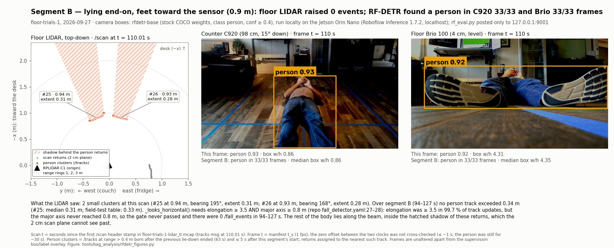
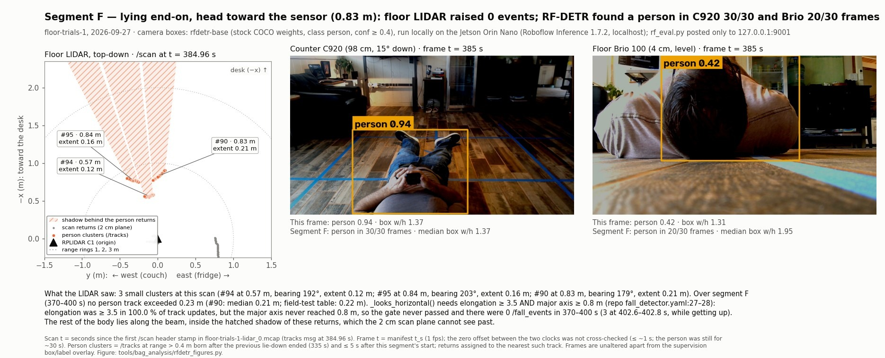
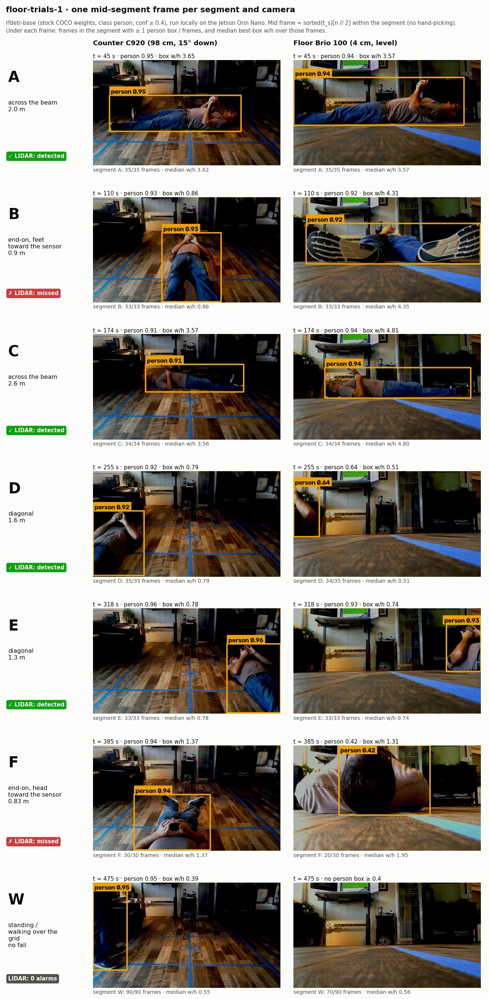

# RF-DETR on the floor-trials-1 frames: results

Companion to the pre-declared plan [`2026-09-27-rfdetr-eval-plan.md`](2026-09-27-rfdetr-eval-plan.md), committed in
`73ec3f6` before any model was run. The plan's four conditions and thresholds are used here unchanged. No segment was
redefined and no threshold was moved after the results came in. Where the audit found a problem with a verdict, the
problem is written next to the verdict. No verdict was flipped.

**Sources for every number below.** The raw results are `results-rfdetr-{nano,base,medium}.json`, written by
`rf_eval.py` on the Jetson in `/opt/nvme/frames/floor-trials-1/`. The Mac copies in
`~/src/local/prevera-frames/floor-trials-1/` are md5-identical. The verdicts come from
`tools/bag_analysis/score_rfdetr.py`, which uses only the standard library, only reads the results files, and
recomputes everything from the raw `frames[].persons[]` boxes. The figures come from
`tools/bag_analysis/rfdetr_figures.py`. The LIDAR numbers come from `floor-trials-1-lidar_0.mcap` and
[`2026-09-27-floor-mount-grid.md`](2026-09-27-floor-mount-grid.md). Jetson times are UTC. The three runs took place
from 23:55 to 00:00 UTC, which is 16:55 to 17:00 PDT on 2026-09-27.

## 1. Answer

Yes. On the counter C920, all three stock COCO RF-DETR sizes (nano, base, medium) ran locally on the Orin Nano. Each
put a `person` box at confidence ≥ 0.4 on every frame of the two end-on lie-downs that the floor LIDAR missed: B
(33/33) and F (30/30). All three detected the standing or walking person in 90/90 W frames.

Conditions 1 and 2 pass for every model. Condition 3 fails for every model. On the counter camera, the median box is
taller than wide for the lying segments B, D and E (0.78 to 0.87). The plan declared in advance what that means: box
shape alone cannot carry D1, and keypoints are needed.

Cost, measured next to the running LIDAR driver and fall detector:
- Nano: 107.9 ms median serial round trip, 9.3 fps.
- Base and medium: 126.9 ms median serial round trip, 7.9 fps.
- Lowest `MemAvailable` seen: 2584 MB, during the medium run with two models resident.

This is a feasibility result, not a recall estimate. It covers one subject, one room and one session. The 1 fps
frames within each segment are near-duplicates, so each segment on each camera is closer to one trial than to 30.

## 2. Setup

```
580 JPEGs (1 fps, 1280x720) + manifest.json            /opt/nvme/frames/floor-trials-1/
        │  base64 JSON, one request at a time, 3 untimed warm-ups first
        ▼
rf_eval.py <model> 0.4 ──POST──► 127.0.0.1:9001 /infer/object_detection
        │                        Roboflow Inference 1.7.2 (jetson-6.2.0 image), uvicorn, 1 worker
        │                        stock COCO RF-DETR: rfdetr-nano | rfdetr-base | rfdetr-medium
        ▼
results-<model>.json ──► score_rfdetr.py (Mac, stdlib, read-only) ──► verdicts below
        (jtop + /proc/meminfo sampled every 0.5 s during the run)

running alongside, not restarted: sllidar_node (RPLIDAR C1, 10 Hz) + fall_detector + foxglove_bridge + rosbridge
```

| Part | What was used | Evidence |
|---|---|---|
| Device | Jetson Orin Nano 8 GB developer kit ("Super"), L4T R36.4.7, reported as JetPack 6.2.1 | `/proc/device-tree/model`, `/etc/nv_tegra_release` |
| Server | Roboflow Inference **1.7.2**, image `roboflow/roboflow-inference-server-jetson-6.2.0`, listening on **127.0.0.1:9001** only | `GET /info` returns `"version":"1.7.2"`; `ss -ltn` shows `127.0.0.1:9001` |
| Models | `rfdetr-nano`, `rfdetr-base` (alias `coco/36`, 560×560 input), `rfdetr-medium` (alias `coco/40`, 576×576 input). Stock COCO weights, no fine-tuning, class `person`, confidence 0.4 | `GET /model/registry` after the runs. Nano had already been evicted, so its alias and input size were not read and are not guessed here |
| Client | `rf_eval.py`: serial, one frame per request. Latency is timed around the HTTP call only; the base64 body is built before the timer starts. Keeps `class == "person"` | [`jetson/rf_eval.py`](../../jetson/rf_eval.py), a verbatim copy committed on 2026-09-28 (until then on the Jetson only; gap, section 7) |
| Scorer | `score_rfdetr.py --lidar rfdetr-nano=39/43 --lidar rfdetr-base=47/46` | this commit |

**Two environment fixes made RF-DETR run on this image.** The operator (the session that launched the container)
reported both. The container's environment could not be read from the evaluation account: the docker socket gave
permission denied, and the server process runs as root. So this doc records what was reported and the traces the
fixes left on disk.

1. **`TRITON_HOME` / `TRITON_CACHE_DIR` pointed at the writable cache volume.** The documented `--read-only` run
   command leaves Triton's kernel cache under `/root`, which is read-only in that command.
   Trace: `/opt/nvme/inference-cache/triton/cache/` exists, holds 6 compiled-kernel entries, and was created at
   23:48:39 UTC. The current server process started at about 23:48 UTC (from `ps` elapsed time). The model cache
   directories `coco/{3,36,38,40}` are dated 23:42 to 23:43 UTC, so they came from an earlier container start.
2. **`MAX_ACTIVE_MODELS=2`,** set after a `CUBLAS_STATUS_ALLOC_FAILED`.
   Trace: after three models were run in order nano, base, medium, the registry holds exactly two (base and medium).
   Nano, the first loaded, has been evicted. That is what a cap of 2 would produce.

**Active learning and telemetry.** The operator reported both as disabled in the container environment. That
**is not verified**, and one trace points the other way:
- The container environment could not be read.
- `rf_eval.py` does not send `disable_active_learning` in the request body. The audit's reading of the 1.7.2 source is
  that the default is `False`.
- The usage database `/opt/nvme/inference-cache/cache/usage.db` was last written at 00:00:42 UTC, 18 s after the last
  results file (00:00:24). So the usage collector was active in some form.
- No network egress capture exists.

What is verified:
- `rf_eval.py` posted only to `http://127.0.0.1:9001` (`rf_eval.py:19`).
- The server listens only on loopback.
- None of the three scripts run here (`rf_eval.py`, `score_rfdetr.py`, `rfdetr_figures.py`) uploads anything. What
  the server itself did with the frames is the open question above.

Inferred, not observed: the model weights were downloaded from Roboflow with the account's API key. The request body
carries the key, and the registry and cache hold the `coco/*` weights.

The plan's line "Frames never leave the device" is wrong as written. The frames were copied to the Mac for scoring and
figures, and the LIDAR-only mcap is on the Mac Studio (full bags are also backed up to the OMEN;
`2026-09-27-floor-mount-grid.md:94-96`). The accurate statement is: *inference ran on the Jetson,
and the client sent frames only to localhost.* The figure subtitles were corrected to say this (section 4). The plan
is left as committed.

**LIDAR stack during the runs.**
- `sllidar_node` and `fall_detector` started at 23:51:34 UTC (`~/guardian-logs/perception.log`), about 3 min before
  the nano run.
- The runner checked `~/guardian-status.sh` before and after each model: driver 1, detector 1, foxglove :8765 and
  rosbridge :9090 listening, `/dev/rplidar` present. The `/scan` counts are in section 5.
- Cameras were stopped. The last line of `~/guardian-logs/camera.log` is `usb_cam` shutting down at 22:55:01 UTC, and
  no camera process was running when checked after the runs (about 00:20 UTC). Both of these are after the fact; no process list was taken
  during the run.

## 3. The four conditions

Verdicts are exactly as `score_rfdetr.py` computes them against the plan. "≥ 90 %" is compared in whole numbers
(`10·hits ≥ 9·n`), so B needs 30/33, F needs 27/30, and W needs 81/90. The scorer re-applied conf ≥ 0.4 and dropped
0 boxes. Its per-segment rates agree with the runner's `summary.per_segment` for all three models.

| Condition (plan) | rfdetr-nano | rfdetr-base | rfdetr-medium | Beside the verdict (audit) |
|---|---|---|---|---|
| **C1** person in ≥ 90 % of B and of F frames, on at least one camera | **PASS** | **PASS** | **PASS** | The C920 alone carries F for every model. The floor Brio alone would fail F for nano (26/30) and base (20/30). |
| **C2** person in ≥ 90 % of W frames, counter camera | **PASS** 90/90 | **PASS** 90/90 | **PASS** 90/90 | All 90 W/C920 boxes touch the top edge of the frame (median box 238×466 px on base): **hips and legs only**. This passes as a detection, but it is not a view of a standing person. |
| **C3** counter-camera median box w/h > 1.0 in every lying segment A to F, and < 1.0 in W | **FAIL** (B, D, E) | **FAIL** (B, D, E) | **FAIL** (B, D, E) | The W half passes because the frame cuts off the top of the person, not because of posture. D and E fail with the body cut by the frame's side edge. |
| **C4** latency and minimum `MemAvailable` next to the LIDAR stack | reported | reported | reported | No pass bar. See section 5. |

### C1: coverage of the LIDAR blind spot

| Segment / camera | nano | base | medium |
|---|---|---|---|
| B / C920 (counter) | 33/33 | 33/33 | 33/33 |
| B / Brio (floor) | 33/33 | 33/33 | 33/33 |
| F / C920 (counter) | 30/30 | 30/30 | 30/30 |
| F / Brio (floor) | **26/30** (86.7 %) | **20/30** (66.7 %) | 30/30 |

The plan says "on at least one camera". That can be read per segment, or as one camera covering both B and F. The C920
is 100 % on both B and F for every model, so both readings give the same verdict.

**F/Brio misses.**
- Nano misses t = 372, 379, 381, 394 s.
- Base misses t = 370, 371, 374, 375, 376, 377, 382, 383, 386, 397 s.
- Medium misses none.

The misses are interleaved with hits on near-identical frames. Median F/Brio confidence is 0.59, 0.46 and 0.60 (the
lowest hit is 0.47, 0.41 and 0.48), just above the 0.4 threshold. The F/Brio boxes touch the top edge of the frame in every hit for nano
(26/26) and base (20/20), and in 29 of 30 for medium: the head is close to a camera 4 cm off the floor. These are real misses of a visible head and shoulders; F-372s-brio
is one that nano misses. The plan names only "stock COCO RF-DETR". Choosing medium because it happens to score 30/30
here would be picking the model after seeing the results, so all three sizes are reported.

### C2: detection when nobody is down

W/C920 is 90/90 for every model, with best-box confidence at least 0.78. The audit's qualification stands: from 98 cm
at 15° down, the C920 never shows a standing person's torso or head in W. Every box starts at the top row of pixels.

For reference only (not a condition), W/Brio is 70/90 for every model. The 20 misses are t = 440 to 447 s and 464 to
475 s, the same frames for all three sizes. Four of them (440, 444, 447, 468) were checked by eye and show an empty
room, so the person had left the floor camera's view.

### C3: shape separates lying from standing (counter camera)

Median best-box w/h on the C920 is judged. Brio values are shown for reference only. The two numbers in brackets are
the frames on the wrong side of 1.0, then the frames with no box.

| Seg | Want | nano C920 | base C920 | medium C920 | Brio (n / b / m) |
|---|---|---|---|---|---|
| A | > 1 | 3.61 PASS (0, 0) | 3.62 PASS (1, 0) | 3.65 PASS (0, 0) | 3.71 / 3.57 / 3.74 |
| B | > 1 | **0.85 FAIL** (33, 0) | **0.86 FAIL** (33, 0) | **0.87 FAIL** (33, 0) | 4.33 / 4.35 / 4.27 |
| C | > 1 | 3.59 PASS (0, 0) | 3.56 PASS (0, 0) | 3.54 PASS (0, 0) | 4.76 / 4.80 / 4.77 |
| D | > 1 | **0.78 FAIL** (35, 0) | **0.79 FAIL** (34, 0) | **0.79 FAIL** (35, 0) | 0.52 / 0.51 / 0.52 |
| E | > 1 | **0.78 FAIL** (33, 0) | **0.78 FAIL** (33, 0) | **0.78 FAIL** (33, 0) | 0.75 / 0.74 / 0.74 |
| F | > 1 | 1.36 PASS (0, 0) | 1.37 PASS (0, 0) | 1.36 PASS (0, 0) | 1.95 / 1.95 / 1.96 |
| W | < 1 | 0.55 PASS (0, 0) | 0.55 PASS (0, 0) | 0.54 PASS (0, 0) | 0.58 / 0.55 / 0.58 |

The plan puts the bar on the median, so the scorer had to define what a failing frame is. A frame fails when its
best-box aspect is on the wrong side of 1.0 or it has no box. In the failing segments, every frame fails except one:
base D-238s-C920 has aspect 1.03. In the passing segments there is one failing frame: base A-028s-C920 has aspect
exactly 1.00. The scorer prints the full frame lists.

**Reading the failure.**
- The medians move by at most 0.02 across nano, base and medium, so the failure follows the view, not the model size.
- **B:** from 98 cm at 15° down, a body lying end-on with its feet toward the counter is foreshortened into a box of
  about 403×470 px. The box reaches the bottom of the frame (y = 712 to 715 of 720).
- **D and E:** the body is cut by the frame's side edge. All 35/35 D/C920 boxes touch the left edge, and all 33/33
  E/C920 boxes touch the right edge. The floor Brio also gives tall boxes for D (0.51) and E (0.74), and its boxes touch
  the same edges: every D/Brio box touches the left edge and every E/Brio box the right edge.
- **W:** the pass comes from the frame cutting the person off at the top (see C2).

The plan's pre-declared consequence applies: **box shape alone cannot carry D1; keypoints are needed.**

## 4. Figures

All three figures use rfdetr-base boxes at conf ≥ 0.4, drawn with `supervision` 0.30.5. Apart from the box overlay,
the frames are unaltered. The figures were regenerated for this commit with the subtitle "rf_eval.py posted only to
127.0.0.1:9001", which replaces "frames never left the device". They are JPG, not PNG: as PNG, the two blind-spot
figures were about 820 KB each, over the 600 KB limit. The script tries PNG first and falls back to JPG (quality 90 for
the blind-spot figures, 85 for the grid).

### Segment B: end-on, feet toward the sensor, t = 110 s



**What the LIDAR saw.** At this scan the floor LIDAR sees two sole clusters: #25 at 0.94 m, bearing 195°, 0.31 m wide,
and #26 at 0.93 m, bearing 168°, 0.28 m wide. Over the segment (94 to 127 s):
- No person track exceeds 0.34 m.
- `_looks_horizontal()` needs elongation ≥ 3.5 **and** a major axis ≥ 0.8 m (`src/prevera_bringup/config/fall_detector.yaml:27-28`). Elongation
  passed on 99.7 % of track updates, but the major axis never did.
- There are 0 `/fall_events`.

The body lies inside the hatched shadow behind the soles, which a 2 cm scan plane cannot see past.

**What RF-DETR saw.** RF-DETR-base finds the person on the C920 (0.93, box w/h 0.86) and on the Brio (0.92, w/h 4.31),
in 33/33 frames on each camera.

### Segment F: end-on, head toward the sensor, t = 385 s



**What the LIDAR saw.** At this scan there are three small clusters: #94 at 0.57 m (0.12 m wide), #95 at 0.84 m
(0.16 m) and #90 at 0.83 m (0.21 m). Over 370 to 400 s:
- No person track exceeds 0.23 m.
- Elongation is ≥ 3.5 on 100 % of track updates, but the major axis never reaches 0.8 m.
- There are 0 `/fall_events`. The only 3 events come at 402.6 to 402.8 s, while the person gets up.

**What RF-DETR saw.** RF-DETR-base finds the person on the C920 at 0.94 (30/30 segment frames). On the Brio, this frame
only just clears the threshold at 0.42, and the Brio detects the person in 20/30 segment frames.

### All segments: one frame per segment and camera



Rows are segments A to F and W. Columns are the counter C920 and the floor Brio. Each cell is the middle frame of its
segment (`sorted(t_s)[n // 2]`, not hand-picked). Each row is labelled with segment, pose, distance and LIDAR outcome.
Each cell shows that segment's detection count and median box w/h. The W Brio middle frame (475 s) has no box and is
shown as it is.

The sheet computes its medians from the runner's 2-decimal `best_aspect_wh` (`rfdetr_figures.py:110`). The scorer uses
the raw width/height. That is why W/Brio reads 0.56 on the sheet and 0.55 in the C3 table; the runner's summary gives
0.555.

## 5. Cost on the device (C4, report only)

| Model | Client latency median / p90 (ms) | Server processing median (ms) | Serial fps | `first_call_s` | `MemAvailable` before run → min (MB) | GPU max % (single 0.5 s sample) | `/scan` msgs per ~5 s, before → after |
|---|---|---|---|---|---|---|---|
| rfdetr-nano | 107.9 / 114.6 | 88.4 | 9.3 | 2.4 | 3109 → 2866 | 99.3 | 39 → 43 |
| rfdetr-base | 126.9 / 131.2 | 109.1 | 7.9 | 1.8 | 2916 → 2910 | 99.6 | 47 → 46 |
| rfdetr-medium | 126.9 / 132.7 | 109.1 | 7.9 | 1.3 | 2992 → 2584 | 99.5 | not relayed |

What each column measures, and what it does not:

- **Client latency** is the HTTP round trip from `rf_eval.py` on the same device. It covers the request, the server,
  and parsing the JSON response. It does not include reading the JPEG or base64-encoding it. `fps_serial` is
  1000 / median latency, one request in flight at a time. This is not a throughput benchmark.
- **Server processing** is the median of the response's `time` field. In 1.7.2 that field spans request decode, image
  decode, resize, forward pass and postprocess (audit, `inference/core/models/base.py`). It is **not** the forward pass
  alone. The scorer's column was relabelled from "inference-only" in this commit. Client minus server has a median of
  19.4, 18.0 and 17.9 ms, so HTTP and JSON account for about 14 to 18 % of the round trip. Nano is 20.7 ms faster
  server-side than base and medium. Base and medium have the same medians but different p90s, and only 21/580 frames
  have identical box lists. They are different models whose medians happen to match.
- **`first_call_s`** is the first request, timed before the 3 warm-ups. The weights were already on local disk (the
  cache directories are dated 23:42 to 23:43 UTC), and base was probably already resident when its run started. These
  are warm loads from the local cache, **not cold-start costs**.
- **Memory.** `MemAvailable` comes from `/proc/meminfo`, which on the Orin's unified memory includes GPU allocations. It
  was read once before each run and every 0.5 s during it. The before-run baseline drifted from 3109 to 2916 to
  2992 MB as models built up in one server process that could not be restarted. So "before minus minimum" is **not** a
  per-model cost; base shows only 6 MB. Only the minimum is usable, as an absolute floor: **2584 MB**, during the medium
  run with two models resident and the cameras stopped. The camera capture load of a production setup was absent. The
  server's own accounting is not usable: the registry reports `vram_bytes = -42614784` for base.
- **GPU max** is the maximum single jtop sample, so it says nothing about average use.
- **`/scan` counts** were taken by `guardian-status.sh` before and after each model, not during the run. The nominal
  count is 50 per 5 s (10 Hz). The earlier healthy readings were 41 to 47 idle (`2026-09-27-floor-mount-grid.md:12`)
  and 47 with cameras up (`:83`). Nano's 39 was taken **before** any inference, so it is measurement jitter, not load.
  Medium's before and after counts were cut off in the runner output passed to the scorer. They are reported as not
  relayed. No fresh reading was substituted.
- **Not measured:** whether inference disturbs `/scan` or the fall detector while it runs. No bag was recorded during
  the runs, and the detector was not exercised under the co-load. The claim "inference does not disturb the LIDAR
  stack" is open.

For D0 (fusion inside a Workflow or in ROS), the number to carry forward is a round trip of about 108 to 127 ms per
frame, of which 18 to 19 ms is HTTP and JSON, with about 2.6 GB of headroom left. That covers only this measurement:
serial, one camera stream, and cameras off.

## 6. What the audit found, and what held

An independent audit read the results files, the Inference 1.7.2 source, the server registry and the frames. Its
findings, and how each is handled above:

| Finding | Severity | Handling |
|---|---|---|
| "Server inference" time includes decode, preprocessing and postprocessing | invalidates the label | Relabelled "server processing" in the scorer and in this doc |
| `first_call_s` is not a cold start | invalidates that use | Reported as a warm load from the local cache |
| W's median < 1 is not evidence of posture: W/C920 boxes are legs only, cut at the top of the frame | invalidates that reading | Written beside C2 and C3. Verdicts unchanged |
| `/scan` counts bracket each run; nothing was sampled during it | qualifies C4 | Stated. Co-load effect listed as not measured |
| `MemAvailable` before minus minimum is not a per-model cost | qualifies C4 | Only the 2584 MB minimum is carried forward |
| Frames within a segment are near-duplicates (box-centre SD ≤ 6.6 px; frame-to-frame pixel change 0.3 to 0.6 out of 255) | qualifies all rates | Rates are presented as a feasibility check on 6 poses, not recall |
| F/Brio is fragile (26, 20 and 30 of 30), and picking medium for that would be post-hoc selection | qualifies C1 (Brio) | All three sizes reported. C1 rests on the C920 |
| "Frames never leave the device" is false as written | qualifies the plan and figures | Figure subtitles corrected. Plan left as committed. Correct wording in section 2 |
| D and E: the body is partly outside both cameras' views | qualifies "detected" in D and E | Edge-touch counts written beside C3 |

**What held.**
- Every rate recomputed from the raw boxes matches the runner's `per_segment` for all three models.
- Re-applying conf ≥ 0.4 dropped 0 boxes.
- No finding changes a verdict: C1 PASS, C2 PASS and C3 FAIL, for all three sizes.
- The B and F LIDAR misses are confirmed from the bag (0 `/fall_events` in both windows; major axis never ≥ 0.8 m).
- The C920 detections in B and F are high confidence: minimum best-box confidence 0.84 in B and 0.90 in F across all
  models.

## 7. Gaps and next steps

**Gaps (stated, not fixed):**
- **Sample:** one subject, one room, one lighting setup, one session. The poses were staged, often while holding a
  phone.
- **Model:** stock COCO RF-DETR (nano, base, medium) only. No fine-tuning, no keypoints, no other architecture.
- **Sampling:** about 1 fps extracted frames. Frames within a segment are consecutive seconds of a person holding
  still, so they are **not independent samples**. Treat each segment on each camera as roughly one trial.
- **Pass bar:** the ≥ 90 % bar is a feasibility gate. With n = 30 to 35 correlated frames, it is not a recall estimate
  with a confidence interval.
- **Privacy:** it is not verified that active learning and telemetry were off. `rf_eval.py` does not pass
  `disable_active_learning`, `usage.db` was written after the last run, and there is no egress capture.
- **Code and co-load:** `rf_eval.py` was on the Jetson only until 2026-09-28, when a verbatim copy entered the repo
  as [`jetson/rf_eval.py`](../../jetson/rf_eval.py). The LIDAR co-load effect was not measured during these runs (no
  bag); it was measured on 2026-09-28 for a fine-tuned model ([fine-tune results, section 5](2026-09-28-roboflow-finetune-results.md)).
  Medium's `/scan` counts were not relayed.
- **Clocks:** the zero of the frames' `t_s` was not cross-checked against the scan stamps. Each lie-down was held still
  for about 30 s, so an offset of 1 s or less does not change a figure.

**Next steps:**
1. **D1: keypoints.** Condition 3 failed as the plan anticipated. Next is stock RF-DETR person keypoints on the same
   580 frames, with the same pre-declare-then-run discipline and a torso-angle criterion written before the run. The
   counter camera needs a view that includes the full body in D, E and W, or the criterion has to cope with truncated
   bodies.
2. **D0: fusion inside a Roboflow Workflow.** Run the same frames through a Workflow with the LIDAR state as a
   `WorkflowParameter`. Measure that round trip against the 108 to 127 ms direct-call baseline above, with a bag
   recording `/scan` and `/fall_events` during the run so the co-load question gets an answer.
3. **Close the privacy gap structurally.** Set `disable_active_learning: true` in the request, record the container's
   `docker run` environment in the repo, and capture egress for one run.
4. **Commit `rf_eval.py`** alongside the scorer so the runner is versioned too. Done 2026-09-28: `jetson/rf_eval.py`.

## Reproduce

```bash
# Verdicts, tables and every failing frame (Mac; standard library only; reads the results files only)
python3 tools/bag_analysis/score_rfdetr.py --lidar rfdetr-nano=39/43 --lidar rfdetr-base=47/46

# Figures (throwaway venv; see the script docstring for the uv install line)
<venv>/bin/python tools/bag_analysis/rfdetr_figures.py --model rfdetr-base

# Runner (Jetson; the key is sourced into the environment and never printed; jetson/rf_eval.py is the versioned copy)
ssh <user>@<jetson-ip> 'set -a; . ~/.roboflow.env; set +a; python3 /opt/nvme/frames/rf_eval.py rfdetr-base 0.4'
```

---

## Publication note

Published 2026-09-27 from the private development repository. Host names, LAN addresses, local paths, account
names and references to unpublished planning documents were replaced (for example `<jetson-ip>`); measurements,
tables and findings are unchanged. Commit hashes, branch names and PR numbers refer to the private history and do
not resolve here. Decision labels such as D0 and D1 are defined in [`docs/DECISIONS.md`](../DECISIONS.md). Line
numbers cited into this document from other documents refer to it as published: this note sits at the end so
they hold. The three figures in `2026-09-27-rfdetr/` were re-encoded once for publication (JPEG quality 92, metadata stripped), so their byte sizes differ from what section 4 states; the pixel content is otherwise the figure script's output.
