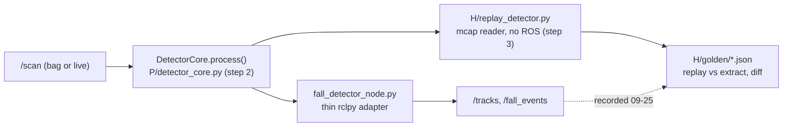
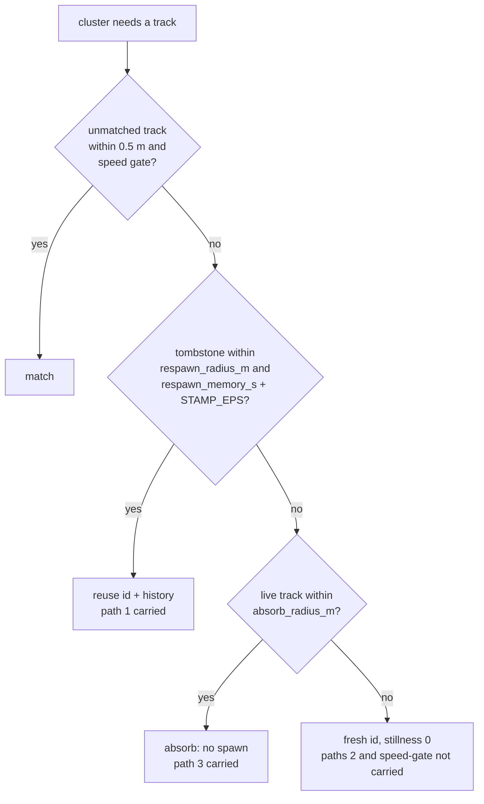

# Implementation plan v4: offline replay harness + detector fixes (HANDOFF chunks 1-2)

Repo: the private development repository (published as `prevera-guardian-lidar`; every path below is repo-relative). **Target branch: `feat/replay-harness`.** Verified on this Mac 2026-09-26 (round 3):

- `feat/replay-harness` HEAD is **`3896706`** (`tools(jetson): MJPEG server for the camera topic`, adds only `jetson/mjpeg_server.py`) = `5b394aa` (`src/prevera_bringup/config/rplidar_c1.yaml:6` -> `inverted: true`) on top of `fix/background-absorption` `7b705c2`. A commit landed on the target branch between round 1 and round 2, so: **`git fetch origin && git status` before every commit**, and re-read this header's shas before starting.
- `git merge-base --is-ancestor 36ca257 feat/replay-harness` -> yes. `git diff --stat 36ca257 feat/replay-harness -- src/` = `rplidar_c1.yaml | 2 +-` only (re-run this round); `git diff --stat 36ca257 feat/replay-harness -- src/prevera_perception src/prevera_msgs` is **empty**: the perception code and messages on the target branch are byte-for-byte what produced the 09-25 bags (deployed commit `36ca257`, PR #1 OPEN). `fall_detector.yaml` is identical on `feat/replay-harness`, `<docs-branch>` and `36ca257`. `tools/bag_analysis/{empty_beams,fall_timeline,scan_sector}.py` and `jetson/*.sh` exist on the target branch (added in `076354e`), so the `H` directory below already exists.
- `<docs-branch>` HEAD is **`fcbc5ec`** (round 3: `git log --oneline <docs-branch>` shows `fcbc5ec`, `8fc35a4`, `6950bfa`, ...; `git rev-list --count bcae696..<docs-branch>` = **9** docs commits above `bcae696`; v3 said `6950bfa` / seven, which was stale). Merge-base with the target branch is still `7b705c2`. It carries `docs/hardware/rig-2026-09-26.md`, which does **not** exist on `feat/replay-harness` (`git ls-tree -r --name-only feat/replay-harness -- docs/` lists only `docs/field-tests/{2026-09-25-rplidar-fall-tests.md,HANDOFF-2026-09-26.md}`). Every rig-doc citation below is "`docs/hardware/rig-2026-09-26.md` on `<docs-branch>`"; the file is byte-identical at `6950bfa` and `fcbc5ec` (`git show <rev>:docs/hardware/rig-2026-09-26.md | md5` = `feaadeadf5c7c30e2c8703088961eba5` for both, this round), so the cited lines (`:35`, `:51`, `:103`, `:113-114`) are anchored to `fcbc5ec`.
- `~/.venv-prevera310` **does not exist yet** on this Mac (`ls -d ~/.venv-prevera310` -> "No such file or directory", this round). Every "verified on the pinned venv" statement in this plan was run in an equivalent scratch venv (a local scratch venv: Python 3.10.21, numpy 1.26.4, scikit-learn 1.7.2, mcap 1.5.0, pytest 9.1.1). Step 0 creates the real one; nothing else in the plan runs before it.

Paths are relative to the repo root. `P = src/prevera_perception/prevera_perception`, `T = src/prevera_perception/test`, `Y = src/prevera_bringup/config/fall_detector.yaml`, `H = tools/bag_analysis`, `N = P/fall_detector_node.py`, `L = H/params/2026-09-25-live.yaml` (the 20-key legacy snapshot, step 3). Simulation scripts cited as `scratch-<name>/<file>` were local, unversioned simulations (directories `scratch-planrev`, `scratch-critic1`, `scratch-critic2`, `scratch-round2`, `scratch-round3`; not in this repository); Appendix D lists the round-2 verified outputs and Appendix E the round-3 ones.



## 0. Chosen approach and what was rejected

Skeleton = **risk-first**: one code path for legacy and fixed behaviour; every new config knob has a `0`/`False` = legacy value so the same `Tracker`/`DetectorCore` reproduces the 09-25 bags and, with the yaml flipped, runs the fixes; the harness has `--legacy`; the first OMEN command is the mcap schema check; spawn diagnostics and the recorded `/tracks` id-transition analysis decide carry scope by a **pre-declared rule** (step 7), not after seeing data.

Grafted from testability-first: `synthetic_scene.py` extraction (all 14 existing tests collect on a no-ROS Mac), mcap fixture writer + self-consistency test, `warm_start` detection, golden JSON + `diff` verb, `transitions` analysis of recorded `/tracks`. From minimal-refactor: spike-path deadlock analysis and the alignment-window reading of "exactly".

Rejected, with reason (full history in `scratch-round3/harness-plan-v4-full.md` section 0; the reasons that still bind are restated where they apply):
- minimal-refactor `velocity_window: 30` (count-based, changes legacy output) -> time-based `spike_memory_s`, `0 = legacy`, own commit (step 8).
- anchor state machine, hypothesis tests, string `stillness_mode`, auto-generated `declare_parameter` loop, "resurrect the whole Track": rejected for scope/typing/testability; explicit `Tombstone`, numeric knobs, explicit declares + parity test instead.
- `still_since_s = still_since_s or history[0].t`: wrong at stamp 0.0 (2.8 s instead of 2.9 s, `scratch-planrev/step6_sim.py` F) -> `if still_since_s is None`.
- v1 `test_resets_after_long_gap_without_eviction` and the 0.2 m jitter disc: contradict the algorithm (straddling sample keeps coverage; max pairwise 0.318 m > D) -> gap-credit semantics (Appendix A), 0.10 m jitter radius.
- (round 2) beam-6/beam-8 overrides on every scan (never-foreground beam; 260 all-NaN `nanmedian` warnings, `scratch-critic1/sim_a_fixture.py`) -> override set v3; "person WARN >= 12.4 s" (legacy fires at 9.0 s via the spike path, `N:209-211`) -> spike-path expectation; "fixing" `missed_scans == 1` on spawn (changes legacy eviction timing, `scratch-round2/tracker_checks.py`) -> kept and asserted; absorption by DBSCAN label order (fragment first claims the track) -> size-ordered association gated on `absorb_radius_m > 0`.
- (round 3) exact float literals on stamp-derived values (`46*0.1 = 4.6000000000000005`, `97*0.1-40*0.1 = 5.700000000000001`, `29*0.1 = 2.9000000000000004`, `39*0.1 = 3.9000000000000004`, `39*0.1-21*0.1 = 1.8000000000000003`, `scratch-critic2/step5_config_check.py`; the round-2 sims rounded before comparing, `scratch-critic1/sim_b_stillness.py:85`, `scratch-round2/sim_step7_core.py:79-81`) -> the test float rule (section 1), never rounding in the tracker.
- (round 3) tombstone "inclusive" with bare `>`/`<=`: false under header stamps (`5.9 - 2.9 = 3.0000000000000004`, `scratch-critic2/stamp_reconstruction.py`) -> `STAMP_EPS` (section 1; 78/78 checks under both stamp sources, Appendix E).
- (round 3) `--spawn-diagnostics` via tracker hooks in step 3 (`Tracker` exposes only `.tracks`, `P/tracker.py:49-51`; `_spawn_track` records nothing, `:85-98`; step 3 forbids `src/` edits) -> harness-side observation in step 3, `Tracker.spawn_log` from step 5.
- (round 3) the near-arc fixture variant as the step-2 golden (shifts DBSCAN label order: ids person 1 / near arc 2 / line 3, three WARNs, `scratch-round3/sim_near_arc.py`) -> harness-verb tests only; the golden stays on override set v3 with exactly 2 WARNs.

Convention for every new config field: **defaults = legacy** (`0`/`False`). Consequences: (a) the Jetson node is unchanged until the yaml commit (step 9) deploys; (b) the 4-keyword constructors at `T/test_tracker.py:10-15` and `T/test_synthetic_fall.py:16` keep legacy semantics; (c) the step-2 golden equivalence test stays valid through steps 4-8 without edits; (d) every harness test in `T/test_replay_harness.py` passes `--params L` (the legacy snapshot) explicitly and never relies on `Y`, so steps 4 and 9 cannot silently change its expectations.

## 1. Definitions used everywhere

- **stamp_s** = `header.stamp.sec + nanosec*1e-9` (`N:143`). Never mcap log time (`H/fall_timeline.py:14` uses log time; do not copy). Golden JSON stores `stamp_ns = sec*10**9 + nanosec` as int. **Two stamp sources exist and differ by up to 4.4e-16 s** (`scratch-critic2/stamp_reconstruction.py`: 55 of 160 fixture scans differ between `i*0.1` and `sec + nanosec*1e-9`): core-driven tests use `i*0.1`; the mcap fixture, the node and the harness use the header reconstruction. Every algorithm comparison that can straddle a boundary uses `STAMP_EPS` (below); every test expectation uses the test float rule (below). The legacy fixture output is identical under both sources (WARN scans 80 and 90, 46 OBSERVE; same script).
- **`STAMP_EPS = 1e-6`** (seconds; module constant in `P/tracker.py`, introduced in step 6, **not** a declared parameter, so the yaml-parity test expects no key for it). It is used in exactly four comparisons and nowhere else: (1) tombstone prune `stamp_s - tomb.last_seen_s > respawn_memory_s + STAMP_EPS` (step 7); (2) tombstone reuse `stamp_s - tomb.last_seen_s <= respawn_memory_s + STAMP_EPS` (step 7); (3) window pop `history[1].t <= t - W + STAMP_EPS` (step 6); (4) window coverage `(t - history[0].t) >= W - STAMP_EPS` (step 6). It is **not** applied to the `evaluate` thresholds (`N:209,213`), to legacy stillness accrual (`:113`), to `dt_track <= 0`, to the association gate or to the speed gate. With the defaults (`still_window_s = 0`, `respawn_memory_s = 0`) none of the four branches executes, so the step-2 golden is unaffected. No real pair of stamps is within 1e-6 s. Verified under both stamp sources: `scratch-round3/sim_eps_semantics.py`, 78/78 OK (Appendix E).
- **Test float rule (round 3, uniform, no judgement calls)**: in every test of steps 5-8, a `stillness_s`, `age_s`, `still_since_s`, stamp or stamp-difference expectation is written `assert value == pytest.approx(expected, abs=1e-9)` with `expected` the decimal literal (e.g. `4.6`, `5.7`, `2.9`, `3.9`, `1.8`, `1.5`, `4.0`); a speed or `peak_recent_velocity` expectation is `pytest.approx(expected, rel=1e-6)` (float32 centroids, `T/test_tracker.py:20`: `0.4/0.1 -> 3.999999761581421`, `0.3/0.6 -> 0.49999991059303284`, `0.3/0.1 -> 2.999999523162842`); a confidence is `pytest.approx(expected, abs=1e-6)`; ints, ids, list contents, `missed_scans` and booleans are exact. **Never round inside the tracker**: `stillness_s` is published as `stillness_duration_s` (`N:240`) and rounding would change the wire value. The `stamp in [a, b]` window assertions on the fixture stay as they are (they are platform windows, not float tolerances).
- **Settle window** = `background.warmup_scans + background.window_size` = 70 scans = 7.0 s at 10 Hz; harness default `--settle-s 7.0`. Stated bound: this covers warm-up plus one full median window, but **held-beam state has `max_hold_scans` memory** (`P/background.py:72-74`, `Y:12` = 1200 scans = 120 s), so a live node that was holding beams at record start can differ from a cold replay for up to 120 s. The 7 s window is the pre-declared evaluation window regardless; residuals beyond it are attributed via the `divergence` verb, never used to move the window.
- **Evaluation window end `t_end` (round 3, pre-declared for every bag, no run-time choice)**: `sanity` computes `death_gap_t_end_s` = the header stamp of the last `/scan` **before the first inter-scan gap > 5.0 s**; if no such gap exists it equals the last `/scan` header stamp. `replay`, `extract`, `diff` and `divergence` all take `--end-s <header-stamp-relative seconds>` and ignore everything after it; step 3b passes `--end-s` = `death_gap_t_end_s` from `sanity` for **all three bags** (for the fall-test bags it is expected to equal the last `/scan` stamp; for the session bag it implements "last `/scan` before the death gap", field notes :12, without anyone choosing "~18 min" by hand). The value is written in the run log next to the `sanity` output before any `diff` runs.
- **Float rule**: every published float is `float32` on the wire (`FallEvent.msg:15-22`, `PersonTrack.msg:10-12`; verified: a written `confidence: 0.3` decodes as `0.30000001192092896`, `scratch-planrev/mcap_roundtrip.py`). The harness casts every float it serializes through `float(np.float32(v))` in **both** `replay` and `extract`; `diff` compares `stamp_ns`, `track_id`, `level` exactly and floats with `math.isclose(a, b, rel_tol=1e-6, abs_tol=1e-4)`. **Core dataclass rule (round 2)**: `cluster_points` -> `_build_cluster` computes the centroid as the mean of float32 points (`P/clustering.py:56`; verified dtype `float32`, `scratch-round2/sim_fixture_v3.py`), so `track.centroid[i]` is `np.float32` and `json.dumps` of it raises `TypeError: Object of type float32 is not JSON serializable` (verified). Today's node casts at `N:182,236`. Therefore **every float field of `Event` is built with `float(...)` in the core** (`x`, `y`, `confidence`, `major_axis_m`, `elongation`, `stillness_s`, `peak_recent_velocity`), and `test_event_fields_are_python_floats` (step 2) asserts `type(v) is float` for each.
- **Elongation rule**: `Event.elongation = float(min(track.elongation, 1e6))` is computed **in the core** (today the clamp is in the node at `N:239` while `P/clustering.py:33-35` yields `inf` for `minor_axis_m < 1e-3`). The node writes `float(ev.elongation)`. `PersonTrack.elongation_ratio` stays raw (`N:187`, `inf` is a valid float32). Any harness serialization of a track elongation also clamps to `1e6`; all JSON is written with `json.dumps(..., allow_nan=False)` so an `inf`/`nan` leak fails loudly.
- **"Reproduce exactly" (chunk-1 gate, R2)** — pre-declared, per bag, evaluated over `[t0 + 7.0 s, t_end]` where `t0` = first `/scan` header stamp and `t_end` = `death_gap_t_end_s` (above):
  - HARD: multiset of WARN events on `(stamp_ns, level=2)` replayed == recorded. Both sides are 0 on 09-25 (field notes :13-14); the log says "vacuous", not "passed".
  - **OBSERVE pass bar** (the only non-vacuous chunk-1 evidence): align each recorded OBSERVE (level 1) to an unmatched replayed OBSERVE greedily in time order when `|Δstamp| <= 0.15 s` and `||Δlocation|| <= 0.10 m`. With `N_rec` recorded OBSERVE events in the window: PASS iff `missed <= max(1, ceil(0.10 * N_rec))` AND `extra <= max(2, ceil(0.10 * N_rec))`. Reported per bag as PASS/FAIL with the numbers; no other tolerance may be introduced after the run.
  - **Precondition**: post-settle, `/tracks` header stamps == `/scan` header stamps for >= 99 % of scans (one `PersonTrackArray` per scan, `N:146`). Only the `/scan` subscription is best-effort (`N:60-62`, `SENSOR_DATA`); `/tracks` and `/fall_events` publishers are reliable depth 10 (`N:63-64`). The unknown is the recorder's `/scan` subscription QoS (HANDOFF:66 says best-effort for `/scan` subscribers), so recorder and node may have dropped different scans; the precondition quantifies that.
  - **Extraction-bug detector (R3)** (decides blocking): the `divergence` verb compares, per scan, the replayed track set with the recorded `/tracks` message (`count`, centroids within 0.02 m, `horizontal_extent_m` within 0.02 m, `elongation_ratio` equal when both are non-finite (`N:187` publishes raw `inf`) else within `rel_tol=1e-3`, `age_s` within 0.05 s, `is_still` equal). A scan where the track sets are equal but the OBSERVE/NONE decision differs for some track is classified per track:
    - **`boundary_band`** (round 3, informational, never blocks): either side's `horizontal_extent_m` satisfies `|extent - fall.major_axis_m| <= 0.02` **or** either side's finite `elongation_ratio` satisfies `|elongation - fall.elongation_ratio| <= 2e-3 * fall.elongation_ratio` (thresholds read from the loaded config, not literals; `0.8` and `3.5` under `L`). Reason: the decision at `N:221-223` is a hard threshold and the "same track" tolerances are wider than its sensitivity (`0.79` vs `0.805`, `3.497` vs `3.5003` are "same" yet straddle it); the half-widths cover every straddling pair (Appendix E arithmetic). Counted as `boundary_band_diff_events`.
    - **`warn_level_diff`** (informational): the two sides differ only at level >= 2 (`stillness_s` / `peak_recent_velocity` are not in `PersonTrack.msg`, so this detector cannot adjudicate WARN paths; on the 09-25 bags there are 0 WARN so this class is empty by construction).
    - **`same_tracks_diff_events`**: everything else — same inputs, same tracks, values away from every threshold, different OBSERVE/NONE output. **`same_tracks_diff_events > 0` blocks steps 4-9** (bug in `detector_core`/harness). Why this is sound on the 09-25 bags: they contain 0 WARN, so `_already_alerted` is empty and `evaluate` decides OBSERVE vs NONE from `elongation`/`major_axis_m` alone (`N:218-224`), both of which are in `PersonTrack.msg:10-11`. A FAIL of the OBSERVE bar with `same_tracks_diff_events == 0` is reported as FAIL with the first-divergence scan and cause (warm-up occupancy / held beams / dropped scans / platform / boundary band) and does **not** block; the chunk-1 claim is then "bounded", written as such. This is consistent with section 6's platform-jitter gap: platform jitter lands in `boundary_band`, never in the blocking class.
  - Track ids remapped by first co-occurrence (`--id-mode bijection`; live node had a running counter, `P/tracker.py:46`).
  - `warm_start`: true when any `/tracks` message exists within the first `warmup_scans` (30) scans of the bag (live node already warm: `jetson/guardian-up.sh:4,10` + crontab `@reboot`, HANDOFF:78). `warmup_occupied`: true when any recorded `/tracks` message in the first 70 scans contains a track with centroid range > 0.4 m (the `H/fall_timeline.py:22-23` "person-like" rule). Warm-up feeds unmasked scans (`N:132-134`), so with `warmup_occupied` the replay bakes that person into its background for the run (HANDOFF:58, lesson 4); the log states it and strict equality is not claimed for that bag. Strict equality is only claimed on `warm_start == false` bags. **On the standard fixture (override set v3) these flags are `warm_start == False` (first `/tracks` at scan index 30) and `warmup_occupied == True` (the person enters at 3.5 s, range 2.6 m, inside the first 70 scans) by construction** (`scratch-round3/sim_near_arc.py`); the `False` case of `warmup_occupied` is tested on a scripted-`/tracks` fixture (step 3).
- **Python floor (enforced, round 2; provenance corrected round 3)**: Jetson runs Python 3.10 with apt numpy/sklearn from jammy: `jetson/09-ros2-humble.sh:12` adds the jammy ROS repo and `:18` installs `python3-sklearn` and `python3-pytest` directly; **numpy reaches the Jetson as the Debian dependency of apt `python3-sklearn`** (`:18`). `src/prevera_perception/package.xml:18-19` declares the rosdep keys `python3-numpy`/`python3-sklearn`, but the script never runs `rosdep install` (`:32` runs only `sudo -u <user> rosdep update || true`), so those keys document the dependency without installing it. Jammy ships **`python3-sklearn 0.23.2-5ubuntu6` and `python3-numpy 1:1.21.5-1ubuntu22.04.1`** (packages.ubuntu.com/jammy, fetched this round); the exact Jetson versions still arrive from the OMEN and are pinned then (decision taken). This Mac's `~/.venv` is Python 3.14 with numpy 2.x. **All Mac checks run in `~/.venv-prevera310`** (Python 3.10, numpy < 2), created in step 0. Structural guards, all in `T/test_python_floor.py` (step 2): `test_python_is_310` asserts `sys.version_info[:2] == (3, 10)` unless `PREVERA_ALLOW_OTHER_PY=1`; `test_numpy_major_version_is_1` asserts `numpy.__version__.split('.')[0] == '1'` unless `PREVERA_ALLOW_NUMPY2=1`; `test_sklearn_version_recorded` (round 3) asserts `tuple(int(x) for x in sklearn.__version__.split('.')[:2]) >= (0, 23)` and prints `SKLEARN_VERSION=<v> NUMPY_VERSION=<v> PYTHON=<v>` so every run log carries the triple; `test_language_floor` walks every `*.py` under `P/`, `T/` and `H/` and runs `ast.parse(source, feature_version=(3, 10))` (rejects `except*`, `type X = ...`, PEP 695; accepts `match`, walrus) and asserts by regex that no file imports `tomllib` or `typing.Self`/`from typing import ... Self`. `H/requirements.txt` pins `numpy<2`. **sklearn parity is not reachable on this Mac** (round 3): `scikit-learn==0.23.2` has no cp310 wheel and one default-path source install attempt failed in the numpy-1.17.3 sdist it pulls in (`NameError: name 'CCompiler' is not defined`, `scratch-critic2`); it was not retried and is not on the critical path. Consequence, stated: every DBSCAN-sensitive number in Appendices D/E was produced on sklearn 1.7.2; **step 3b command 8 is the first execution of every such window on the deployed sklearn (OMEN apt python)**, and its full pytest output is written to the run log; no fixture window becomes a Jetson-deploy gate until it has passed there. If a window fails only on 0.23.2, the window (never a detector threshold) is re-derived from the OMEN output and marked "derived on 0.23.2" in the test's docstring. Language floor: no `Self`, `tomllib`, `except*`, `type` statements or PEP 695 generics (3.11+); `match` and `dataclass(slots=True)` are allowed. `from __future__ import annotations` at the top of every new module (house pattern, `P/tracker.py:9`).
- **How tests import the harness**: `tools/bag_analysis/` is outside the `prevera_perception` package (`src/prevera_perception/setup.py:9` packages only `prevera_perception`). Add `T/conftest.py`:
  ```python
  import sys
  from pathlib import Path
  REPO_ROOT = Path(__file__).resolve().parents[3]        # test -> prevera_perception -> src -> repo
  HARNESS_DIR = REPO_ROOT / "tools" / "bag_analysis"
  if str(HARNESS_DIR) not in sys.path:
      sys.path.insert(0, str(HARNESS_DIR))
  ```
  `T/test_replay_harness.py` begins with `pytest.importorskip("mcap_ros2")` and only then `import replay_detector, mcap_fixture` (both are top-level modules under `H/`, no `__init__.py`). `colcon test` runs pytest from the package source dir, so `__file__`-relative resolution holds on the Jetson; without `mcap_ros2` the file is skipped (not a collection error). `H/replay_detector.py` inserts `Path(__file__).resolve().parents[2] / "src" / "prevera_perception"` into `sys.path` itself so it also runs from a shell with no `PYTHONPATH`. The harness never imports from `T/`; anything the harness and the tests both need (override sets) lives in the package (`P/synthetic_scene.py`, step 2).
- **Per-call tracker observables (round 3, one convention)**: `Tracker.retired_ids: list[int]`, `Tracker.absorbed: list[AbsorbRecord]` and `Tracker.spawn_log: list[SpawnRecord]` are all **reset to `[]` at the start of every `update()` and filled during that call only**; none is cumulative. `AbsorbRecord(cluster_centroid: np.ndarray, point_count: int, into_track_id: int)`; `SpawnRecord(track_id: int, path: str, cluster_centroid: np.ndarray, nearest_live_id: int | None, nearest_live_m: float | None, nearest_live_was_matched: bool | None, nearest_tomb_id: int | None, nearest_tomb_m: float | None, scans_since_nearest_seen: int | None)` with `path in {"no-candidate", "gate-fail", "speed-gate", "tombstone-reuse"}` (an absorbed cluster produces an `AbsorbRecord`, not a `SpawnRecord`). `spawn_log` is added in step 5 (paths `no-candidate`/`gate-fail`/`speed-gate`), `absorbed` and `tombstone-reuse` in step 7, `retired_ids` in step 7. These attributes are read by tests and by the harness; they change no published field.
- **Commits**: conventional-commit subject **without** a `[claude]` prefix, e.g. `feat(perception): extract ROS-free detector core`, body, ending with `Co-Authored-By: Claude Fable 5.1 <noreply@anthropic.com>`; identity `Jeremy Gracey <jeremy.a.gracey@gmail.com>` (repo `git config user.email` is already that; `3896706` and `5b394aa` carry it, re-checked this round). `git fetch origin && git status` before each commit.

### Step 0 — Mac environment (before any other command)

```
uv venv --python 3.10 ~/.venv-prevera310
uv pip install --python ~/.venv-prevera310/bin/python 'numpy<2' scikit-learn pytest pyyaml mcap mcap-ros2-support
~/.venv-prevera310/bin/python -c "import sys, numpy, sklearn, mcap, mcap_ros2, yaml, pytest; assert sys.version_info[:2] == (3, 10), sys.version; assert numpy.__version__.startswith('1.'), numpy.__version__; print(sys.version.split()[0], numpy.__version__, sklearn.__version__, mcap.__version__)"
```
Expected on this Mac (from the scratch venv built with the same commands): `3.10.21 1.26.4 1.7.2 1.5.0`. The `assert sys.version_info[:2] == (3, 10)` is the interpreter floor; the numpy assert is the ABI floor; both are repeated as tests in step 2 so the gate is structural, not a one-time shell check. `'numpy<2'` is the only version pin on the Mac (sklearn parity is an OMEN/Jetson gate, section 1). `uv` is at `~/.local/bin/uv` (0.12.5, re-checked this round). If the version print differs, record it in the run log; do not proceed on numpy 2.x.

## 2. Requirements (R1-R8) and where each is proven

The handoff table (`docs/field-tests/HANDOFF-2026-09-26.md:33-36`) carries no R labels; these are this plan's labels so an engineer can map each requirement to a step and a test.

| R | Requirement | Source | Proven by | Where |
|---|---|---|---|---|
| R1 | Detector logic runs over a bag without ROS, printing events | HANDOFF:35 (`tools/bag_analysis/replay_detector.py`) | step 3 `replay` verb; `test_replay_matches_core_driven_directly`; `--help` with rclpy absent | Mac, OMEN |
| R2 | The three 09-25 bags reproduce the recorded events "exactly" — bounded per section 1 (WARN parity vacuous, OBSERVE bar, `--end-s` pre-declared) | HANDOFF:35 | step 3b `diff --strict` then `--id-mode bijection`; `test_recorded_events_reproduce_exactly_on_fixture` (machinery) | OMEN (bags), Mac (fixture) |
| R3 | Same inputs never give different outputs (extraction-bug detector with boundary-band exclusion) | this plan's strengthening of R2; no handoff line | `divergence`: `same_tracks_diff_events == 0` | OMEN, Mac (fixture) |
| R4 | Lying segments of `fall-test-lowered-064632` yield WARN | HANDOFF:36; field notes :14,:20-22 | step 9 OMEN pass 2, `--compare-labels` (bar in step 9) | OMEN |
| R5 | Empty-room segments yield 0 events — **two-tier pre-declared bar (step 9)**: HARD 0 WARN (blocks deploy), SOFT 0 events of any level (reported with mechanism breakdown) | HANDOFF:36 | step 9 `--compare-labels` PASS/FAIL per segment per tier | OMEN |
| R6 | Near-sensor clutter removed (no replayed track < 0.3 m) and session-bag OBSERVE/min lower than legacy | field notes :25, HANDOFF:60 | step 4 / step 9 `replay --track-range-hist` (golden `track_range_hist`); `test_min_range_removes_near_track_on_fixture` (Mac) | OMEN, Mac (fixture) |
| R7 | The synthetic regression suite keeps passing (foreground hold, `T/test_synthetic_fall.py`) and all legacy unit tests pass | HANDOFF:56 ("keep the regression test"); field notes :27 | step 1 `14 passed` and every later step's done-when | Mac, OMEN, Jetson |
| R8 | Everything runs on the Jetson's Python 3.10 + apt numpy 1.x/sklearn 0.23.x | `jetson/09-ros2-humble.sh:12,18` | `T/test_python_floor.py` (4 tests), step-0 asserts, version parity in the run log, step 3b command 8 on apt sklearn | Mac, OMEN, Jetson |

## 3. Commit sequence (all on `feat/replay-harness`)

| # | Commit | Behaviour change on Jetson? | Verified on |
|---|---|---|---|
| 1 | `synthetic_scene.py` extraction | none | Mac |
| 2 | `detector_core.py` extraction, node becomes thin adapter; clamp + float casts move into `Event`; override sets in `synthetic_scene.py`; python-floor tests | none (byte-identical events) | Mac; node adapter test on OMEN |
| 3 | `H/replay_detector.py` + fixture writers + Mac tests + requirements + conftest | none (`tools/` + tests only) | Mac, then OMEN |
| 3b | OMEN legacy replay of the three bags, baseline doc, goldens | none | OMEN |
| 4 | Fix: `min_range_m` 0.3 (+ `fall.major_axis_m` node default 0.6->0.8) | yaml line only | Mac + OMEN |
| 5 | Fix: per-track `last_seen_s` + association speed gate 3 m/s + `spawn_log` | off by default | Mac |
| 6 | Fix: windowed displacement stillness (0.25 m / 1.5 s) + `STAMP_EPS` | off by default | Mac |
| 7 | Fix: spot memory across re-spawn (tombstone reuse; split absorption gated) + `retired_ids`/`absorbed` | off by default | Mac |
| 8 | Approved: time-based `spike_memory_s` for `peak_recent_velocity` | off by default | Mac |
| 9 | Yaml flip + node declares + docs + labels sidecar + test updates | YES | OMEN chunk-2 gate |
| 10 | Deploy to Jetson with rollback tag | YES | Jetson (from OMEN) |

### Step 1 — `synthetic_scene.py` extraction (FIRST COMMIT)

Files: add `P/synthetic_scene.py`; edit `P/synthetic_publisher_node.py`, `T/test_synthetic_fall.py`.

Move `_build_scan`, `_person_pose`, `_paint_person`, `_ray_ellipse_hit` and the constants `NUM_BEAMS=720`, `RANGE_MAX=12.0`, `ROOM_WALL_RANGE=5.0` (`P/synthetic_publisher_node.py:37-39,53-121`) into a ROS-free class `SyntheticScene(rng)` in `P/synthetic_scene.py` (imports: `math`, `numpy` only). `SyntheticScanPublisher` keeps `import rclpy`/`Node`/`LaserScan` (`:30-32`) and delegates `_build_scan(t)` to `SyntheticScene.build_scan(t)`. **All four references in `T/test_synthetic_fall.py` change**: `:10` (the import becomes `from prevera_perception.synthetic_scene import SyntheticScene`), `:17` (`N = SyntheticScene.NUM_BEAMS`), `:21-25` (`_synthetic()` returns `SyntheticScene(np.random.default_rng(42))` instead of the `__new__` hack) and `:33` (`ranges = pub.build_scan(t)`). Draw order of `self._rng` must be unchanged (one `normal(0, 0.01, 720)` per `build_scan`, `:56-57`) so seed-42 outputs are identical. Add `SyntheticScene.build_scan(t, overrides: dict[int, float] | None = None)` that applies per-beam range overrides after painting (used by steps 2-3 to inject `inf`, `nan`, `0.02 m`, `11.0 m`/`10.5 m`, a collinear "line" cluster and a near arc; default `None` leaves output identical). `ANGLE_MIN = -math.pi` and `ANGLE_INCREMENT = 2*math.pi/NUM_BEAMS` become class constants (`T/test_synthetic_fall.py:18` and `:127-129` of the publisher use these values).

Done when: `cd src/prevera_perception && PYTHONPATH=. ~/.venv-prevera310/bin/python -m pytest test -q -p no:cacheprovider` prints `14 passed` (5 background + 3 clustering + 4 tracker + 2 synthetic, `grep -c '^def test_' T/*.py`) on this Mac with no rclpy on the path (today on the scratch 3.10 venv: `12 passed` with `--ignore=test/test_synthetic_fall.py`, and `1 error during collection` at `synthetic_publisher_node.py:30` without it — verified). `grep -n rclpy P/synthetic_scene.py` is empty; `grep -n 'SyntheticScanPublisher\|_build_scan' T/test_synthetic_fall.py` is empty.

### Step 2 — `detector_core.py` extraction (behaviour-identical)

Files: add `P/detector_core.py`, `T/test_detector_core.py`, `T/test_python_floor.py`, `T/legacy_reference.py`, `T/test_node_adapter.py`; edit `N`, **`P/synthetic_scene.py`** (override sets, round 3).

`P/detector_core.py` (imports: `math`, `enum`, `dataclasses`, `numpy`, `.background`, `.clustering`, `.tracker`):
- `class AlertLevel(IntEnum)`: NONE=0 OBSERVE=1 WARN=2 ALERT=3 CRITICAL=4 (mirrors `src/prevera_msgs/msg/FallEvent.msg:5-9`). `ALERT_NAMES` dict (from `N:253-259`).
- `@dataclass(frozen=True) FallConfig(elongation_ratio, major_axis_m, velocity_spike_mps, sustained_down_s, spike_stillness_s: float = 0.5, degenerate_requires_extent: bool = False)` — `0.5` is the literal at `N:209`; `degenerate_requires_extent=False` is today's `N:219-220` (non-finite elongation counts as horizontal without the extent check). Neither is declared by the node until step 9.
- `@dataclass(frozen=True) DetectorConfig(min_range_m, max_range_m, background: BackgroundConfig, cluster: ClusterConfig, tracker: TrackerConfig, fall: FallConfig)`; `frame_id` stays in the node.
- `@dataclass(frozen=True) Event(track_id: int, level: AlertLevel, confidence: float, x: float, y: float, major_axis_m: float, elongation: float, stillness_s: float, peak_recent_velocity: float)` built as `Event(track_id=int(track.track_id), level=level, confidence=float(confidence), x=float(track.centroid[0]), y=float(track.centroid[1]), major_axis_m=float(track.major_axis_m), elongation=float(min(track.elongation, 1e6)), stillness_s=float(track.stillness_s), peak_recent_velocity=float(track.peak_recent_velocity))` — the `N:239` clamp and the `N:234-241` `float()` casts, moved here (float rule, section 1).
- `def scan_to_points(ranges, angle_min, angle_increment, foreground, min_range_m, max_range_m)` = `N:152-166` with scalars in place of `msg`.
- `def looks_horizontal(track, fall)` = `N:218-224` plus: `if not math.isfinite(track.elongation): return (not fall.degenerate_requires_extent) or track.major_axis_m >= fall.major_axis_m`. `def evaluate(track, fall) -> tuple[AlertLevel, float]` = `N:205-216` with `fall.spike_stillness_s` in place of `0.5`.
- `class DetectorCore`: holds `Background`, `Tracker`, `_already_alerted: set[int]` (MUST live here; it is what makes one-WARN-per-track and OBSERVE-every-scan reproducible, `N:58,196-203`). `process(ranges: np.ndarray, angle_min: float, angle_increment: float, stamp_s: float) -> ScanResult | None`; returns `None` during warm-up after `background.update(ranges)` with no mask (`N:132-134`), otherwise the exact order mask -> `update(ranges, foreground=mask)` -> points -> `cluster_points` -> `tracker.update(clusters, stamp_s)` -> events (`N:136-147,194-203`). `ScanResult(tracks: list[Track], events: list[Event])`. `DetectorCore.tracker` is a public read-only property (the harness reads `tracker.tracks`, and from step 5 `tracker.spawn_log`). Step 2 does not touch `P/tracker.py`; the `_already_alerted` pruning line is added in step 7 together with `Tracker.retired_ids`.

`N`: keep `_declare_parameters` lines verbatim (`:72-96`); `_read_parameters` builds `DetectorConfig` (the two new `FallConfig` fields take their defaults); `_on_scan` = `asarray(float32)` (`:131`) -> `stamp_s` (`:143`) -> `core.process(...)` -> `if None: return` -> `_publish_tracks` -> `_publish_event` per event with `event.alert_level = int(ev.level)`, `event.elongation_ratio = float(ev.elongation)` (no second clamp), and the same warn log line (`:246-250`). Delete `_scan_to_points`, `_emit_fall_events`, `_evaluate`, `_looks_horizontal`, `_ALERT_NAMES`, `_Params`, `_already_alerted` from the node. Topics, QoS (`:60-64`), published fields (`:177-190,229-243`) unchanged. The strings `velocity_spike_mps` and `sustained_down_s` **legitimately remain** at `N:95-96` (declare) and `N:124-125` (read).

`T/legacy_reference.py`: a **verbatim** copy of the pre-refactor node's pure functions taken from `git show 36ca257:src/prevera_perception/prevera_perception/fall_detector_node.py` lines 149-166 (`_scan_to_points`, taking a `msg` stand-in object with `.angle_min`/`.angle_increment`), 194-224 (`_emit_fall_events` returning a list instead of publishing, `_evaluate`, `_looks_horizontal`) and 239 (the clamp), with `FallEvent.NONE/OBSERVE/WARN` replaced by the ints 0/1/2 and `self._*` thresholds by constructor arguments. Header comment names the source commit and lines. This is the reference, not `T/test_synthetic_fall.py:28-41` (which builds points as `ranges[fg]` with no `isfinite`/`min_range`/`max_range` filter, `:39`, and would only prove core == test loop).

`P/synthetic_scene.py` additions (round 3 — **the single home of every override set**, importable by `T/*`, `H/mcap_fixture.py` and `H/replay_detector.py` alike because all three already put `src/prevera_perception` on `sys.path`; no copy of the tables may exist anywhere else):
- `LINE_BEAMS = range(350, 358)`; `NEAR_ARC_BEAMS = range(100, 111)`.
- `def overrides_v3(i: int, line_scans: "Collection[int] | None" = None) -> dict[int, float]`: returns the v3 table below for scan index `i`; the line-cluster beams are included for `i >= 40` when `line_scans is None`, otherwise only when `i in line_scans` (step 7's absent-line variants).
- `def overrides_v3_near_arc(i: int) -> dict[int, float]`: `overrides_v3(i)` plus, for `i >= 40`, every beam in `NEAR_ARC_BEAMS -> 0.20`. **Used only by the harness-verb tests of step 3** (it shifts DBSCAN label order and adds a third WARN; see section 0 and Appendix E), never by the step-2 golden or the node adapter test.

**Step-2 override set v3** (used by the golden test, the fixture writer and the node adapter test; simulated end to end in `scratch-round2/sim_fixture_v3.py`, re-run this round, values in Appendix D): drive `SyntheticScene` (seed 42, 160 scans, stamps `i*0.1`, angles `-pi + i*2pi/720`) with `build_scan(t, overrides_v3(i))` where, for scan index `i`:
- beam 5 -> `inf` on **every** scan (never foreground: `inf < x` is False at `P/background.py:82`; all-`inf` history median is `inf`, no warning);
- beam 7 -> `11.0` for `i < 40` (bakes 11.0 into the median) and `10.5` for `i >= 40` (foreground because `10.5 < 11.0 - 0.15`, held there by the foreground hold, then dropped by `max_range_m` 10.0 at `N:156`);
- beam 6 -> **no override for `i < 40`** (its background is the scene wall, ~5.0 m) and `0.02` for `i >= 40` (foreground because `0.02 < 5.0 - 0.15`, held, then dropped by `min_range_m` 0.05 at `N:155`);
- beam 8 -> **no override for `i < 40`** and `nan` for `i >= 40` (never foreground because `nan < x` is False; never enters the history because beams 6 and 7 are foreground and `mask_dilation_beams: 2` holds beams 4..9, `P/background.py:69,84-92`, so `nanmedian` never sees a NaN column);
- for `i >= 40` a collinear line `x = 1.0` on beams 350..357 (`r_b = 1.0 / cos(a_b)`; yields `minor_axis_m == 0.0`, `elongation == inf`, `major_axis_m == 0.061`, 8 points, `P/clustering.py:33-35`).
Expected per scan `i >= 40`: foreground flags `{5: False, 6: True, 7: True, 8: False}`; no point ever comes from beams 5-8; zero `RuntimeWarning`s under `-W error`.

`T/test_python_floor.py`: `test_python_is_310`, `test_numpy_major_version_is_1`, `test_sklearn_version_recorded`, `test_language_floor` (section 1, Python floor). No ordering dependency on the other test files.

`T/test_detector_core.py`:
- `test_alert_level_matches_msg`: parse `src/prevera_msgs/msg/FallEvent.msg` for `uint8 NAME=val`, assert `AlertLevel[NAME] == val`.
- `test_warmup_returns_none`: first 30 scans -> `None`, scan 31 -> `ScanResult`.
- `test_core_matches_legacy_reference_golden`: run override set v3 through (a) `DetectorCore.process` and (b) `Background` + `legacy_reference._scan_to_points` + `cluster_points` + `Tracker` + `legacy_reference._emit_fall_events` on the same scans with the legacy thresholds **hardcoded as constants in the test module** (the `T/test_synthetic_fall.py:13-16` pattern, not read from `Y`, so steps 4 and 9 cannot move this golden): `min_range_m` 0.05, `max_range_m` 10.0, elongation 3.5, major 0.8, spike 0.8, sustained 4.0, with `pytestmark = pytest.mark.filterwarnings("error::RuntimeWarning")` at module level (so the all-NaN `nanmedian` regression fails loudly); assert per-scan identical `(track_id, centroid, stillness_s, elongation, major_axis_m)` and identical `(level, track_id, confidence, elongation)` event tuples (the line cluster yields `elongation == 1e6` on both sides); exactly one WARN per track id; OBSERVE emitted every scan for horizontal un-alerted tracks; beams 6 and 7 are foreground on every scan >= 40 yet never produce a point, beams 5 and 8 are never foreground (assert all four via `foreground_mask` + `scan_to_points` directly as well). Bounded golden facts (platform-sensitive only through DBSCAN, so asserted as windows, Appendix D): exactly 2 WARNs — the line cluster's at `stamp == 8.0 s` (sustained path, `confidence == 0.6`, `peak_recent_velocity == 0.0`, `stillness_s == approx(4.0, abs=1e-9)`, located within 0.1 m of (1.0, -0.06)) and the person's at a stamp in `[8.6, 9.4] s` (spike path: `peak_recent_velocity >= 0.8`, `0.5 < stillness_s <= 1.0`, `confidence == approx(min(1, 0.5 + 0.1*stillness_s), abs=1e-6)`, located within 0.25 m of (2.4, 1.4)); on the pinned Mac venv the values are 9.0 s, 0.56, 0.6, 1.52, (2.301, 1.282), and 46 OBSERVE in total.
- `test_event_fields_are_python_floats`: every `Event` produced by the golden run has `type(ev.x) is float` (and the same for `y`, `confidence`, `major_axis_m`, `elongation`, `stillness_s`, `peak_recent_velocity`), `type(ev.track_id) is int`, and `json.dumps(dataclasses.asdict(ev), allow_nan=False)` succeeds (the `float32` regression, section 1).
- `test_degenerate_cluster_event_is_clamped_and_json_finite`: the line cluster alone -> `Event.elongation == 1e6`, `looks_horizontal` True with defaults, False with `degenerate_requires_extent=True` because `major_axis_m` 0.061 < `fall.major_axis_m` 0.8; `json.dumps(dataclasses.asdict(ev), allow_nan=False)` succeeds.
- `test_min_range_filters`: returns at 0.2 m and 2.0 m, `min_range_m=0.3` keeps only the 2.0 m point; `0.05` keeps both.
- `test_yaml_keys_match_declared_parameters`: flatten `Y` `fall_detector.ros__parameters` to dotted keys; assert equal to the set of names in `_declare_parameters` (read by regex from `N` source, no rclpy import; 20 keys at this step) and that every declared name (minus `frame_id`) is a field path in `DetectorConfig`. Value parity: yaml values vs declare defaults with a known-exception set asserted **exactly** (equality, not subset): initially `{fall.major_axis_m}` (node `:94` 0.6 vs `Y:28` 0.8), empty after step 4, and after step 9 exactly the set of keys the yaml flips while the declare defaults stay legacy: `{tracker.max_association_speed_mps, tracker.per_track_dt, tracker.still_window_s, tracker.respawn_memory_s, tracker.spike_memory_s}` plus `tracker.absorb_radius_m` and/or `fall.degenerate_requires_extent` only if their step-7/step-9 rules fire (`still_displacement_m`, `respawn_radius_m`, `fall.spike_stillness_s` have yaml == default and are not exceptions; `STAMP_EPS` is a constant, not a key). **This file is edited in steps 4 and 9** (both Files lines list it).

`T/test_node_adapter.py` (`pytest.importorskip("rclpy")`; runs on OMEN WSL, HANDOFF:21, and on the Jetson, never on the Mac). **Round-3 design (resolves the KEEP_LAST reader-cache loss and the one-sided spin)**:
- `rclpy.init(args=["--ros-args", "--params-file", str(Y)])` (`FallDetectorNode()` takes no arguments, `N:42-43`; global ROS args carry the yaml into the node), construct `detector = FallDetectorNode()` and a `test_node = rclpy.create_node("adapter_test")`.
- Test-node publisher: `LaserScan` on `/scan`, `QoSProfile(reliability=RELIABLE, history=KEEP_LAST, depth=10)` (a reliable publisher is compatible with the node's best-effort `SENSOR_DATA` subscription, `N:61`).
- Test-node subscriptions on `/tracks` and `/fall_events`: **`QoSProfile(reliability=RELIABLE, history=KEEP_ALL)`** (compatible with the node's reliable depth-10 publishers, `N:63-64`; KEEP_ALL means no message is overwritten while the executor is busy — with rclpy's default `KEEP_LAST` depth 10 an unspun subscriber keeps only the last 10 samples, which is why the v3 design could never see 130).
- **One `rclpy.executors.SingleThreadedExecutor` holds both nodes** (`executor.add_node(detector); executor.add_node(test_node)`).
- Discovery wait: `while scan_pub.get_subscription_count() < 1: executor.spin_once(timeout_sec=0.1)`, bounded at 5 s, and likewise until `detector`'s `/tracks` publisher reports `get_subscription_count() >= 1`.
- Publish the 160 `LaserScan`s (from `SyntheticScene` with `overrides_v3`, `angle_min=-pi`, `angle_increment=2pi/720`, header stamps `sec, nanosec = divmod(i*10**8, 10**9)`, i.e. exactly the fixture's integer stamps) **in lockstep, including the 30 warm-up scans**: after publishing scan `i`, (1) **drain the executor until idle** — loop `handler, *_ = executor.wait_for_ready_callbacks(timeout_sec=0.1); handler()` (or the equivalent `spin_once` loop) until it raises `rclpy.executors.TimeoutException`; this proves scan `i` was consumed by `_on_scan` before scan `i+1` is published, and matters most for `i < 30` where nothing is published back: without it the warm-up scans pile into the node's best-effort **KEEP_LAST depth-5** `SENSOR_DATA` subscription (`N:61`) and the background differs from the reference; (2) for `i >= 30` additionally loop `executor.spin_once(timeout_sec=0.05)` until `len(tracks_msgs) == i - 29` (scan index 30 is the first that publishes) or a 1.0 s deadline per scan elapses; record the first scan index at which the deadline expired (if any).
- After the last scan, spin until `len(events_msgs)` stops growing for 0.5 s.
- **Reference**: `reference = DetectorCore(detector._read_parameters())` — the node's own parsed config (the harness yaml loader does not exist at step 2, and this keeps the test valid under the step-9 yaml without an edit) — driven with the same 160 scans and the same `sec + nanosec*1e-9` stamps.
- Assert `len(tracks_msgs) == 130` (reported on failure with the count and the first deadline-expired index, so a shortfall is attributable to timing, not to a node drop), then assert the event tuples `(stamp_ns, track_id, level, confidence, elongation)` equal those from `reference.process` (after the float32 cast), and `elongation_ratio == 1e6` for the line cluster. This is the only test that executes the node.

Done when: all of the above pass on the Mac 3.10 venv plus the 14 legacy tests (`test_node_adapter` skips); `grep -n 'def _evaluate\|def _looks_horizontal\|def _scan_to_points\|def _emit_fall_events\|_already_alerted\|_ALERT_NAMES\|class _Params\|math.isfinite\|^import math\|1e6' N` returns nothing; `grep -c 'velocity_spike_mps' N` prints `2` and `grep -c 'sustained_down_s' N` prints `2` (declare + read only); the node legitimately keeps `msg.angle_min`/`msg.angle_increment` passed into `core.process`, `track.stillness_s > 0.0` at the old `:189`, and `ev.peak_recent_velocity` -> `preceding_velocity_mps`; `git diff N` touches no topic name, QoS, or published field; `grep -c 'def overrides_v3' P/synthetic_scene.py` prints `1` and `grep -rn '350, 358\|range(100, 111)' T/ H/` is empty (no copies of the override tables outside the package); `test_node_adapter.py` passes on the OMEN when step 3b's environment exists (it is part of the OMEN checklist, not a Mac gate).

### Step 3 — Replay harness (ROS-free)

Files: add `H/replay_detector.py`, `H/mcap_fixture.py`, `H/requirements.txt` (`numpy<2`, `scikit-learn`, `pyyaml`, `mcap`, `mcap-ros2-support`), `L = H/params/2026-09-25-live.yaml` (verbatim `git show 36ca257:src/prevera_bringup/config/fall_detector.yaml`, identical to `Y` at HEAD), `H/README.md`, `T/conftest.py`, `T/test_replay_harness.py`. **No tracked file under `src/` changes in this step.**

`H/replay_detector.py`:
- `sys.path.insert(0, <repo>/src/prevera_perception)` from its own `__file__`; imports `prevera_perception.detector_core` and `prevera_perception.synthetic_scene` only. Never imports `fall_detector_node` (rclpy at `N:27`). `rosbag2_py` is imported lazily inside the rosbag2 reader only.
- Readers: `--reader mcap` (default): open every `*.mcap` under the bag dir sorted by name (rosbag2 splits), `mcap.reader.make_reader(f, decoder_factories=[mcap_ros2.decoder.DecoderFactory()]).iter_decoded_messages(topics=[...])`; `--reader rosbag2` = `H/fall_timeline.py:10-21` verbatim but emitting header stamps (WSL fallback if schemas are empty). Both yield `(topic, header_stamp_ns, log_time_ns, decoded)`.
- `/scan` -> `np.asarray(msg.ranges, dtype=np.float32)` (`N:131`; decoded `ranges` arrive as a Python list, verified), `angle_min`/`angle_increment` from the message (real C1 scans are not 720 beams from `-pi`; `T/test_synthetic_fall.py:18` hardcodes). Skip-and-count scans whose beam count differs from the first (`P/background.py:42-44` claims a node-boundary check that does not exist; `np.stack` at `:58` would raise).
- Config: `--params <yaml>` (default `Y`), loader flattens `fall_detector.ros__parameters` with the int/float/bool casts of `N:98-126` and passes dotted keys into the frozen dataclasses by keyword, so an unknown key raises (catches yaml typos) and a missing key takes the dataclass default (so the 20-key `L` loads as legacy at every step); `--set key=value` overrides dotted keys; **precedence**: `--params` is loaded first, then `--legacy` filters the key set, then every `--set` is applied last and always honoured (so `--legacy --set min_range_m=0.3` replays legacy code paths with one changed knob); `--legacy` is structural: **keep only the dotted keys present in `L`** (the 20-key snapshot of `36ca257`, which *is* the legacy set) and drop every other key before building the dataclasses (covers `tracker.*` and `fall.*` additions alike; zero maintenance, and it does not change meaning when step 9 declares new keys at `N:73-96`).
- Common options on every bag verb: `--settle-s S` (default 7.0) and **`--end-s E`** (header-stamp-relative; default = `death_gap_t_end_s`, computed the same way `sanity` computes it, and printed).
- Verbs:
  - `replay` — events in the `H/fall_timeline.py:30` line format keyed on header stamp relative to the first scan; `--json out.json` writes the golden schema (Appendix C); **`--spawn-diagnostics` (round 3, works on the unmodified step-2 tracker)**: per new track id, computed **from outside the tracker** by snapshotting `core.tracker.tracks` before and after each `process`: `new_ids = after - before`; for each new id the harness records the distance to the nearest prior-live track, split as `matched` (its centroid changed or its `missed_scans` reset to 0 in this scan) vs `unmatched`, the distance to the nearest harness-side evicted track (the harness keeps its own list of `(id, last centroid, last stamp)` for ids that disappeared, pruned after 10 s), and scans since that track was last seen, and classifies the path as `no-candidate` (no prior live track), `gate-fail` (nearest prior live track > `tracker.association_gate_m`) or `split-like` (nearest prior live track within the gate and matched by another cluster this scan). **When `core.tracker` has a `spawn_log` attribute (`hasattr`, from step 5) the harness prints its `SpawnRecord`s instead**, which adds the `speed-gate` and `tombstone-reuse` paths and, with `absorbed` (step 7), the absorbed clusters; the outside classification is still computed and printed beside it as a cross-check. So step 3b's legacy run legitimately shows only the three outside-observable paths, and pass 2 (step 9) shows all of them; **`--compare-labels labels.json`** (Appendix C: per-segment event counts by level plus, for `empty` segments, a mechanism breakdown of every event: `near<0.3`, `band 0.3-0.4`, `degenerate` (`elongation == 1e6`), `other`, classified in that order (first match wins), with the track's range/extent/point-free fields; prints the R5 PASS/FAIL per segment per tier, step 9); `--per-second` (largest non-near track table as `H/fall_timeline.py:31-35`); **`--track-range-hist`**: per-scan counts of **replayed** tracks by centroid range band `[0,0.1) [0.1,0.2) [0.2,0.3) [0.3,0.4) [0.4,0.5) [0.5,inf)`, printed as totals per band plus the maximum per-scan count for each band, and always written into the golden JSON as `track_range_hist` (band -> `{total, max_per_scan}`); this is the observable behind the step-4 and R6 done-whens.
  - `extract` — recorded `/fall_events` -> same JSON, `source: recorded`; `track_range_hist` computed from recorded `/tracks`.
  - `diff a.json b.json [--strict | --settle-s S --end-s E --id-mode bijection]` — exit 0/1/2. **Compared keys (round 3, stated)**: `events` and `track_range_hist` only. Same-bag precondition: `scan_count`, `first_stamp_ns`, `last_stamp_ns` must be equal, else **exit 2** with a message (distinct from the event-mismatch exit 1). Every other top-level key (`source`, `code_rev`, `config_sha256`, `config`, `warm_start`, `warmup_occupied`, `tracks_per_scan_ratio`, `skipped_scans`, `gaps`, `beam_count`) is printed side by side and never compared. `--strict`: same event count and order, exact `stamp_ns`/`track_id`/`level`, floats per the float rule, **and** `track_range_hist` equal; bijection mode: section-1 alignment and pass bar over `[t0 + S, t0 + E]` on `events` **only** — `track_range_hist` is printed side by side and does not affect PASS/FAIL (on real bags the recorded and replayed hists differ through warm-up occupancy and held beams, and section 1 declares no hist criterion for chunk 1) — prints `missed`, `extra`, `N_rec`, PASS/FAIL, and the first three mismatches with stamps.
  - `divergence <bag>` — replays and, per scan, compares replayed tracks with the recorded `/tracks` message (section-1 tolerances): prints the first divergent scan and its cause class (`tracks-count`, `centroid`, `extent`, `age`, `is_still`), the three counts `same_tracks_diff_events` (must be 0), `boundary_band_diff_events` and `warn_level_diff` with the first three examples of each (stamp, track, both values, both decisions), and the first stamp after which the track sets agree for 3 consecutive seconds (`first_agreement_s`, informational).
  - `sanity <bag>` — scan count, beam-count histogram, `/tracks`-per-`/scan` match ratio post-settle, stamp gaps > 1.5x median dt, **`death_gap_t_end_s`** (section 1), `warm_start`, `warmup_occupied`, first stamp, duration, per-topic counts, and `near_track_range_hist`: counts of **recorded** track-scans with centroid range in the six bands above (tells before step 4 whether `min_range_m: 0.3` removes the housing clutter that field notes :25 place "within 0.4 m" and `H/empty_beams.py:21` lists below 0.30 m).
  - `schemas <bag>` — `{name: (encoding, len(data))}` from `get_summary().schemas` and `(topic, encoding)` per channel.
  - `transitions <bag>` — from recorded `/tracks`: for every new id, whether the previous largest non-near id (range > 0.4 m, `H/fall_timeline.py:22-23`) was still alive at that scan (`old_alive`), centroid distance from its last centroid, scans since it was last seen, and whether the new id's first centroid was within 0.5 m of an id that was matched in the same scan (`split_like`). Prints a table and totals; `--json` writes the rows.

`H/mcap_fixture.py`: writes fixture bags with `mcap_ros2.writer.Writer` (`register_msgdef(datatype, msgdef_text) -> Schema`, `write_message(topic, schema, message_dict, log_time, publish_time)`, verified signatures). Schema text = rosbag2_storage_mcap's concatenated `ros2msg` form (Appendix B; verified round-trip on the pinned venv for `sensor_msgs/msg/LaserScan`, `prevera_msgs/msg/FallEvent` and `prevera_msgs/msg/PersonTrackArray` with nested `PersonTrack[]`, `uint8` constants, `inf` ranges, `inf` track elongation and NaN `vjepa_confidence`). Two writers:
- `write_scene_bag(path, overrides=overrides_v3, with_outputs=True, params=L)`: `/scan` from `SyntheticScene` (seed 42, 160 scans, header stamps `sec, nanosec = divmod(i*10**8, 10**9)`), optionally `/tracks` and `/fall_events` produced by `DetectorCore` itself under `params`, written with the node's float32 fields. `overrides=overrides_v3_near_arc` gives the near-arc variant.
- **`write_scripted_tracks_bag(path, script)`** (round 3): `/scan` as above (any override set) plus `/tracks` messages taken **verbatim from `script`**, a list of `(scan_index, [ {track_id, x, y, extent, elongation, age_s, is_still}, ... ])`, so tests can construct id transitions, empty warm-ups and near-sensor histograms that the real detector would not produce. The script rows are data; the writer never runs the detector for them.

`T/test_replay_harness.py` (`pytest.importorskip("mcap_ros2")` first, then `import replay_detector, mcap_fixture` via `T/conftest.py`; **every replay in this file passes `--params L`**, never `Y`, so steps 4 and 9 do not move its expectations; fixtures are written once per session into `tmp_path_factory`):
- `test_fixture_bag_replays_to_warn` (legacy semantics, values from `scratch-round2/sim_fixture_v3.py`): the fixture replayed under `L` yields exactly two level-2 events. (i) The person's, selected by location within 0.25 m of (2.4, 1.4): stamp in `[8.6, 9.4] s` (the fall ends at 8.4 s and the **spike path** `N:209-211` fires as soon as `stillness_s > 0.5` with `peak_recent_velocity` 1.52 m/s still inside the 10-scan window), `peak_v >= 0.8`, `0.5 < stillness_s <= 1.0`, `confidence == approx(min(1, 0.5 + 0.1*stillness_s), abs=1e-6)` (pinned venv: 9.0 s, 0.56, 0.6, (2.301, 1.282)); assert that **no** level-2 event for that track exists after it (`_already_alerted`, `N:202-203`). (ii) The line cluster's, selected by location within 0.1 m of (1.0, -0.06): stamp `== 8.0 s`, sustained path (`stillness_s == approx(4.0, abs=1e-9)`, `peak_v == 0.0`, `confidence == approx(0.6, abs=1e-6)`). Never assert on "the" WARN.
- `test_replay_matches_core_driven_directly`: same event tuples as calling `DetectorCore.process` on the scene with the same config **and the same `sec + nanosec*1e-9` stamps**.
- `test_recorded_events_reproduce_exactly_on_fixture`: fixture carrying the core's own `/fall_events` + `/tracks` (including the line cluster's `elongation_ratio == 1e6` events): `extract` == `replay --params L` under `diff --strict` exit 0 (end-to-end proof of the reproduce machinery including the clamp, the float32 cast and the `track_range_hist` comparison, on the Mac, before any real bag); `divergence` on the fixture reports `same_tracks_diff_events == 0`, `boundary_band_diff_events == 0` and no divergent scan; `sanity` on it reports `warm_start == False`, `warmup_occupied == True`, `death_gap_t_end_s == approx(15.9, abs=1e-9)`.
- `test_diff_detects_perturbation_and_flags`: one level changed -> exit 1 naming stamp/track; `scan_count` changed -> exit 2; one elongation set to `inf` in the JSON -> `extract`/`replay` writer refuses (`allow_nan=False`); scripted `/tracks` in the first 30 scans -> `warm_start` true, scripted `/tracks` only from scan 30 with every centroid at range 0.3 m during the first 70 scans -> `warm_start` false and `warmup_occupied` false; a scripted non-near track at scan 50 -> `warmup_occupied` true; injected 0.5 s stamp gap appears in `gaps`; an injected 6 s gap after scan 100 -> `death_gap_t_end_s == 10.0` and `replay --end-s` default drops every event after it; a scan with 719 beams is skipped and counted.
- `test_bijection_bar_math`: synthetic golden pairs: `N_rec=5`, one missed -> PASS (`max(1, 1)`), two missed -> FAIL; `N_rec=167`, 17 missed -> PASS, 18 -> FAIL; extras `max(2, ceil(0.1*N))`.
- `test_yaml_loader_matches_node_casts`: loading `L` yields configs equal to hand-built expected values (the 20 legacy keys, `N:74-96` defaults except `fall.major_axis_m` 0.8 from `L:28`); loading `Y` succeeds and yields a `DetectorConfig` whose dotted keys are a superset of `L`'s (exact values of `Y` are the parity test's job, step 2, because `Y` changes in steps 4 and 9); `--set tracker.association_gate_m=0.6` overrides; `--set tracker.no_such_key=1` raises; `--legacy` on `Y` yields a `TrackerConfig`/`FallConfig` equal to ones built from `L` only.
- **Harness-verb tests (round 3; every verb that feeds a decision has a no-bag test):**
  - `test_schemas_verb_on_fixture`: `schemas` on the fixture lists `sensor_msgs/msg/LaserScan`, `prevera_msgs/msg/FallEvent`, `prevera_msgs/msg/PersonTrackArray` with encoding `ros2msg` and `len > 0`, and `/scan` with `cdr`.
  - `test_transitions_verb_on_scripted_tracks`: `write_scripted_tracks_bag` with four scripted transitions on top of a walking id 1 at range 3 m: (a) id 2 first appears at scan 50, 0.1 m from id 1's centroid while id 1 is matched in the same scan -> `old_alive True, split_like True`; (b) id 3 first appears at scan 70 at id 1's last centroid + 0.05 m, id 1 last seen at scan 60 -> `old_alive False, split_like False, scans_since 10, distance approx 0.05`; (c) id 4 first appears at scan 90 3.0 m away while id 3 is alive -> `old_alive True, split_like False`; (d) id 5 first appears at scan 120 with no non-near id alive for 20 scans -> `old_alive False, split_like False, scans_since 20`. Assert the four rows and the totals.
  - `test_compare_labels_mechanisms_on_near_arc_fixture` (values from `scratch-round3/sim_near_arc.py`, Appendix E): the near-arc fixture replayed under `L` with a labels file `{walking: [3.5, 8.0), lying: [8.4, 16.0], empty: [7.0, 8.0)}`: `empty` -> `L1 == 20, L2 == 0`, mechanisms `{near<0.3: 10, degenerate: 10}`; `lying` -> `L2 == 1` (the person's) plus the line's and near arc's WARNs fall before 8.4 s so they are not in `lying`; with `--set min_range_m=0.3` added: `empty` -> `L1 == 10`, mechanisms `{degenerate: 10}`; a labels file with no `empty` segment -> the output says `no empty segment` and R5 is reported `N/A`, not PASS; a labels file whose `empty` segment starts at 6.9 -> validation error (must start >= 7.0).
  - `test_track_range_hist_and_sanity_near_hist`: near-arc fixture under `L`: golden `track_range_hist` has `[0.1,0.2) == {total: 120, max_per_scan: 1}`, every band below 0.1 and between 0.2 and 0.5 is `{0, 0}`, `[0.5,inf) == {245, 2}`; `sanity` on the same fixture (its `/tracks` written by the core under `L`) reports the same `near_track_range_hist`; `extract` and `replay` produce equal histograms.
  - `test_min_range_removes_near_track_on_fixture` (R6 machinery): near-arc fixture, `replay --params L --set min_range_m=0.3 --track-range-hist`: every band below 0.3 is `{0, 0}`, exactly two WARNs remain (person and line), 46 OBSERVE.
  - `test_spawn_diagnostics_outside_classification`: on the standard fixture under `L` the outside classification yields exactly two spawns: the person's at 3.5 s (`no-candidate`) and the line's at 4.0 s (`gate-fail`: nearest live track is the person at > 0.5 m); on the near-arc fixture three spawns, the near arc's at 4.0 s `gate-fail`. (No `split-like` case exists on these fixtures; it is exercised by `test_transitions_verb_on_scripted_tracks`'s row (a) through the same distance logic.)
  - `test_per_second_table_on_scripted_tracks`: the scripted bag of the transitions test: the per-second table names the largest non-near id each second and excludes ids at range <= 0.4 m.

Done when: those tests pass on the Mac 3.10 venv; `~/.venv-prevera310/bin/python H/replay_detector.py --help` runs with rclpy absent; **`git status --short -- src/` shows exactly two lines, `?? src/prevera_perception/test/conftest.py` and `?? src/prevera_perception/test/test_replay_harness.py`, and `git diff --stat -- src/` prints nothing** (untracked files never appear in `git diff`; the pair of commands is the observable: no tracked file under `src/` modified, exactly two new ones).

### Step 3b — OMEN pass 1: legacy reproduction (start the moment a bag is reachable; needs nothing from steps 4-9)

Environment: WSL Ubuntu 22.04, the bag backup directory on the workstation; use apt `python3` + `python3-numpy` + `python3-sklearn` (the same Debian packages as the Jetson, `09-ros2-humble.sh:18`; DBSCAN label order at `P/clustering.py:45` feeds greedy association order at `P/tracker.py:65`), `pip install --user mcap mcap-ros2-support pyyaml` (plain install: `mcap` needs `lz4`/`zstandard` for compressed chunks, so `--no-deps` would break the reader); then verify the apt numpy is still the one in use: `python3 -c "import numpy; print(numpy.__file__)"` must print a path under `/usr/lib/python3/dist-packages` — if pip pulled a numpy into `~/.local`, `pip uninstall --user numpy`. Record `python3 -c "import sys, numpy, sklearn; print(sys.version.split()[0], numpy.__version__, sklearn.__version__)"` on OMEN and Jetson in the run log; these become the pins (expected `3.10.x 1.21.5 0.23.2`).

Commands, in order, for each of `fall-test-062816`, `fall-test-lowered-064632`, `session-20260926-051900`:
1. `python3 H/replay_detector.py <bag> schemas` — need `prevera_msgs/msg/FallEvent` and `PersonTrackArray` with encoding `ros2msg` and `len > 0`, `/scan` channel `cdr`. Empty schema or missing `/fall_events` -> `--reader rosbag2` with the workspace sourced (HANDOFF:67), and that bag has no chunk-1 ground truth.
2. `ros2 bag info <bag>` (durations, counts, compression) and `cat <bag>/metadata.yaml` -> run log; nothing in the repo records them.
3. `python3 H/replay_detector.py <bag> sanity` and `transitions --json H/golden/<bag>.transitions.json`. **Write `death_gap_t_end_s` into the run log now; it is `E` in every later command for this bag.**
4. `python3 H/replay_detector.py <bag> extract --end-s E --json H/golden/<bag>.recorded.json`.
5. `python3 H/replay_detector.py <bag> replay --legacy --params tools/bag_analysis/params/2026-09-25-live.yaml --end-s E --spawn-diagnostics --track-range-hist --json H/golden/<bag>.legacy.json` (the literal path of `L`; every later `--params L` in this plan means that path).
6. `python3 H/replay_detector.py diff H/golden/<bag>.recorded.json H/golden/<bag>.legacy.json --strict`; then always `--settle-s 7.0 --end-s E --id-mode bijection` (the pre-declared bar).
7. `python3 H/replay_detector.py <bag> divergence --legacy --params L --settle-s 7.0 --end-s E`.
8. `PYTHONPATH=src/prevera_perception python3 -m pytest src/prevera_perception/test -v -rA` (apt python; includes `test_node_adapter.py` with the workspace sourced; `test_python_floor.py` passes on apt 3.10 + numpy 1.x and prints the version triple). **This is the first run of every DBSCAN-sensitive fixture window on sklearn 0.23.2; paste the full output into the run log** (section 1, Python floor).

Files: `H/golden/*.json`, `docs/field-tests/2026-09-26-replay.md` (run log with config sha256, versions, per-bag `sanity` flags incl. `death_gap_t_end_s`, `transitions` table, diff tables, `divergence` summary with all three counts, `track_range_hist`, full step-8 pytest output).

Done when: for `fall-test-062816` (5 L1) and `fall-test-lowered-064632` (167 L1): WARN diff empty (0 vs 0, stated as vacuous); OBSERVE bar PASS/FAIL recorded with `missed/extra/N_rec`; `same_tracks_diff_events == 0` (else steps 4-9 are blocked until the extraction bug is found; `boundary_band_diff_events` and `warn_level_diff` are recorded, never block); `/tracks`-per-`/scan` >= 99 % post-settle or the shortfall quantified; `warm_start`/`warmup_occupied` recorded per bag; the session bag compared over `[t0 + 7.0, death_gap_t_end_s]` (expected ~18 min, field notes :12 — the number comes from `sanity`, not from the notes). `transitions` output states, for 7->8 and 14->20->21 (field notes :22) and every other transition, `old_alive` and `split_like` — this feeds step 7's pre-declared rule. `near_track_range_hist` (recorded) and the legacy replay's `track_range_hist` recorded — these feed step 4's done-when. Step-8 pytest output recorded with the sklearn version.

### Step 4 — Fix: `min_range_m` 0.3

Files: `Y:4` (`min_range_m: 0.3`), `N:74` (default 0.3) and `:94` (`fall.major_axis_m` default 0.8), `T/test_detector_core.py` (value-parity exception set becomes empty).
Runtime note: the node default change is runtime-neutral (yaml wins via `src/prevera_bringup/launch/perception.launch.py:18,31`); the yaml line is the behaviour change (HANDOFF:36; field notes :25 "~1 track/scan within 0.4 m").
Done when: parity test passes with no exceptions; `test_min_range_filters` and `test_min_range_removes_near_track_on_fixture` pass; all 14 legacy tests pass; on OMEN `replay fall-test-lowered-064632 --legacy --params L --set min_range_m=0.3 --end-s E --track-range-hist` shows `track_range_hist` bands `[0,0.1)`, `[0.1,0.2)`, `[0.2,0.3)` with `total == 0` and `max_per_scan == 0`, and reports the `[0.3,0.4)` band's `total`/`max_per_scan` (from the step-3b histogram it is already known whether that band is populated); OBSERVE count drops vs the legacy golden. If the 0.3-0.4 m band is non-empty, that is written in the run log as a finding with the histogram; raising `min_range_m` above the handoff's 0.3 is a decision for Jeremy (open item), not a tuning move.

### Step 5 — Fix: per-track `last_seen_s` + association speed gate (3 m/s)

Files: `P/tracker.py`, `T/test_tracker.py`.
`TrackerConfig` gains `max_association_speed_mps: float = 0.0` (0 = off) and `per_track_dt: bool = False`. `Track` gains `last_seen_s: float` (set to `stamp_s` in `_spawn_track`, updated in `_update_track`). Per-track dt is a prerequisite bundled here: with the tracker-global dt (`P/tracker.py:54`) a track matched after k misses has speed inflated (k+1)x at `:102`, so the gate would reject every reacquisition. In `_update_track`, `dt_track = stamp_s - track.last_seen_s` when `per_track_dt` else legacy `dt`, used for velocity (`:102`), `age_s` (`:111`) and legacy stillness accrual (`:113`). **Consequence stated**: with `per_track_dt` the published `age_s` (`N:188`) grows by the whole gap on reacquisition instead of by the last global `dt`; the `divergence` verb's `age_s` tolerance applies to legacy replays only, so it is unaffected. In `_associate`, iterate candidates sorted by distance (replaces the single-min `_nearest_track_id` at `:78-83`); accept the first with `distance <= gate` and (`max_speed == 0` or `dt_track <= 0` or `distance/dt_track <= max_speed`); else spawn (`:71-73` semantics; step 7 inserts the spot-memory lookup before the spawn). `update()` passes `stamp_s` down; signature unchanged. `_spawn_track(cluster, stamp_s)` gains the stamp argument. **`Tracker.spawn_log`** (section 1 convention): reset at the top of `update()`; `_spawn_track` appends a `SpawnRecord` with `path` = `no-candidate` (no live track), `gate-fail` (nearest live track beyond the gate) or `speed-gate` (a candidate inside the gate was rejected only by the speed gate), plus the nearest-live distance and whether that track was matched this scan.

**Legacy quirk kept, stated plainly (verified `scratch-round2/tracker_checks.py`)**: a spawned track is not added to `matched` (`P/tracker.py:66-73`), so `_age_unmatched_tracks` (`:115-119`) counts the spawn scan as a miss: `missed_scans == 1` right after spawn, `== 2` after one further unmatched scan; a track never re-matched is evicted at `t_spawn + 1.5 s` (16 counted misses), a track matched at least once at `last_seen + 1.6 s`. Changing this would alter legacy eviction timing and break the step-2 golden, so it stays; every test below asserts the real counts. Also: `T/test_tracker.py:18-24` builds float32 centroids like the real pipeline, so speeds are float32-rounded; tests use the test float rule (`rel=1e-6` for speeds).

**Test config (round 3)**: the four existing tests keep `CONFIG` (`T/test_tracker.py:10-15`, `max_missed_scans=5`) untouched, so `test_missing_track_ages_out` proves what it proved. Every new test in this step uses a new module constant `CONFIG15 = TrackerConfig(association_gate_m=0.5, max_missed_scans=15, velocity_window=10, still_velocity_mps=0.15)` (the yaml values, `Y:21-24`) extended per test with `dataclasses.replace(CONFIG15, ...)`. Reason: under `CONFIG` a spawned track has `missed_scans == 1`, five empty updates make it `6 > 5` and it is evicted in the `t = 0.5` update (`:121-124`), so the reacquire test below would see a fresh id 2 with `peak == 0.0` at `t = 0.6` (`scratch-critic2/step5_config_check.py`: `max_missed_scans=5 -> tracks == [] at 0.5, ids [2] peak [0.0]`; `max_missed_scans=15 -> ids [1] peak [3.0]`).

Tests (write first; `_cluster` helper gains a `point_count` keyword, default 20; all with `CONFIG15`; simulated under both stamp sources in `scratch-round3/sim_eps_semantics.py`, Appendix E):
- `test_association_jump_rejected`: track at (1,0) t=0.0 (`missed_scans == 1` on spawn); cluster (1.4,0) at t=0.1 = 4 m/s, distance 0.4 < gate; with `max_association_speed_mps=3.0` -> two tracks: old id `missed_scans == 2`, `peak_recent_velocity == 0.0`; new id `missed_scans == 1`; `spawn_log == [SpawnRecord(track_id=2, path="speed-gate", ...)]`. With `max_association_speed_mps=0` -> one track, `peak_recent_velocity == pytest.approx(4.0, rel=1e-6)` (float32: `3.999999761581421`).
- `test_reacquire_after_miss_uses_per_track_dt`: spawn at t=0.0, 5 empty updates (t=0.1..0.5; the track survives with `missed_scans == 6` under `CONFIG15`), cluster 0.3 m away at t=0.6 -> matched (distance 0.3 <= gate), same id 1, speed `== approx(0.5, rel=1e-6)` with `per_track_dt=True, max_association_speed_mps=3.0` (float32: `0.49999991059303284`), `== approx(3.0, rel=1e-6)` with `per_track_dt=False, max_association_speed_mps=0` (`0.3 / 0.1`, global dt; float32 gives `2.999999523162842`). Assert only the two speeds and the id; do not assert rejection with `per_track_dt=False` and the gate on, because `2.9999995 <= 3.0` is accepted and the outcome would hinge on float32 rounding.
- `test_speed_gate_falls_through_to_next_candidate` (fall-through needs different per-track dts: with equal dt the nearer candidate always has the lower speed. Config: `CONFIG15` with `per_track_dt=True`, `max_association_speed_mps=3.0`. t=0.0: clusters at (0,0) and (0.75,0) -> tracks A, B (both `missed_scans == 1`). t=0.1..0.9: cluster (0,0) only -> A matched each scan, B misses 9 more (`missed_scans == 10`, alive). t=1.0: cluster (0.35,0): A nearest at 0.35 m with `dt_track=0.1` -> 3.5 m/s, rejected; B at 0.40 m <= gate with `dt_track=1.0` -> 0.4 m/s, accepted -> B matched (`missed_scans == 0`, centroid `(0.35, 0)` exact), no spawn (`spawn_log == []`), A `missed_scans == 1`).
- `test_legacy_defaults_unchanged` (the 4 existing tests plus a golden list of `(id, centroid, stillness_s, peak, missed_scans)` per scan on the plain synthetic scene run (`T/test_synthetic_fall.py` `_run`, one track) captured before this change; on the override-set-v3 run (two tracks) `spawn_log` paths are `no-candidate` for the person at 3.5 s and `gate-fail` for the line at 4.0 s, matching `test_spawn_diagnostics_outside_classification`).
Done when: new and existing tracker tests pass; step-2 golden still passes (defaults are legacy); existing spikes 1.1-1.5 m/s (`T/test_tracker.py:36,52`) still pass with the gate on at 3.0; `test_spawn_diagnostics_outside_classification` still passes and the harness now prints `SpawnRecord`s (`hasattr` path) whose paths agree with the outside classification on the standard fixture.

### Step 6 — Fix: windowed displacement stillness

Files: `P/tracker.py` (adds `STAMP_EPS`), `T/test_stillness.py`.
`TrackerConfig` gains `still_window_s: float = 0.0` (0 = legacy `:113`) and `still_displacement_m: float = 0.25`. `Track` gains `position_history: deque[tuple[float, np.ndarray]]` and `still_since_s: float | None`. `STAMP_EPS = 1e-6` is defined at module level in `P/tracker.py` (section 1).

**Spawn seeds the history (explicit)**: `_spawn_track(cluster, stamp_s)` sets `position_history = deque([(stamp_s, cluster.centroid.copy())])` and `still_since_s = None` (the spawn sample is the first retained sample; without it every expected value below is 0.1 s low — `scratch-planrev/step6_sim.py` `run()` appends the first sample, which is why it reproduces 2.9/5.9). Step 7's tombstone path seeds the history differently (tombstone history plus `(t, c)`).

Algorithm, on each **matched** scan at stamp `t` with centroid `c` (W = `still_window_s`, D = `still_displacement_m`), run before `track.centroid` is overwritten:
```
history.append((t, c))
while len(history) > 1 and history[1].t <= t - W + STAMP_EPS: history.popleft()   # keep ONE straddling sample
covered = (t - history[0].t) >= W - STAMP_EPS
still = covered and max(||c_i - c|| for (t_i, c_i) in history) < D
if still:
    if still_since_s is None: still_since_s = history[0].t              # `is None`, never `or`
    stillness_s = t - still_since_s
else:
    still_since_s = None; stillness_s = 0.0
```
Unmatched scans append nothing and leave the state frozen (as `:115-119`). `is_still` stays `stillness_s > 0.0` (`N:189`), now meaning "window satisfied". `stillness_s` is never rounded.

**Chosen semantics, stated plainly** (simulated in `scratch-planrev/step6_sim.py`, `scratch-critic1/sim_b_stillness.py` and, with `STAMP_EPS` under both stamp sources, `scratch-round3/sim_eps_semantics.py`; all scenarios pass):
- "Displacement" is the maximum distance between the current centroid and every retained sample of the last W seconds (plus the straddling one). A lying body whose centroid wanders inside a 0.25 m disc stays still; two samples 0.25 m apart within one window mean "moved".
- The first still scan credits the whole window: `stillness_s` jumps from 0 to >= W (1.5 s) at once (`FallEvent.msg:20` "time since cluster last moved"); thereafter it grows by wall-clock time between matched scans.
- **The window may begin inside the descent tail.** `still_since_s` is the stamp of the oldest retained sample within D of the current centroid, not the first scan after motion stopped: on the fixture, the fall ends at 8.4 s but the samples at 8.2 and 8.3 s (y = 1.1, 1.25 during the 1.5 m/s descent) are within 0.25 m of the lying centroid (2.301, 1.282), so `still_since_s = 8.2` and the window is satisfied at **9.7 s**, not 9.9 s (`scratch-round2/sim_fixed_spike0.py`: "person still_since first set: (9.7, 8.2)"; `9.7 - 8.2 = 1.5` exactly under both stamp sources, `scratch-critic2/stamp_paths.py`). This is by design (the body was within D of its resting spot for those samples); do not "fix" it.
- **A gap of N missed scans, N <= max_missed_scans (15, so the track is not evicted; reacquisition up to `t_last + 1.6 s` at 10 Hz)**: during the gap stillness is frozen. On reacquisition the retained samples (only the straddling one survives a gap >= W) decide: reacquired within D of every retained sample -> **the gap is credited**, `stillness_s = t - still_since_s` continues (2.0 s still + 1.5 s gap -> 3.5 s at reacquisition); reacquired further than D away -> `stillness_s = 0`, and it refills to W after W seconds at the new spot. Two samples at the same spot separated by >= W are, by this rule, sufficient evidence of stillness over the gap; that is the same evidence the tombstone path uses, so the two paths agree.
- **N = 16** (eviction, `:121-124`): the track is gone; step 7's tombstone decides (same spot within `respawn_memory_s` of `last_seen_s` -> id and history carried, gap credited; else fresh track with 0). Beyond `respawn_memory_s` -> fresh track, 0.
- Legacy (`still_window_s == 0`): `:113` unchanged, and `per_track_dt` decides which dt it accrues. `STAMP_EPS` is not used on this path.

Tests (`T/test_stillness.py`, all with `still_window_s=1.5, still_displacement_m=0.25`, `max_missed_scans=15`, stamps `i*0.1` from 0.0, clusters as float64 centroids where a distance must be exact, **every stillness expectation `== pytest.approx(x, abs=1e-9)`** (test float rule; the raw values on this Mac are in Appendix E, e.g. `2.9000000000000004` for "2.9")):
- `test_window_accumulates_with_jitter`: **sampling spec**: `rng = np.random.default_rng(1)`; per scan, in this order, `r = 0.10 * math.sqrt(rng.random())` then `a = 2 * math.pi * rng.random()`; centroid `(1.0 + r*cos(a), r*sin(a))`; 60 scans (6 s). Verified (`scratch-round2/tracker_checks.py`, `scratch-round3/sim_eps_semantics.py`): max pairwise distance 0.1975 m < D, max per-scan step 0.175 m (1.75 m/s > 0.15); windowed final `stillness_s == approx(5.9)`, first non-zero value `== approx(1.5)` at t = 1.5, single id; **legacy mode (`still_window_s=0`) on the same seeded input: final `== 0.0` and max over the run `== 0.0`** (real `Tracker`, documents field notes :20-22; deterministic with the fixed seed).
- `test_walk_never_still`: 0.4 m/s straight walk, 3 s -> stillness 0 on every scan.
- `test_starts_at_stamp_zero`: 30 still scans from t=0.0 -> final `approx(2.9)` (guards the `is None` rule and the spawn seeding; the `or` idiom gives 2.8, a spawn without seeding gives 2.8).
- `test_short_gap_credited`: still t=0.0..1.9, 8 unmatched (t=2.0..2.7), still t=2.8..4.7 at the same spot -> same id, `stillness_s == approx(4.7)`.
- `test_long_gap_credited_when_reacquired_at_same_spot`: still t=0.0..1.9, 15 unmatched (t=2.0..3.4, not evicted at `max_missed_scans=15`; assert one track alive at 3.4), cluster at the same spot t=3.5 -> same id, `stillness_s == approx(3.5)` at reacquisition, `approx(3.9)` at t=3.9.
- `test_long_gap_resets_when_reacquired_elsewhere`: same, cluster 0.45 m away (inside the 0.5 m gate, outside D) at t=3.5 -> same id, `stillness_s == 0.0` at 3.5, `== 0.0` at 4.9, `== approx(1.5)` at 5.0.
- `test_two_samples_apart_reset`: still t=0.0..1.9, one scan 0.3 m away at 2.0, back at the old spot from 2.1 -> 0 at 2.0, 0 at 2.1 and through 3.5 (the excursion sample is still inside the window), `approx(1.5)` at 3.6, `approx(1.8)` at 3.9 (`scratch-critic1/sim_b_stillness.py` "excursion"; raw `1.8000000000000003` / `1.7999999999999998` under the two stamp sources).
- existing `test_fallen_person_stays_tracked_and_meets_sustained_down` ported to run with the window on as well as legacy.
Done when: all pass on the Mac; step-2 golden still passes; `grep -c '^STAMP_EPS = 1e-6' P/tracker.py` prints `1` and `grep -c STAMP_EPS P/tracker.py` prints `5` (definition + the four uses of section 1, the tombstone two arriving in step 7 — so `3` at the end of step 6, `5` after step 7).

### Step 7 — Fix: spot memory across a re-spawn at the same spot

Files: `P/tracker.py`, `P/detector_core.py`, `T/test_stillness.py`, `T/test_detector_core.py`.

**Three spawn paths exist today** (the v1 prose "a same-spot respawn is post-eviction by construction" was false):
1. post-eviction: the `Track` is deleted at `:121-124`; nothing is retained.
2. gate-fail: nearest unmatched track is > 0.5 m away (`:71-73`); the old track stays alive.
3. cluster split: `_associate` is greedy with `exclude=matched` (`:66`); when a lying body splits into two DBSCAN clusters the first claims the track and the second gets `nearest_id is None` (`:67-68`) or a far unmatched track, and spawns at the same spot **while the old track is alive and matched**.
Step 5 adds a fourth: **speed-gate** spawn (candidate within the gate but faster than 3 m/s; the old track stays alive, so no tombstone). At 10 Hz the gate makes the effective association radius 0.3 m per scan; a real fall whose centroid jumps more than that between two consecutive scans spawns a fresh track with `peak == 0` and only the sustained path can fire for it. Not carried (gap stated); `--spawn-diagnostics` counts it as `speed-gate`.



`TrackerConfig` gains `respawn_radius_m: float = 0.25`, `respawn_memory_s: float = 0.0` (0 = off), `absorb_radius_m: float = 0.0` (0 = off). `Tracker._tombstones: list[Tombstone(track_id, centroid, last_seen_s, still_since_s, stillness_s, position_history, velocity_history, age_s)]` written in `_evict_stale_tracks` before `del`, pruned at the **start** of each `update()` when `stamp_s - last_seen_s > respawn_memory_s + STAMP_EPS`. **`Tracker.retired_ids: list[int]`** (section 1 convention): reset to `[]` at the start of every `update()` and filled during that same call only: when `respawn_memory_s == 0` it holds the ids evicted in this call; otherwise the ids whose tombstone expired in this call. **`Tracker.absorbed: list[AbsorbRecord]`** (section 1 convention): reset at the start of every `update()`, one record per cluster dropped by (b) below. `DetectorCore.process` runs `self._already_alerted.difference_update(self._tracker.retired_ids)` right after `tracker.update` (fixes the unbounded set, `N:58`; observable behaviour in legacy mode identical because those ids never return, `P/tracker.py:46` — the step-2 golden proves it).

`_spawn_track(cluster, stamp_s)` consults spot memory first, in this order:
- (a) tombstone reuse (`respawn_memory_s > 0`): if `stamp_s - tomb.last_seen_s <= respawn_memory_s + STAMP_EPS` and `||c - tomb.centroid|| < respawn_radius_m`: the new track **reuses the tombstone's `track_id`** (so `_already_alerted` stays consistent: no duplicate WARN for one lying person — accepted for the demo, documented), seeds `position_history` with the tombstone's history plus `(t, c)` (then the step-6 rule runs and decides when `still_window_s > 0`), carries `still_since_s`, `stillness_s` (so legacy-stillness mode continues the counter), `velocity_history`, `age_s`; the tombstone is removed; `spawn_log` gets a `SpawnRecord(path="tombstone-reuse", nearest_tomb_id=..., nearest_tomb_m=...)`. Memory is measured from `last_seen_s`. With `max_missed_scans=15` at 10 Hz a same-spot cluster at `last_seen + 1.6 s` still matches the alive track (association runs before eviction, `P/tracker.py:57-59`); eviction happens in that update only if the scan is empty, so the first possible tombstone reuse is at `last_seen + 1.7 s`, and **the tombstone stays usable through `last_seen + respawn_memory_s` inclusive, enforced by `STAMP_EPS`** (verified under both stamp sources: reuse at `last_seen + 3.0` succeeds with stillness 5.9, and the prune fires first at `last_seen + 3.1`, `scratch-round3/sim_eps_semantics.py`).
- (b) split absorption (`absorb_radius_m > 0`): if any **live** track (matched or unmatched this scan) has `||c - track.centroid|| < absorb_radius_m`, do not spawn: the cluster is dropped for this scan and an `AbsorbRecord(cluster_centroid, point_count, into_track_id)` is appended to `absorbed`. An unmatched live track that close would already have matched (0.25 < 0.5 gate; the speed gate cannot reject 0.25 m at dt >= 0.1 s), so in practice this fires only for fragments of an already-matched track. Two live tracks never share an id; no id is adopted. **Order rule**: when `absorb_radius_m > 0`, `_associate` iterates clusters sorted by `point_count` descending (stable sort, so ties keep DBSCAN label order) instead of raw label order, so the largest fragment claims the track and carries the track's `elongation`/`major_axis_m` for that scan (`:109-110`); smaller fragments are the ones absorbed. This reorder also decides any other same-scan contention for one track in favour of the bigger cluster; legacy order is untouched because the sort is gated on `absorb_radius_m > 0` (default 0). Stated limitation: the absorbed fragment's points are not merged, so on a split scan the track's extent is the largest fragment's, not the body's.
- (c) else a fresh id (`:85-98`), stillness 0, `spawn_log` path per step 5. Gate-fail spawns > 0.5 m from every live track and > `respawn_radius_m` from every tombstone, and speed-gate spawns, are **not carried** (stated gap; the next lever would be a wider gate for horizontal tracks, out of scope).

**Pre-declared decision rule for the yaml (step 9)**: from step 3b's `transitions` on `fall-test-lowered-064632`, take every transition whose new id first appears within 0.5 m of the previous largest non-near id's last centroid. If more than half have `old_alive == true`, step 9 sets `absorb_radius_m: 0.25`; otherwise it stays `0.0`. Either way `respawn_memory_s: 3.0` is set. The counts and the resulting choice go in the run log before OMEN pass 2 runs.

Document the id-reuse exception to "ids never reused" (`:46`) in the tracker docstring and in `H/README.md` (Foxglove/rosbridge consumers must tolerate an id returning after a gap).

Tests (all with `respawn_memory_s=3.0`, `still_window_s=1.5`, `max_missed_scans=15`, per-scan updates every 0.1 s including empty scans, unless stated; test float rule applies; raw values in Appendix E):
- `test_carries_across_respawn`: still t=0.0..2.9 (30 scans, `last_seen == 2.9`), 16 empty scans t=3.0..4.5 (evicted in the 4.5 update, `tracks == []`, one tombstone), cluster within 0.2 m at t=4.6 (= `last_seen + 1.7`) -> same id, `stillness_s == approx(4.6)` (`t - t_first`; raw `4.6000000000000005`), `spawn_log[0].path == "tombstone-reuse"`.
- `test_far_respawn_is_fresh`: same, cluster 1.0 m away at 4.6 -> new id, 0.
- `test_tombstone_expires` (cadence explicit): same 30 still + 16 empty; keep feeding empty scans; at each update assert `retired_ids == []` and `len(_tombstones) == 1` until **t = 6.0** (first stamp with `6.0 - 2.9 > 3.0 + STAMP_EPS`; at 5.9 the difference is `3.0` or `3.0000000000000004` depending on the stamp source and neither exceeds the epsilon), where `retired_ids == [1]` and `_tombstones == []`; continue empty to 6.3; cluster at the same spot at t=6.4 -> new id 2, `stillness_s == 0`, `retired_ids == []` at 6.4 (it was `[1]` only in the 6.0 call). A variant that jumps straight from the 4.5 update to a 6.4 update sees `retired_ids == [1]` at 6.4 (same implementation); the test uses the per-scan cadence because that is what the node does.
- `test_tombstone_reuse_at_memory_boundary` (round 3): same 30 still + 29 empty (t=3.0..5.8), cluster at the same spot at t=5.9 (= `last_seen + 3.0`) -> same id 1, `stillness_s == approx(5.9)`; run the same scenario a second time with stamps built as `sec + nanosec*1e-9` from integer nanoseconds (`divmod(i*10**8, 10**9)`) and assert the identical result (this is the case that fails without `STAMP_EPS`).
- `test_split_fragment_absorbed_regardless_of_order` (`absorb_radius_m=0.25`): track at (3,0) still 2 s (t=0.0..1.9); at t=2.0 clusters `[(3.0, 0.05) point_count=30, (3.0, -0.15) point_count=8]` -> one track, `len(tracker.absorbed) == 1` with `absorbed[0].point_count == 8` and `into_track_id == 1`, track centroid `== (3.0, 0.05)`, `stillness_s == approx(2.0)` continues; **the same scan with the two clusters in reversed list order gives the identical result** (centroid (3.0, 0.05), the larger cluster wins); with `absorb_radius_m=0` two tracks in either order and `absorbed == []`.
- `test_carried_track_does_not_rewarn` (core-level; scan driver and stamps verified in `scratch-round2/sim_step7_core.py`): drive `DetectorCore.process` with `SyntheticScene.build_scan(t, overrides_v3(i, line_scans=set(range(40, 81)) | set(range(97, 160))))` (line present only for scans 40..80 and 97..159, absent for the 16 scans 81..96), 160 scans, `min_range_m` 0.3, `L` fall thresholds. Select the line track by location within 0.1 m of (1.0, -0.06) (the person is always in the scene and WARNs separately). With `respawn_memory_s=3.0, still_window_s=1.5`: line WARN at 8.0 s (id 2, sustained); the track is evicted in the 9.6 s update (`last_seen == 8.0`, one tombstone); at 9.7 s (= `last_seen + 1.7`) the cluster returns as **the same id 2** with `stillness_s == approx(5.7)` (window carried from `still_since_s == 4.0`; raw `5.700000000000001`); **no second level-2 event for the line location through 16.0 s**. With the same driver in legacy mode (`respawn_memory_s=0, still_window_s=0`): `retired_ids == [2]` in the 9.6 s update, the cluster returns as a fresh id 3 at 9.7 s with `stillness_s == 0.0`, and a **second WARN at 13.7 s** (id 3, sustained, conf 0.6) — documenting today's de-facto re-arm. A third variant (`respawn_memory_s=3.0, still_window_s=0`, legacy stillness with spot memory) returns id 2 at 9.7 s with `stillness_s == approx(4.0)` carried and growing (`approx(4.1)` at 9.8 s), no second WARN — so `Tombstone` also stores `stillness_s` and reuse restores it before the window rule (if any) runs.
- `test_retired_ids_prune_already_alerted` (core-level, same driver with `line_scans=range(40, 81)`, `respawn_memory_s=3.0`): after the 8.0 s WARN, `core._already_alerted` contains id 2; eviction at 9.6 s (tombstone, id still in the set); the tombstone expires in the first update with `t - 8.0 > 3.0 + STAMP_EPS`, i.e. **11.1 s**: assert id 2 is in `_already_alerted` after the 11.0 s scan and absent after the 11.1 s scan, `_tombstones == []`, and `retired_ids == [2]` only in that call.
- `test_missing_track_ages_out` unchanged (tombstones are not in `.tracks`).
Done when: all pass; step-2 golden still passes; `grep -c STAMP_EPS P/tracker.py` prints `5`.

### Step 8 — Approved: time-based spike memory (fifth behaviour change, own commit)

Files: `P/tracker.py`, `T/test_stillness.py`.

All three designs agree: with windowed stillness, `stillness_s` cannot exceed 0.5 s until W = 1.5 s after the window opens, by which time `peak_recent_velocity` (max over `velocity_window=10` scans ~1 s, `P/tracker.py:97,105,108`) has forgotten the descent, so the spike path (`N:209`) is unreachable and only the 4 s sustained path fires (fixture under the fixed config with `spike_memory_s=0`: person WARN at 12.2 s, sustained, `scratch-round2/sim_fixed_spike0.py`). `velocity_history` stores `(t, speed)`; `TrackerConfig.spike_memory_s: float = 0.0` (0 = count-based legacy: `maxlen=velocity_window`, peak = max of speeds, identical output); when > 0 the deque is unbounded, pruned to `t >= now - spike_memory_s`, and peak = max speed in that window. Yaml value 2.5 (= window + the msg's "last second before stillness", `FallEvent.msg:21`). Tombstone reuse carries the `(t, speed)` history.

Test `test_spike_survives_window_fill` (in `T/test_stillness.py`; positions x = 0, 0.15, 0.30, 0.45, 0.60 at t = 0.0..0.4 = 1.5 m/s, then still at 0.60; `still_window_s=1.5`, `max_missed_scans=15`): the first scan with `stillness_s > 0.5` is t = 1.8 (scan index 18) with `stillness_s == approx(1.5)` (window from the 0.3 s sample, which is within 0.25 m of 0.60); with `spike_memory_s=2.5` its `peak_recent_velocity == approx(1.5, rel=1e-6)` and the core emits WARN via the spike path with confidence `approx(min(1, 0.5 + 0.1*1.5), abs=1e-6) == 0.65`; with `spike_memory_s=0` the peak at 1.8 is 0.0, no spike WARN, and the sustained WARN fires at t = 4.3 (scan index 43, `stillness_s == approx(4.0)`, confidence 0.6) (`scratch-critic1/sim_b_stillness.py` "spike_mem" lines; `scratch-round3/sim_eps_semantics.py` indices 18 / 43 under both stamp sources).

Done when: `test_spike_survives_window_fill` passes in both `spike_memory_s` modes; every step-5/6/7 test still passes; the step-2 golden still passes (default 0 = legacy); `grep -n 'spike_memory_s' P/tracker.py` shows the field, the prune and the peak computation.

### Step 9 — Yaml flip, node declares, docs, labels, test updates

Files: `Y` (`tracker:` add `max_association_speed_mps: 3.0`, `per_track_dt: true`, `still_window_s: 1.5`, `still_displacement_m: 0.25`, `respawn_radius_m: 0.25`, `respawn_memory_s: 3.0`, `absorb_radius_m: 0.25` or `0.0` per the step-7 rule, `spike_memory_s: 2.5`; `fall:` add `spike_stillness_s: 0.5`, `degenerate_requires_extent: false` (flip rule below); `min_range_m: 0.3` already from step 4), `N` (`declare_parameter` + `_read_parameters` for each new key, same pattern as `:88-91,116-121`; the yaml-parity test forces yaml and node to be edited together — a yaml key without a declare crashes the node at launch), **`T/test_detector_core.py`** (the parity exception set becomes the step-9 set of section "Step 2"), **`T/test_replay_harness.py`** (adds `test_fixture_bag_replays_to_warn_fixed_config`, below), `docs/field-tests/labels/README.md` + `docs/field-tests/labels/fall-test-lowered-064632.json` + `fall-test-062816.json` (Appendix C schema; derived from `--per-second` output + field notes, confirmed by Jeremy; no `empty` segment may start before `t0 + 7 s` and none may extend past `death_gap_t_end_s`; if a bag has no empty-room segment, the file says so and `--compare-labels` reports "no empty segment" and R5 `N/A` instead of passing vacuously), `docs/field-tests/2026-09-26-replay.md`, `N:12-16` docstring and `FallEvent.msg:20-21` comments only (no field change, so `prevera_msgs` is not rebuilt).

`test_fixture_bag_replays_to_warn_fixed_config` (the only no-bag end-to-end check of the fixed pipeline; values from `scratch-round2/sim_fixture_v3.py` and `sim_fixed_spike0.py`): replay the fixture with `--params Y` (the flipped yaml). Person (within 0.25 m of (2.4, 1.4)): exactly one WARN, stamp in `[9.5, 10.0] s`, spike path (`peak_v >= 0.8`, `stillness_s >= 1.5 - 1e-6`, `confidence == approx(min(1, 0.5 + 0.1*stillness_s), abs=1e-6)`; pinned venv: 9.7 s, 0.65, 1.5, 1.52). With `--set tracker.spike_memory_s=0` added: no spike WARN for the person and a sustained WARN at a stamp in `[12.0, 12.5] s` with `stillness_s >= 4.0 - 1e-9`, `confidence == approx(0.6, abs=1e-6)` (pinned venv: 12.2 s). Line cluster (within 0.1 m of (1.0, -0.06)): `if cfg.fall.degenerate_requires_extent: assert no event of any level for it` (its `major_axis_m` 0.061 < 0.8) `else: assert WARN at 8.0 s` (sustained). The test reads the loaded config to pick the branch, so it is valid under either outcome of the flip rule. The legacy tests in the same file keep passing because they pass `--params L`.

OMEN pass 2: `replay <bag> --params Y --end-s E --compare-labels docs/field-tests/labels/<bag>.json --spawn-diagnostics --track-range-hist --json H/golden/<bag>.fixed.json` on the two fall-test bags; session bag for OBSERVE/min legacy vs fixed and for the R5 HARD bar over its post-settle window. Re-run step 3b's legacy diffs and `divergence` (must still match: proves the legacy path is untouched).

**Pre-declared R4 bar**: PASS iff every `lying` segment of `fall-test-lowered-064632` contains >= 1 level-2 event whose stamp lies inside the segment, with time-to-WARN (first WARN stamp minus segment `t0`) logged per segment and max `stillness_s >= 4.0` reached in each (was 0.4, field notes :20). `fall-test-062816`: 0 WARN expected (person invisible on the floor, field notes :13); a WARN there is reported as a finding, not a failure of R4.

**Pre-declared R5 bar (round 3, two tiers; every outcome is PASS/FAIL, never merely "explained")**:
- **HARD**: 0 events with level >= 2 inside every `empty` segment of both fall-test bags **and** inside the session bag's `[t0 + 7.0, death_gap_t_end_s]` window (the whole session bag is empty-room walking, field notes :12; walking is not a fall). A HARD FAIL **blocks step 10** until the mechanism is fixed by a pre-declared lever (below) or Jeremy accepts it in writing. Why a hard tier exists: windowed stillness lets *any* static held-foreground cluster accrue `stillness_s`, so a degenerate near-sensor or furniture cluster that the legacy node only ever OBSERVEd (stillness never accumulated, field notes :20) can reach the 4 s sustained WARN under the fixed config — the near-arc fixture shows exactly this (its 0.2 m arc WARNs at 8.0 s, `scratch-round3/sim_near_arc.py`). That is the regression this tier catches; `min_range_m` and `degenerate_requires_extent` are its levers.
- **SOFT**: 0 events of any level per `empty` segment; reported PASS/FAIL per segment with the mechanism breakdown; a SOFT FAIL never blocks.
- Both tiers are printed by `--compare-labels`; R5 is reported as `HARD PASS/FAIL, SOFT PASS/FAIL` per bag, `N/A` for a bag without an `empty` segment.

**Pre-declared flip rule for `fall.degenerate_requires_extent`**: run pass 2 with it `false`. If >= 50 % of the events inside `empty` segments (all levels) have `elongation == 1e6`, set it `true`, re-run, and record both results; otherwise it stays `false`. If the dominant mechanism is `band 0.3-0.4` the lever is `min_range_m` (decision for Jeremy); if `other`, the offending tracks' ranges/extents go in the doc as the next lever — no threshold is tuned to these bags (HANDOFF:58, lesson 4). If the HARD tier fails and the flip rule does not fire, the WARN-producing tracks' mechanism class, range and extent go in the run log and step 10 waits for Jeremy.

Done when: R4 PASS as defined; R5 HARD PASS on all three bags (or Jeremy's written acceptance) and SOFT recorded per segment; `fall-test-062816` yields 0 WARN; R6 session bag OBSERVE/min lower than legacy, and the fixed golden's `track_range_hist` has `total == 0` for every band below 0.3 m; the yaml-parity test passes for every new key with exactly the step-9 exception set; all Mac tests pass (including the fixed-config fixture test); legacy goldens unchanged. If a lying segment lacks WARN, `--spawn-diagnostics` (now from `spawn_log`) names the mechanism (gate-fail respawn > 0.5 m vs **speed-gate spawn** vs window not covered vs absorbed-but-moved) and that goes in the doc as the next lever instead of blind tuning.

### Step 10 — Deploy with rollback (ops, from OMEN; this Mac cannot reach the Jetson)

Preconditions: step 9's R4 PASS, R5 HARD PASS (or written acceptance), all OMEN tests green on apt sklearn.

`git tag jetson-known-good-2026-09-25 36ca257 && git push origin --tags`. On the Jetson: `ls -la $GUARDIAN_WS/install/prevera_perception/lib/python3.10/site-packages/` — if no symlink/egg-link, `git pull` does not change the running node until rebuilt (`guardian-up.sh:7` sources `install/setup.bash`). Then `git fetch && git checkout <sha> && source /opt/ros/humble/setup.bash && colcon build --packages-select prevera_perception`, `~/guardian-down.sh` in one ssh call, `~/guardian-up.sh` in a second (HANDOFF lesson 8, `:64`), `~/guardian-status.sh` (driver 1, detector 1, ~50 scans/5 s, branch line shows the sha; `jetson/guardian-status.sh:8-9,13-14,16`), `ros2 param get /fall_detector min_range_m` == 0.3 and `tracker.still_window_s` == 1.5, 10 s empty-room `ros2 topic echo --no-daemon /fall_events` silent. The driver already runs `inverted: true` on this branch (`rplidar_c1.yaml:6`); the detector is mirror-invariant (rig doc :35) so 09-25 tuning holds, but every bag recorded from now on has `+y` mirrored relative to the 09-25 bags — the labels sidecar records `driver_inverted` per bag. Restart the detector after any rig move (lesson 5) and before every recording with nobody in view (HANDOFF:45) so future bags are fresh-start, `warmup_occupied == false`, and strict-reproducible. Rollback = `git checkout jetson-known-good-2026-09-25 && colcon build --packages-select prevera_perception && guardian-down && guardian-up` (rehearsed once, timed).

## 4. Test matrix (what runs where)

Mac command: `cd src/prevera_perception && PYTHONPATH=. ~/.venv-prevera310/bin/python -m pytest test -v -p no:cacheprovider`. OMEN command: `PYTHONPATH=src/prevera_perception python3 -m pytest src/prevera_perception/test -v -rA` (apt python, workspace sourced for `test_node_adapter.py`) plus the harness commands in steps 3b/9. Jetson: `colcon test --packages-select prevera_perception` (harness tests importorskip `mcap_ros2`; node adapter test runs).

| Test | Where | Needs real bag |
|---|---|---|
| test_background (5), test_clustering (3), test_tracker (4 existing) | Mac, OMEN, Jetson | no |
| test_synthetic_fall (2) after step 1 | Mac, OMEN, Jetson | no |
| test_python_floor (interpreter 3.10, numpy 1.x, sklearn >= 0.23 recorded, language floor via `ast.parse feature_version=(3,10)`) | Mac, OMEN, Jetson | no |
| test_detector_core (alert enum, warm-up, legacy-reference golden with override set v3, python-float fields, clamp/JSON, min_range, yaml parity) | Mac, OMEN, Jetson | no |
| test_node_adapter (both nodes on one executor, KEEP_ALL subscriptions, lockstep publish; 130 `/tracks`; events == core) | OMEN (WSL Humble), Jetson | no |
| test_replay_harness (fixture legacy WARNs incl. spike path at 9.0 s, core-vs-replay, self-consistency strict incl. clamp and hist, diff/flags/end-s, bar math, yaml loader; **harness-verb tests: schemas, transitions, compare-labels mechanisms, range hists, min_range on fixture, spawn diagnostics, per-second**; after step 9 the fixed-config fixture test) | Mac, OMEN | no |
| test_tracker additions with `CONFIG15` (jump gate with real miss counts, per-track dt, fallthrough, legacy golden, spawn_log paths) | Mac, OMEN, Jetson | no |
| test_stillness (jitter 0.10 m with pinned sampling, walk, stamp-zero, short gap, long gap credited, long gap reset, excursion, carry, far, expiry with cadence, memory-boundary reuse under both stamp sources, absorb both orders, no-rewarn, prune, spike memory) | Mac, OMEN, Jetson | no |
| schemas / sanity / transitions / divergence on 3 bags | OMEN | yes |
| R2-R3 legacy replay vs recorded, OBSERVE bar, bug detector with band exclusion | OMEN | yes |
| R4-R6 fixed config (lying WARN bar, empty two-tier bar with mechanism breakdown, 062816 0 WARN, session false-alarm rate, `track_range_hist`) | OMEN | yes |
| Jetson param check + 10 s empty-room silence | Jetson | no |

## 5. Non-negotiables checklist for the executor

- Step 0 first: `~/.venv-prevera310` with Python 3.10 and `numpy<2`, asserted in the shell and by `T/test_python_floor.py`.
- stamp from `header.stamp`, never log time; harness never imports `fall_detector_node`; angles from the message; all `*.mcap` in a bag dir; skip-and-count beam-count changes; `--end-s` from `sanity`'s `death_gap_t_end_s`, never typed by hand.
- Every float the harness writes goes through `np.float32`; every float field of `Event` is a Python `float` built in the core; every elongation written is `min(e, 1e6)`; `allow_nan=False` everywhere.
- Test float rule everywhere in steps 5-8: `approx(x, abs=1e-9)` for stamp-derived values, `approx(x, rel=1e-6)` for speeds, `approx(x, abs=1e-6)` for confidences; never round inside the tracker.
- `STAMP_EPS = 1e-6` in exactly the four comparisons of section 1; nowhere else.
- Override sets live only in `P/synthetic_scene.py`; the near-arc variant is for harness-verb tests only.
- Harness tests pass `--params L` explicitly; `Y` is only exercised by the parity test and by the step-9 fixed-config fixture test.
- First OMEN command is `schemas`; `--reader rosbag2` is the fallback.
- Version parity numpy/sklearn OMEN vs Jetson, recorded in the run log; harness under apt python3; step 3b command 8 output pasted in full (first run on sklearn 0.23.2).
- New config fields default to legacy; the step-2 golden test must pass unchanged through steps 4-8; legacy tracker quirks (spawn counts as a miss) are kept and asserted, not fixed.
- The chunk-1 pass bar, the R3 boundary band, the R4/R5 bars and the step-7/step-9 flip rules are applied as written; no tolerance or threshold is chosen after seeing the data.
- Legacy diffs and `divergence` from step 3b are re-run after step 9 and must still match.
- Tag `36ca257` before deploying; two ssh calls for down/up; restart after rig moves and before every recording.
- `git fetch` before each commit; conventional-commit subject without `[claude]`; Fable attribution trailer; identity `jeremy.a.gracey@gmail.com`.

## 6. Gaps stated (house rule: every gap is written down)

- No ground truth on any 09-25 bag (HANDOFF:12): lying/empty segments are inferred from recorded `/tracks` by the same detector that failed, then human-confirmed; a WARN there is weaker evidence than chunk 3's labelled bag. Do not tune thresholds to these bags (lesson 4).
- Chunk-1 "exactly" is bounded: WARN parity is vacuous (0 vs 0), OBSERVE parity is a pre-declared 10 % bar, the live node was warm-started, and held-beam divergence is bounded by 120 s, not 7 s. Strict equality is only claimable on future fresh-start bags.
- The sensor height that made the lying body visible on 09-25 is **unrecoverable**: `docs/hardware/rig-2026-09-26.md:113-114` (<docs-branch> `fcbc5ec`) records that no height was written down for either 09-25 run; the only measured values are the counter parking position (118 cm upright, 115.5 cm inverted, `:51`) and the floor-mount trial height is still TODO (`:103`, expected 15-30 cm). Chunk-2 results therefore come from an unknown scan plane; comparisons with chunk-3 trials at ~30 cm compare different planes.
- Gate-fail spawns > 0.5 m from every live track, and speed-gate spawns (a fall whose centroid jumps > 0.3 m between consecutive 10 Hz scans), are not carried by any mechanism in this plan; the latter leaves only the 4 s sustained path for that track.
- Tombstone id reuse means a carried track cannot re-WARN within `respawn_memory_s` (accepted for the demo; `_already_alerted` has no re-arm).
- `absorb_radius_m` and `degenerate_requires_extent` are decided by pre-declared rules on the 09-25 bags; they are levers, not tuned values, and both stay off if the rules do not fire. When absorption fires, the track's extent for that scan is the largest fragment's (points are not merged).
- Legacy tracker quirk kept: a spawned track starts with `missed_scans == 1`, so a never-rematched track is evicted at `t_spawn + 1.5 s` (Appendix A); fixing it would change legacy output.
- Fixture WARN stamps (9.0 s legacy, 9.7 s fixed, 12.2 s fixed without spike memory) were produced on this Mac's sklearn 1.7.2; the Jetson/OMEN run sklearn 0.23.2 (jammy), which is not installable on this Mac's Python 3.10; DBSCAN label order or float differences there can shift them by a scan, which is why the tests assert windows, not exact stamps, and why step 3b command 8 is the first run on the deployed version.
- Cross-platform float determinism (aarch64 apt sklearn vs x86_64) can flip a DBSCAN or gate decision; such flips land in `boundary_band_diff_events` (informational) by construction of the R3 band; if OBSERVE-bar diffs persist after version parity, run the harness on the Jetson itself (OMEN can ssh).
- The R5 HARD bar can fail for a reason the fixed config introduces (static held-foreground clusters reaching the sustained WARN); the levers are pre-declared, and a failure that survives them is a decision for Jeremy, not a tuning move.
- The step-3 `--spawn-diagnostics` outside classification cannot see `speed-gate`, `tombstone-reuse` or absorption on the legacy tracker (those paths do not exist before steps 5-7); pass 1 shows three paths, pass 2 all of them.
- The exact `ros2 bag record` command and QoS used on 09-25 are not in the repo; whether the detector was restarted between bags is unknown (drives `warm_start`).
- One inherited commit on the target branch (`7b705c2`) carries a non-project author identity; this plan does not rewrite history. (Resolved for publication: this public repository starts from a fresh history.)
- Handoff budgets 30 + 45 min; this is a multi-hour plan (step 0 ~10 min, steps 1-3 ~3 h on the Mac (the harness-verb tests add ~30 min), 3b ~1 h once a bag is reachable, 4-9 ~3.5 h, 10 ~30 min).

## 7. Needs from Jeremy (only he can supply; unrecoverable facts are in section 6, not here)

| Item | Kind |
|---|---|
| Lying and empty-room segment times for `fall-test-lowered-064632` and `fall-test-062816` (header-stamp-relative seconds), or confirmation of the `--per-second`-derived ones; whether bag 3 has any empty-room segment at all | numbers |
| If the 0.3-0.4 m band is populated in `near_track_range_hist`/`track_range_hist`: raise `min_range_m` above the handoff's 0.3, or keep 0.3 and accept the residual OBSERVE | decision |
| Jetson `numpy`/`sklearn` versions (`python3 -c "import numpy, sklearn; print(numpy.__version__, sklearn.__version__)"`) — arrive from the OMEN, then pinned (expected 1.21.5 / 0.23.2) | numbers |
| Was the detector restarted before each 09-25 bag (sets the `warm_start` expectation)? | fact |
| Jetson build mode: `--symlink-install` or not (`ls -la install/prevera_perception/lib/python3.10/site-packages/`) | fact |
| The actual `ros2 bag record` command used on 09-25 (shell history) and each bag's `metadata.yaml` / `ros2 bag info` | file |
| Written acceptance if the R5 HARD bar fails after the pre-declared levers (step 9), before step 10 | decision |

## Appendix A — Step-6 gap semantics table

| Missed scans N (10 Hz, `max_missed_scans=15`) | Track state | Reacquired within 0.25 m of retained samples | Reacquired > 0.25 m away |
|---|---|---|---|
| 0 | matched every scan | window fills at 1.5 s, then grows | resets to 0, refills after 1.5 s |
| 1..15 (reacquire <= `t_last + 1.6 s`) | alive, stillness frozen during the gap | gap credited: `stillness_s = t - still_since_s` | 0, refills after 1.5 s |
| 16 (evicted at `t_last + 1.6 s`) and reappear <= `last_seen + respawn_memory_s` (3.0 s, inclusive via `STAMP_EPS`) | tombstone | same id, history carried, gap credited | fresh id, 0 |
| reappear > `last_seen + respawn_memory_s + STAMP_EPS` | tombstone expired, id retired from `_already_alerted` in that update | fresh id, 0 | fresh id, 0 |

Footnote: `t_last` above is the stamp of the last **match**. A track that was spawned and never matched again counts its spawn scan as a miss and is evicted at `t_spawn + 1.5 s` (verified `scratch-round2/tracker_checks.py`).

## Appendix B — mcap fixture schema format (verified on the pinned venv, `scratch-planrev/mcap_roundtrip.py`)

Schema text for `register_msgdef(name, text)` = the top-level `.msg` text, then for each dependency a separator line of exactly 80 `=` characters, a line `MSG: <pkg>/<Type>`, and that dependency's `.msg` text; `builtin_interfaces/Time` needs no definition. Register `sensor_msgs/msg/LaserScan` (+ `std_msgs/Header`), `prevera_msgs/msg/FallEvent` (+ `std_msgs/Header`, `geometry_msgs/Point`), `prevera_msgs/msg/PersonTrackArray` (+ `prevera_msgs/PersonTrack`, `std_msgs/Header`, `geometry_msgs/Point`, `geometry_msgs/Vector3`); message bodies are nested dicts (`{"header": {"stamp": {"sec", "nanosec"}, "frame_id"}, ...}`); `ranges` as a Python list of float32 values. Decoded summary shows `('ros2msg', len)` per schema and `cdr` per channel; `uint8` constants, nested arrays, `inf` and `nan` round-trip. Fixture header stamps are integer: `sec, nanosec = divmod(i * 10**8, 10**9)`.

## Appendix C — Golden JSON, labels sidecar, diff rules

Golden: `{bag, source: "recorded"|"replay", code_rev, config_sha256, config (flat dotted keys), scan_count, beam_count, skipped_scans, first_stamp_ns, last_stamp_ns, end_s, gaps: [[stamp_ns, dt_s], ...], death_gap_t_end_s, warm_start, warmup_occupied, tracks_per_scan_ratio, track_range_hist: {"[0,0.1)": {total, max_per_scan}, "[0.1,0.2)": ..., "[0.2,0.3)": ..., "[0.3,0.4)": ..., "[0.4,0.5)": ..., "[0.5,inf)": ...}, events: [{stamp_ns, track_id, level, confidence, x, y, extent_m, elongation, stillness_s, peak_v}]}`; all floats float32-cast, `allow_nan=False`. `track_range_hist` is over replayed tracks for `source: replay` and over recorded `/tracks` for `source: recorded`; both are restricted to `[t0, t0 + end_s]`.

Labels sidecar `docs/field-tests/labels/<bag>.json`: `{"bag", "time_base": "header_stamp_rel", "driver_inverted": false, "sensor_height_cm": null, "segments": [{"t0", "t1", "kind": "lying|empty|walking", "note"}], "confirmed_by": "Jeremy <date>"}`; validation: `empty` segments start >= 7.0 and end <= `death_gap_t_end_s`; `sensor_height_cm` is `null` for the 09-25 bags (unrecorded); a file with no `empty` segment must carry `"no_empty_segment": true` and the reason.

`diff --strict`: `events` counts and order equal; ints exact; floats `isclose(rel_tol=1e-6, abs_tol=1e-4)`; `track_range_hist` equal; same-bag precondition (`scan_count`, `first_stamp_ns`, `last_stamp_ns`) else exit 2; all other keys printed only. `diff --settle-s 7.0 --end-s E --id-mode bijection`: section-1 alignment and bar on `events` only (`track_range_hist` printed, not compared); ids matched by first co-occurrence; output `{N_rec, matched, missed, extra, pass}` and the first three mismatches.

## Appendix D — Round-2 verified numbers (this Mac, scratch 3.10 venv: Python 3.10.21, numpy 1.26.4, sklearn 1.7.2; every row re-run this round unless marked)

| Claim | Value | Script |
|---|---|---|
| Override set v3: foreground flags on every scan >= 40 / scans 30-39; points from beams 5-8; RuntimeWarnings under `-W error` | `{5: F, 6: T, 7: T, 8: F}` / all False; never; none (v2 set: 260 per run) | `scratch-round2/sim_fixture_v3.py`; `scratch-critic1/sim_a_fixture.py` |
| Line cluster (beams 350-357, scan >= 40) | minor 0.0, elongation inf, major 0.0613, 8 points, every scan | same |
| Legacy (`L`) fixture WARNs / OBSERVE | line 8.0 s id 2 conf 0.6 still 4.0 peak 0.0 (1.0, -0.057); person 9.0 s id 1 conf 0.56 still 0.6 peak 1.52 (2.301, 1.282) major 1.552 elong 15.17 / 46 (line 4.0-7.9 s, person 8.4-8.9 s) | same |
| Legacy fixture under header-int stamps (round/trunc/exact) | identical: WARN scans 80 and 90, 46 OBSERVE | `scratch-critic2/stamp_reconstruction.py` |
| Fixed config (`min_range_m` 0.3, gate 3.0, per-track dt, W 1.5, D 0.25, respawn 3.0, spike 2.5; absorb 0 or 0.25 identical) / with `spike_memory_s = 0` | person WARN 9.7 s conf 0.65 still 1.5 peak 1.52 `still_since_s = 8.2`, line 8.0 s, 53 OBSERVE / person WARN 12.2 s sustained conf 0.6 still 4.0 peak 0.0 | same; `scratch-round2/sim_fixed_spike0.py` |
| `track.centroid` dtype / JSON | float32; `json.dumps` -> `TypeError` without `float()` | `scratch-round2/sim_fixture_v3.py` |
| Tracker: `missed_scans` after spawn / after one rejected scan; float32 jump 0.4 m in 0.1 s; legacy reacquire after 5 misses 0.3 m global dt; never-rematched / matched-once eviction | 1 / 2; `3.999999761581421`; `2.999999523162842` (needs `max_missed_scans=15`; with 5 the track is evicted at 0.5 s); `t_spawn + 1.5 s` / `last_seen + 1.6 s` | `scratch-round2/tracker_checks.py`; `scratch-critic2/step5_config_check.py` |
| Jitter (step-6 spec), real legacy `Tracker` / windowed model | final 0.0, max 0.0, max pairwise 0.1975 m, max step 0.175 m / final 5.9, first non-zero 1.5 at t = 1.5 | same; `scratch-critic1/sim_b_stillness.py` |
| Split absorption by label order (v2) | reversed order -> track follows the fragment (3.0, -0.15) | `scratch-critic1/sim_b_stillness.py` |
| Step-7 core driver, line 40..80 and 97..159: fixed / legacy / legacy stillness + respawn 3.0 | line WARN 8.0 s id 2, evicted 9.6 s, back 9.7 s id 2 still 5.7, no second WARN / `retired_ids == [2]` at 9.6 s, fresh id 3 still 0.0, second WARN 13.7 s / id 2 back with still 4.0, 4.1 at 9.8 s, no second WARN | `scratch-round2/sim_step7_core.py` |
| Prune driver, line 40..80 only, fixed | tombstone retires at 11.1 s; `_already_alerted` {1, 2} at 11.0 s -> {1} at 11.1 s | same |
| `ast.parse(feature_version=(3,10))`; `git diff --stat` on untracked files | rejects `except*`/`type X`/PEP 695, accepts `match`/walrus; prints nothing (`git status --short` shows `??`) | round 2 (not re-run) |

## Appendix E — Round-3 verified numbers (this Mac, same scratch venv)

`scratch-round3/sim_eps_semantics.py` — reference model of steps 5-8 with `STAMP_EPS = 1e-6`, every step-5/6/7/8 test scenario, run under **both** stamp sources (`i*0.1` and `sec + nanosec*1e-9` with integer nanoseconds); **78 checks, 78 OK, 0 BAD** under each source. Raw values that motivate the test float rule (first = `i*0.1`, second = header source):

| Expectation | raw `i*0.1` | raw header |
|---|---|---|
| stamp-zero final 2.9 | `2.9000000000000004` | `2.9` |
| long gap same spot at 3.9 | `3.9000000000000004` | `3.9` |
| excursion at 3.9 -> 1.8 | `1.8000000000000003` | `1.7999999999999998` |
| carry at 4.6 | `4.6000000000000005` | `4.6` |
| legacy-still carry, one scan after reuse -> 3.0 | `3.0` | `3.0000000000000004` |
| reuse at `last_seen + 3.0` (5.9) | id 1, still `5.9` | id 1, still `5.9` |
| expiry: first retiring update | index 60 (`6.0`), `retired_ids == [1]`, none at 59 | same |
| jump-variant `retired_ids` at 6.4 | `[1]` | `[1]` |
| absorb, both cluster orders | 1 track, 1 absorbed, centroid y `0.05`, still `2.0` | same |
| speed gate: jump rejected / gate off peak | 2 tracks (missed 2/1, peak 0.0) / `3.999999761581421` | same |
| reacquire speeds ptd True / False | `0.49999991059303284` / `2.999999523162842` | same |
| spike memory: first `still > 0.5` | index 18, still `1.5`, peak `1.5` (2.5) / `0.0` (0) | same |
| spike memory 0: sustained | index 43, still `4.0` | same |

`scratch-round3/sim_near_arc.py` — real `Background`/`cluster_points`/`Tracker` under `L`, override set v3 + beams 100..110 -> 0.20 m from scan 40:

| Claim | Value |
|---|---|
| Near-arc cluster at scan 44 | centroid (-0.122, -0.159), range **0.1999 m** (chord of the 11-beam arc, so band `[0.1,0.2)`), 11 points, major 0.0174, minor 0.00019, elongation `inf` |
| ids (DBSCAN label order shifts) | person 1, near arc 2, line 3 |
| WARNs, legacy `L` | (8.0 s, id 2, near arc, conf 0.6, still 4.0), (8.0 s, id 3, line), (9.0 s, id 1, person, conf 0.56) — three |
| OBSERVE, legacy `L` | 86 |
| `track_range_hist`, legacy `L` | `[0.1,0.2): {120, 1}`, `[0.5,inf): {245, 2}`, all other bands `{0, 0}` |
| labels `empty [7.0, 8.0)` under `L` | L1 20, L2 0, mechanisms `{near<0.3: 10, degenerate: 10}` |
| `--set min_range_m=0.3` | WARNs 2 (line, person), OBSERVE 46, `track_range_hist` bands below 0.5 all `{0, 0}`, `empty` mechanisms `{degenerate: 10}` — identical to override set v3 |
| labels `lying [8.4, 16.0]` | L2 1 (person), L1 6 |
| fixture flags (v3 and near-arc alike) | first `/tracks` at scan index 30 -> `warm_start False`; `warmup_occupied True` |
| zero `RuntimeWarning` under `warnings.simplefilter('error')` | both variants |

Other round-3 shell checks: `git rev-list --count bcae696..<docs-branch>` = 9; rig-doc md5 equal at `6950bfa` and `fcbc5ec`; `ls -d ~/.venv-prevera310` absent; `uv 0.12.5`; packages.ubuntu.com/jammy: `python3-sklearn 0.23.2-5ubuntu6`, `python3-numpy 1:1.21.5-1ubuntu22.04.1`; R3 band arithmetic: `abs(0.805-0.79) <= 0.02` True with decisions False/True, `isclose(3.497, 3.5003, rel_tol=1e-3)` True with decisions False/True, both pairs inside the band; `float(np.float32(0.8)) = 0.800000011920929 >= 0.8` (a recorded extent written exactly at threshold decodes above it — another reason the band exists).

---

## Publication note

Published 2026-09-27 from the private development repository. Local paths, one branch name (`<docs-branch>`), the
location of throwaway simulation scripts and one author-identity remark were replaced; the plan is otherwise as written. Commit hashes and branch
names refer to the private history and do not resolve here. The `scratch-<name>/<file>` scripts cited above were
local, unversioned simulations run while the plan was reviewed; they are not in this repository. Line numbers
cited into other documents refer to those documents as published. What was executed, and how, is summarised in
[`docs/DEVELOPMENT-LOG.md`](../DEVELOPMENT-LOG.md).
